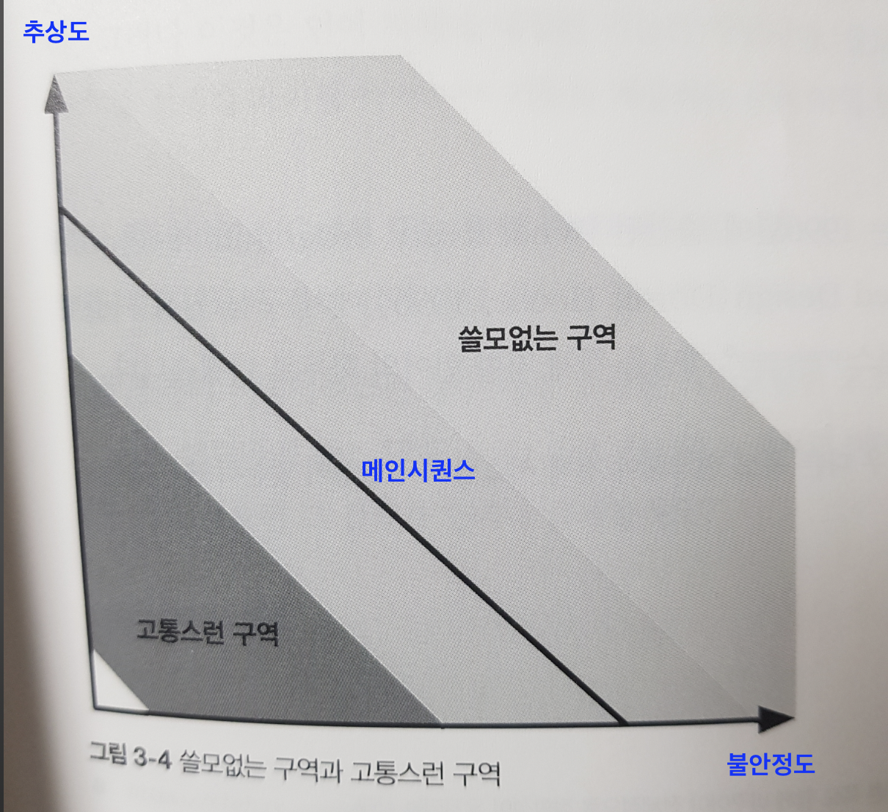

# 모듈성

- 아키텍처를 분석해야할 많은 도구가 모듈성에 기반한다
- 모듈성은 일종의 구성원리
- (암묵적으로) 질서와 일관성이 필요

## 1. 정의
- 사전적 정의: 복잡한 구조를 만드는 데 쓰이는 각각의 표준화한 부품이나 독립적인 단위
- 아키텍처를 논할 때, 클래스+함수 등 코드를 묶어놓은 덩어리를 모듈성이라는 언어로 나타냄
- 이것은 논리적 구분이지 물리적인 구분은 아님
- 네임스페이스(namespace)를 사용하여 이름의 충돌을 방지(자바, 닷넷 등)
- 자바는 이후 JAR 메커니즘을 도입 => 아카이브 파일이 클래스패스에서 디렉터리 구조 역할을 하도록 허용 (JAR파일 + 디렉터리 조합으로 클래스패스)

## 2. 모듈성 측정
- 응집, 커플링, 커네이선스

### 2-1. 응집
- 한 모듈의 파트(구성요소)가 동일한 모듈 안에 얼마나 포함되어 있는지
- 즉, 모듈을 구성하는 파트가 얼마나 연관되어 있는지
- 응집도의 측정범위: (가장 좋음) 기능적 > 순차적 > 소통적 > 절차적 > 일시적 > 논리적 > 동시적 (가장 나쁨)
- 기능적 응집: 기능상 꼭 필요한 것
- 순차적 응집: 두 모듈이 한쪽이 데이터를 출력하면 다른 한쪽이 그것을 입력받는 형식
- 소통적 응집: 통신 체인을 형성
- 절차적 응집: 순차적
- 일시적 응집: 시점 의존성에 따라 연관
- 논리적 응집: 기능적이 아니라 논리적 연관(String Utils)
- 동시적 응집: 아무 연관성 없음

### 2-2. 커플링

### 2-3. 커네이선스
- 변화 종속성, 어느 한쪽을 바꾸면 다른쪽도 바뀌어야 정합성이 유지되는 상태
- 정적 커네이선스, 동적 커네이선스

#### 정적 커네이선스
- 코드 레벨의 커플링
- 명칭 커네이선스: 엔티티명이 일치, 메서드명
- 타입 커네이선스: 엔티티 타입이 일치
- 의미 또는 관례 커네이선스: 어떤 값의 의미가 일치
- 위치 커네이선스: 값의 순서가 일치
- 알고리즘 커네이선스: 특정 알고리즘이 일치 (보안 해시 알고리즘)

#### 동적 커네이선스
- 런타임 호출을 분석하는 유형의 커네이선스
- 실행 커네이선스: 실행 순서가 중요
- 시점 커네이선스: 실행 시점이 중요(두 스레드의 경합)
- 값 커네이선스: 상호 연관된 다수의 값들을 함께 변경할 때 발생(트랜잭션)
- 식별 커네이선스: 동일한 엔티티를 참조할 때 발생(분산큐)
- 동적 커네이선스는 분석이 쉽지 않음

#### 커네이선스 속성
- 강도: 얼마나 쉽게 리팩터링 가능한가
  - 정적 커네이선스의 경우 분석도구를 사용하여 개선 가능 => 아키텍트는 동적 커네이선스보다 정적 커네이선스를 선호
- 지역성: 코드베이스의 모듈들이 얼마나 가까이 있는지
- 정도: 커네이선스가 미치는 영향의 규모(소수 혹은 다수의 클래스에 영향을 미치는가)
- 시스템의 모듈성을 개선하는 세 가지 방식
  1. 시스템을 캡슐화한 요소들로 잘게 나누어 전체 커네이선스를 최소화
  2. 캡슐화의 경계를 벗어나는 나머지 커네이선스를 모조리 최소화
  3. 캡슐화 경계 내부에서 커네이선스를 최소화

## 정리
- 모듈에서 컴포넌트로!
