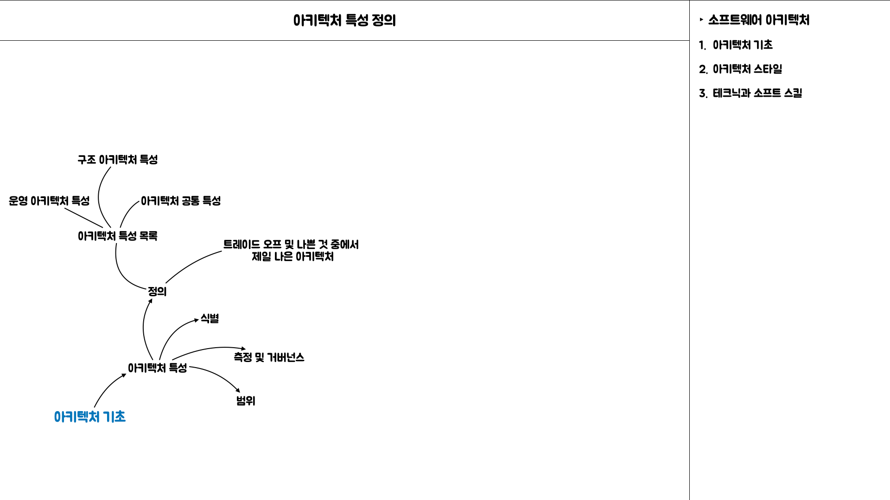
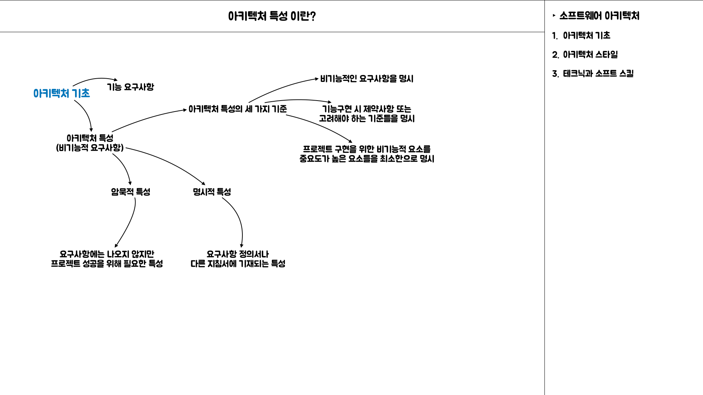
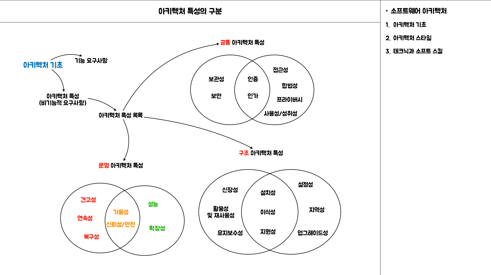
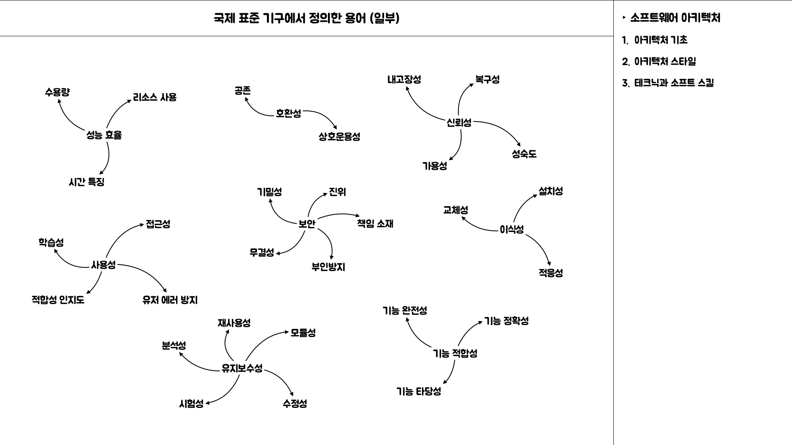

# 1.4 아키텍처 특성 정의

- [소프트웨어 아키텍처 101 - 아키텍처 특성 정의](https://sr-dev.oopy.io/soft-architecture-101/4)

## 서론

어떤 문제를 소프트웨어로 해결하기 위해서는 아키텍트`(아키텍처 적인 관점)`는 먼저 시스템 요구사항을 취합하고 그것을 구현하는 데 필요한 다양한 기술을 소프트웨어 개발 프로세스에 따라 정리한다.

하지만 이렇게 한 줄로 정리하기엔 아쉽기 때문에 아키텍트는 소프트웨어 솔루션을 설계할 때 `많은 부분`을 고려해야 한다고한다.

이 챕터에서는 그 많은 부분에 대해서 정리하는 것을 목표로 한다.

아키텍트는 개발팀과 함께 도메인 또는 비즈니스 요구사항을 정의

그 외에 도메인 기능과 직접적인 관련이 없는 모든 것들, 즉 `아키텍처 특성`을 정의, 발견, 분석하는 일을 수행한다.

### 소프트웨어 `아키텍처`와 `코딩`, `설계`의 차이점?

아키텍처 특성을 정의하는 `아키텍트의 역할`부터 `문제 영역` 및 `독립적인 시스템의 중요한 부분`까지 많은 점들이 다르다.

→ `비기능 요구사항` vs 기능 요구사항 → `아키텍처 특성`

책에서는 `비기능 요구사항`이라는 말을 `아키텍처 특성`이라는 명칭으로 정의하여 서술한다.

### `아키텍처 특성의 세 가지 기준`

- 비 도메인 설계 고려사항을 명시한다.
- 설계의 구조적 측면에 영향을 미친다.
- 애플리케이션 성공에 중요하다.

> `비도메인 설계 고려 사항을 명시한다.`

애플리케이션 설계 시 어플리케이션으로 처리할 일은 구체적인 요구사항으로 정리

아키텍처 특성의 부분

- 요구사항을 구현하는 방법
- 어떤 선택을 하게 된 이유와 관련된 운영 / 설계 기준을 명시
- 기술 부채 방지

> `설계의 구조적 측면에 영향을 미친다.`

아키텍처 특성을 기술하는 주된 이유? “`아키텍처 특성은 특별한 구조적 요소를 고려해야 하는가?`” 라는 설계 고려사항 때문이다.

- 서드파티 결제 프로세서

결제 처리를 한 곳에서 처리하는 경우 아키텍트가 특별하게 구조에 신경 쓸 필요가 없다.

암호화, 해시 등의 표준 보안 장치를 설계에 반영할 필요는 있지만 구조가 중요한 것은 아니기 때문이다.

- 애플리케이션 내부 결제 처리

애플리케이션이 직접 결제 처리를 한다면 아키텍트는 중요한 보안 문제를 `구조적으로 분리`하기 위해 특정한 모듈이나 컴포넌트, 서비스를 설계해야 한다.

이러한 경우 아키텍처 특성은 아키텍처와 설계 모두에 영향을 주게 된다.

위 같은 특정 사례처럼 기능을 직접 구현하는 경우 또는 별도의 서비스를 통해 기능을 구현하는 경우의 기준들을 고려해 설계에 반영해야 한다.

> `애플리케이션 성공에 중요하다.`

애플리케이션이 아키텍처 특성을 모두 지원 할 수 있지만 그렇게 되면 설계의 복잡도가 가중되기 때문에 가급적 아키텍처 특성을 적게 선정하는 일도 중요하다.

- 아키텍처 특성의 분류
    - 명시적 특성
        - 요구사항 정의서나 다른 지침서에 기재되는 특성
    - 암묵적 특성
        - 요구사항에는 거의 나오지 않지만 프로젝트 성공을 위해 필요한 특성
            - `가용성`, `신뢰성`, `보안`과 같은 속성은 거의 모든 애플리케이션의 근간이 되지만 설계 문서에는 등장하지 않는다.
            - 이러한 내용을 아키텍트는 `분석 단계`에서 자신이 문제 영역에 대해 습득한 지식을 활용하여 `아키텍처 특성을 밝혀내야 한다.`
            
각 정의 요소가 다른 요소를 지원하고 결국에는 시스템 전체 설계를 지원하는 모습을 반영하는 그림

아키텍처 특성이 지탱하는 아키텍처 설계는 그럴 듯하게 표현한 듯 보이지만 추상적인 표현한 것으로 설계를 하는 상황에서 주어진 조건으로 할 수 있는 것들의 트레이드 오프를 잘 따져봐야 한다는 뜻이다.

## 1.4.1 아키텍처 특성 (일부) 목록

아키텍처 특성은 `모듈성` 같은 저수준 코드의 특성부터 `확장성`, `탄력성` 같은 복잡한 운영 문제 까지 소프트웨어 시스템의 넓은 범위에 고루 존재한다.

아키텍처 특성을 체계화 하려는 시도가 과거에서부터 있었지만 아직도 보편적인 표준은 따로 없으며 조직마다 자체적으로 해석하여 용어를 정의한다.

하지만 우리는 시스템을 만드는 사람이고 체계를 구축하는 사람으로써 어느정도의 기준을 정립하는 목표를 갖는 것이 중요하다.

빠르게 변화하는 소프트웨어 생태계 특성상 새로운 개념, 용어, 측정, 검증이 계속 출현하기 때문에 매번 새로운 방식으로 아키텍처 특성을 정의하게 된다.

규모와 범위는 방대하지만 아키텍트는 보통 `아키텍처 특성`을 `넓은 범주`로 나눈다.

### 1.4.1.1 `운영` 아키텍처 특성

운영 아키텍처 특성은 `성능`, `확장성`, `탄력성`, `가용성`, `신뢰성` 등의 능력을 말한다.

| 용어     | 영문                   | 정의                                                                                             |
|--------|----------------------|------------------------------------------------------------------------------------------------|
| 가용성    | availability         | 시스템이 얼마나 오랫동안 사용 가능해야 하나? (24/7 이면 장애 발생 시 시스템을 신속하게 재가동하는 절차가 준비되어야 함)                    |
| 연속성    | continuity           | 재해 복구 능력                                                                                       |
| 성능     | performance          | 스트레스 테스트(stress test), 피크 분석(peak analysis) 기능의 사용 빈도 분석, 필요 용량, 응답 시간                         |
| 복구성    | recoverability       | 비즈니스 연속성 요구사항 (예를 들어, 장애 발생 시 얼마나 신속하게 시스템을 재가동 시켜야 하는지?) 백업 전략과 하드웨어 다중화 요건에 영향을 미친다. |
| 신뢰성/안전 | reliability / safety | 시스템에 페일 세이프가 필요한가? 즉, 페일 세이프가 시스템 가동에 필수인가? 시스템 실패 시 회사에 거액의 손실이 발생하는가?                |
| 견고성    | robustness           | 프로그램 실행 중 인터넷 접속 끊김, 정전, 하드웨어 실패 등 에러 및 경계 조건을 감당하는 능력                                         |
| 확장성    | scalability          | 유저 수, 요청 수가 늘어나도 시스템이 그에 맞는 성능을 발휘하는 능력                                                        |

위에 작성된 운영 아키텍처 특성은 운영 및 데브옵스와 많은 부분에서 중첩되며, 많은 소프트웨어 프로젝트에서 이런 관심사는 교차점을 형성한다.

### 1.4.1.2 `구조` 아키텍처 특성

아키텍트는 코드 구조의 특성인 모듈성, 컴포넌트 간 커플링 제어, 가독성 높은 코드, 그 밖의 내부 품질 평가 등 코드 품질 문제에 대해서도 고려해야 한다.

| 용어       | 영문                    | 정의                                                                                      |
|----------|-----------------------|-----------------------------------------------------------------------------------------|
| 설정성      | configurability       | 최종 사용자가 소프트웨어 설정을 쉽게 바꿀 수 있는지?                                                          |
| 신장성      | extensibility         | 새로운 기능을 삽입하는 일의 중요성                                                                     |
| 설치성      | installability        | 필요한 모든 플랫폼에 시스템을 얼마나 손쉽게 설치할 수 있는지?                                                     |
| 활용성/재사용성 | leverageability/reuse | 공통 컴포넌트를 여러 제품에서 활용할 수 있는지?                                                             |
| 지역성      | locality              | 데이터를 입력/조회하는 화면에서 다국어가 지원되는가? 리포트(report) 장표에서 멀티바이트 문자 및 측정, 화폐 단위 등의 요구사항         |
| 유지보수성    | maintainability       | 시스템을 얼마나 쉽게 변경 및 개선할 수 있는지?                                                             |
| 이식성      | portability           | 하나 이상의 플랫폼에서 시스템을 실행할 수 있는지? (동일한 프론트엔드를 SAP DB와 오라클 데이터베이스에서 모두 실행할 수 있는가?)        |
| 지원성      | supportability        | 애플리케이션은 어느 정도의 기술 지원을 필요로 하는지? 시스템에서 발생한 에러를 디버깅하려면 로깅 및 기타 기능이 어느 수준으로 뒷받침되어야 하는지? |
| 업그레이드성   | upgradeability        | 이 애플리케이션/솔루션의 구 버전을 새 버전으로 쉽고 빠르게 업그레이드 할 수 있는가?                                        |

### 1.4.1.3 아키텍처 `공통` 특성

`운영` 아키텍처 특성 및 `구조` 아키텍처 특성과 다르게 중요한 설계 제약조건과 고려 사항은 대부분 따로 분류하기가 어려운 경우가 많다.

| 용어      | 영문                      | 정의                                                                                                                                      |
|---------|-------------------------|-----------------------------------------------------------------------------------------------------------------------------------------|
| 접근성     | accesibility            | 색맹, 청각 장애인 등 모든 유저가 접근하는데 불편함이 없는지?                                                                                                     |
| 보관성     | archivability           | 데이터를 따로 아카이빙해야 하는지? 아니면 일정 시간 경과 후 삭제해야 하는지? (고객 계정은 3개월 후 삭제하거나 미사용 계정으로 표시하, 추후 해당 고객이 다시 접속할 지도 모르기 때문에 보도 데이터베이스에 아카이빙 한다.) |
| 인증      | authentication          | 유저가 본인이 맞다는 것을 증명하기 위해 필요한 보안 요구사항                                                                                                      |
| 인가      | authorization           | 유저가 애플리케이션에서 정해진 기능만 사용할 수 있도록 강제하는 보안 요구사항 (유스 케이스, 서브 시스템, 웹 페이지, 비즈니스 규칙, 필드 레벨 등등)                                              |
| 합법성     | legal                   | 시스템 운영상 법적 제약조건이 있는가? (데이터 보호, 사베인스 옥슬리법, GDPR 등) 회사는 어떤 권리를 유보 해야 하는지? 애플리케이션을 개발 / 배포 하는 방법에도 따로 법정 규정이 있는지?                  |
| 프라이버시   | privacy                 | 회사 내부 임직원의 트랜잭션을 외부에 드러내지 않는 기능 (가령, 암호화 트랜잭션은 DBA나 네트워크 아키텍트도 해독불가)                                                                |
| 보안      | security                | 데이터를 암호화한 뒤 데이터베이스에 보관해야 하는지? 내부 시스템 간 네트워크 통신도 암호화해야 하나? 원격 유저 액세스는 어떤 종류의 인증이 필요한지?                                           |
| 사용성/성취성 | usability/achievability | 유저가 애플리케이션 / 솔루션을 이용하여 원하는 목적을 달성하기 위해 필요한 교육/훈련 수준. 사용성 요구사항 역시 다른 아키텍처 이슈 못지않게 진지하게 다루어야 한다.                                      |

아키텍처 특성은 어떻게 나열해도 불완전한 목록이 될 수 밖에 없고, 소프트웨어마다 고유한 팩터를 바탕으로 중요한 아키텍처 특성이 도출될 수도 있다.

여기까지 정의한 용어는 대부분 의미가 미묘하거나, 객관적으로 정의하기 어렵다거나, 다소 부정확하고 모호한 부분도 있고, 정의가 중복되는 것들도 많이 있다.

실무에서 이러한 용어를 사용할 때는 정의를 명확하게 정리하여 커뮤니케이션에 혼선을 빚지 않도록 주의해야 할 것이다.

> 국제 표준 기구(ISO, International Organization for Standardization)

국제 표준기구가 발표한 기능별 목록

- 소프트웨어 아키텍처 특성

| 특성                            | 설명                                                                                      | 목록                                                               | 설명                                                  |
|-------------------------------|-----------------------------------------------------------------------------------------|------------------------------------------------------------------|-----------------------------------------------------|
| 성능 효율(performance efficiency) | 알려진 조건에서 리소스 양에 비례하는 성능 측정값.                                                            | 시간 특징 (time behavior)                                        | 응답 시간, 처리 시간, 처리율                                   |
|                               |                                                                                         | 리소스 사용                     (resource utilization)            | 사용한 리소스의 종류와 양                                      |
|                               |                                                                                         | 능력                         (capacity)                        | 최대 설정된 한계치를 초과한 정도                                  |
| 호환성 (compatibility)       | 제품, 시스템, 컴포넌트가 다른 제품, 시스템, 컴포넌트와 정보를 교환하거나 동일한 하드웨어/소프트웨어 환경을 공유하면서 필요한 기능을 수행할 수 있는 정도 | 공존                         (coexistence)                     | 환경과 리소스를 다른 제품과 공유하면서 효율적으로 필요한 기능을 수행할 수 있음        |
|                               |                                                                                         | 상호운용성                      (interoperability)                | 둘 이상의 시스템에 정보를 교환, 활용 가능한 정도                        |
| 사용성 (usability)           | 유저가 시스템을 원하는 목적에 맞게 효과적으로, 효율적으로, 만족스럽게 사용할 수 있는 정도.                                    | 적합성 인지도                    (appropriateness recognizability) | 유저가 자신의 사용 목적에 소프트웨어가 부합하는지 인식할 수 있음                |
|                               |                                                                                         | 학습성                        (learnability)                    | 유저가 얼마나 쉽게 소프트웨어 사용법을 익히는가                          |
|                               |                                                                                         | 유저 에러 방지                   (user error protection)           | 유저가 실수하는 것을 방지                                      |
|                               |                                                                                         | 접근성                        (accessibility)                   | 사람들이 소프트웨어의 가장 다양한 능력과 기능을 접할 수 있게 함                |
| 신뢰성 (reilability)         | 주어진 기간 동안 특정 조건에서 시스템이 기능하는 정도.                                                         | 성숙도                        (maturity)                        | 정상 작동 시 소프트웨어가 원하는 신뢰성을 보장하는가?                      |
|                               |                                                                                         | 가용성                        (availability)                    | 소프트웨어가 가동 중이고 액세스 가능한가?                             |
|                               |                                                                                         | 내고장성                       (fault tolerance)                 | 하드웨어/소프트웨어가 고장나도 소프트웨어가 의도한 대로 작동되는지?               |
|                               |                                                                                         | 복구성                        (recoverability)                  | 소프트웨어가 고장나도 영향 받은 데이터를 되살리고, 원하는 시스템 상태로 돌아갈 수 있는가? |
| 보안 (security)             | 사람들, 다른 제품, 시스템이 자신의 인증 레벨에 맞게 데이터를 액세스할 수 있게끔 소프트웨어가 정보를 보호하는 정도                       | 기밀성                        (confidentiality)                 | 데이터는 인증된 사람만 액세스 할 수 있음                             |
|                               |                                                                                         | 무결성                        (integrity)                       | 데이터를 함부로 변조하지 못하게 소프트웨어가 허가되지 않은 액세스를 차단함           |
|                               |                                                                                         | 부인 방지                      (nonrepudiation)                  | 어떤 액션이나 이벤트가 발생했음을 증명함                              |
|                               |                                                                                         | 책임 소재                      (accountability)                  | 유저가 수행한 액션을 추적                                      |
|                               |                                                                                         | 진위                         (authenticity)                    | 유저 신원을 증명                                           |
| 유지보수성 (maintainability)   | 개발자가 얼마나 효율적으로 소프트웨어를 고쳐 개선/발전시키고 계속 변화하는 환경이나 요구사항에 맞게 적용할 수 있는가                       | 모듈성                        (modularity)                      | 소프트웨어를 독립된 컴포넌트로 구성할 수 있는 정도                        |
|                               |                                                                                         | 재사용성                       (reusability)                     | 개발자가 어떤 자산을 여러 시스템에서, 다른 자산을 구축하는 데 다시 사용할 수 있는 정도  |
|                               |                                                                                         | 분석성                        (analyzability)                   | 개발자가 얼마나 쉽게 소프트웨어 메트릭을 취합할 수 있는가                    |
|                               |                                                                                         | 수정성                        (mofifiability)                   | 개발자가 기존 제품 품질을 떨어뜨리지 않고도 어렵지 않게 소프트웨어를 수정할 수 있는가?   |
|                               |                                                                                         | 시험성                        (testability)                     | 개발자나 다른 사람들이 얼마나 쉽게 소프트웨어를 테스트할 수 있는가?              |
| 이식성 (porability)          | 개발자가 하드웨어, 소프트웨어, 또는 다른 운용 환경에 있는 시스템, 제품, 컴포넌트를 다른 곳에 옮길 수 있는 정도.                      | 적응성                        (adaptability)                    | 개발자가 소프트웨어를 다른 하드웨어, 소프트웨어                          |
|                               |                                                                                         | 설치성                        (installability)                  | 소프트웨어를 주어진 환경에 설치 또는 삭제할 수 있는지                      |
|                               |                                                                                         | 교체성                        (replaceability)                  | 개발자가 얼마나 쉽게 다른 소프트웨어로 기능을 교체할 수 있는가                 |

- 소프트웨어의 기능적 측면

| 특성                                  | 설명                                               | 목록                                      | 설명                                   |
|-------------------------------------|--------------------------------------------------|-----------------------------------------|--------------------------------------|
| 기능 적합성 (functional suitability) | 주어진 조건에서 제품이나 시스템을 가동할 때, 명시/암묵적인 요구사항을 충족하는 정도. | 기능 완전성 (functional completeness)    | 제공되는 기능들이 전체 작업과 유저 목표를 얼마나 커버하는가?   |
|                                     |                                                  | 기능 정확성 (functional correctness)     | 제품이나 시스템이 올바른 결과를 어느 정도로 정확하게 제공하는가? |
|                                     |                                                  | 기능 타당성 (functional appropriateness) | 주어진 작업과 목표를 얼마나 쉽게 달성할 수 있는가?        |

이러한 특성들은 소프트웨어를 구축하는데 필요한 동기부여에 관한 요구사항으로, 아키텍처 특성과 문제 영역 사이의 관계를 생각하는 방식이 어떻게 발전해왔는지 알 수 있다.

<aside>
💡 소프트웨어 아키텍처는 모호한 것들 투성이다.
</aside>

위 용어들은 동일한 용어를 다양한 의미로 사용되기 때문에 용어를 사용하는 경우 서로 같은 의미로 이해하고 사용할 수 있도록 명확하게 정의하는 것이 중요하다.

## 1.4.2 트레이드오프 및 나쁜 것 중에서 제일 나은 아키텍처

위에서 나열된 아키텍처 특성들은 여러 이유로 일부만 애플리케이션에서 지원 가능하다고 한다. 그 이유는

1. 지원되는 특성마다 설계 노력이 필요하고, 구조적으로도 지원되어야 한다.
2. 각 아키텍처 특성이 다른 특성에 영향을 미치는 경우가 많다는 사실이 더 큰 문제이다.

<aside>
💡 `최고(best)의 아키텍처`를 고집하지 말고 `나쁜 것 중에서 제일 나은(least worst) 아키텍처`를 선택하세요.
</aside>

아키텍처 특성에 너무 욕심내면 모든 비즈니스 문제를 해결하기 위한 일반적인 솔루션이 되어 버린다. 

그러나 그런 아키텍처는 설계하기가 까다롭기 때문에 실현 가능성이 낮다.