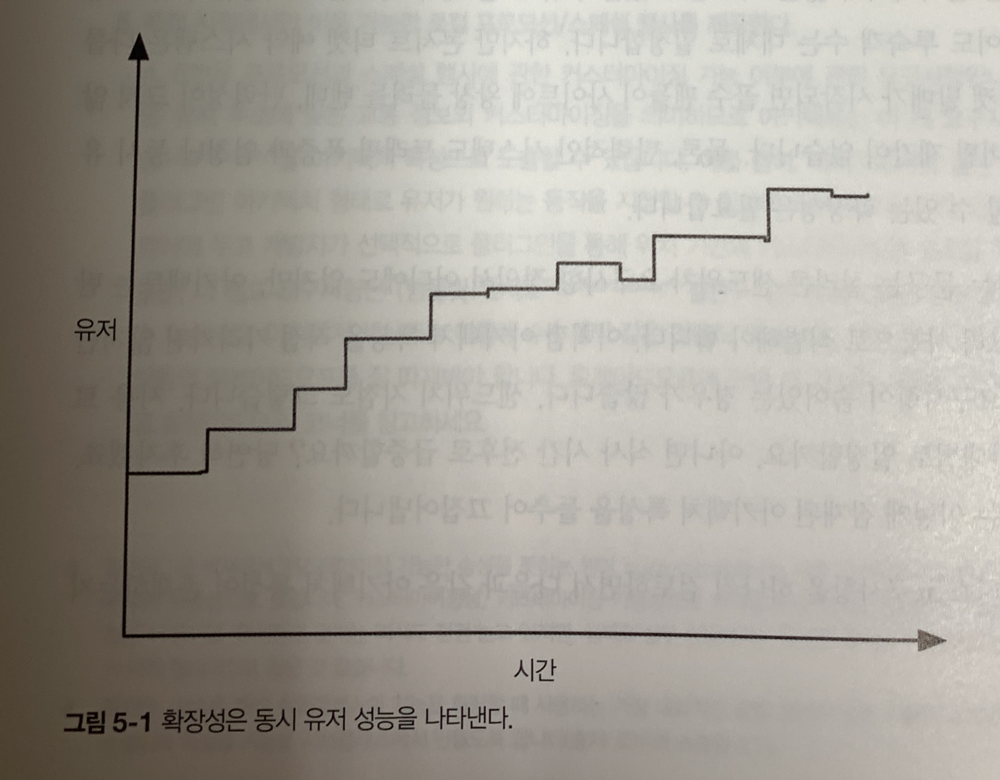
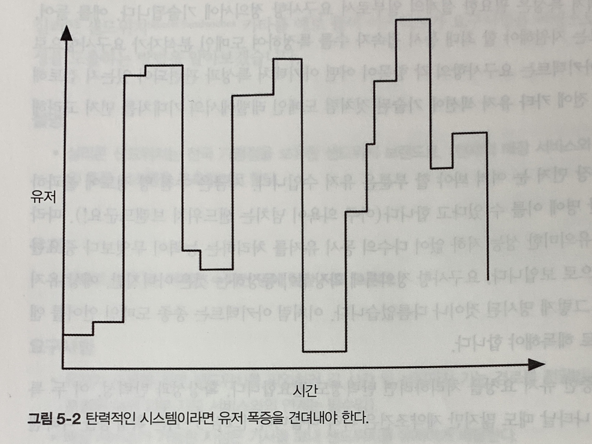

# 5장 아키텍처 특성 식별

- 아키텍처를 구축하거나 기존 아키텍처의 타당성을 검증할 때는 아키텍처 특성 식별을 가장 먼저 해야함
- 아키텍처 특성을 정확하게 식별하기 위해서는 아키텍트는 해당 도메인을 잘 이해하고 있어야 하며, 도메인 이해 관계자들과 협력하여, 도메인 관점에서 중요한 것들을 결정해야 함
---------------------------------------

## 5.1 도메인 관심사에서 아키텍처 특성 도출

### 아키텍처 결정
- 아키텍트는 도메인의 핵심 목표와 현재 상황을 고려하여 도메인 관심사를 '~성'으로 해석한 후, 그에 따라 정확하고 합리적인 아키텍처 결정을 내려야 함
- 도메인 이해 관계자와 협력해서 주요 아키텍처 특성을 정의하는 한 가지 팁은, 최종 목록을 가능한 한 짧게 해야 함

### 안티패턴
- 제네릭 아키텍처를 설계하려는 것은 가장 흔한 안티 패턴
- 너무 많은 아키텍처 특성을 수용하면 아키텍트, 개발자가 당초 의도했던 문제 영역의 해결을 시도하기도 전에 아키텍처가 너무 복잡해짐
- 아키텍처 특성의 개수에 연연하지 말고 가급적 설계를 단순화해야 함.
> <사례 연구 : 바사> : 수송선과 전함 2가지 역할을 모두 하려 하다 침몰

### 아키텍처 우선 순위 결정
- 모든 아키텍처 특성의 우선 순위에 만장일치로 의견이 모아지는 경우는 거의 없음
- 최종 목록을 주고 각자 가장 중요한 특성 3개를 뽑는 방법을 통해, 합의를 이끌어내고, 가장 중요한 것에 대해 논의할 수 있음

### 도메인 관심사 및 아키텍처 특성
- 아키텍트와 도메인 이해관계자들이 서로 다른 언어로 말하기 때문에 문제 발생
- 아키텍트는 확장성, 상호운용성, 가용성 등을 말하는데, 도메인 이해 관계자는 인수 병합, 고객 만조, 출시 시점 등을 이야기 함

**도메인 관심사를 아키텍처 특성으로 옮긴 표**
| 도메인 관심사   | 아키텍처 특성                 |
|-------------|---------------------------
| 인수 합병      | 상호운용성, 확장성, 적응성, 신장성
| 출시 시기      | 민첩성, 시험성, 배포성
| 유저 만족      | 성능, 가용성, 내고장성, 시험성, 배포성, 민첩성, 보안
| 경쟁 우위      | 민첩성, 시험성, 배포성, 확장성, 가용성, 내고장성
| 시간 및 예산   | 단순성, 실행성
> 아키텍트는 한 가지 성분(민첩성)에만 집착하여, 도메인 관심사(출시 시기)를 잘못해석하는 함정에 빠지기 쉬움

---------------------------------------

## 5.2 요구사항에서 아키텍처 특성 도출
- 요구사항 정의서에서 도출한 아키텍처 특성도 있지만, 아키텍트가 알고 있는 도메인 지식에서 도출되는 특성도 있기 때문에, 도메인 지식을 알고 있으면 유리 **ex) 학사 관리 시스템에서 시스템 규모 산정**

### 아키텍처 카타의 유래
- 테드 뉴어드라는 저명한 아키텍트는 초보 아키텍트가 도메인에 관한 설명을 보고 아키텍처 특ㄱ성을 도출하는 연습을 할 수 있도록 아키텍처 카타를 고안

미리 정의된 섹션
1. 설명 : 시스템으로 해결하려는 전체 도메인 문제
2. 유저 : 시스템을 사용할 것으로 예상되는 유저의 유형과 인원수
3. 요구사항 : 아키텍트가 도메인 유저 및 도메인 전문가의 말을 듣고 예상하는 도메인/도메인 수준의 요구사항
4. 부가 콘텍스트 : 요구사항만에는 명확하게 기술되어 있지 않지만 아키텍트가 암묵적인 문제 영역에 관한 지식을 이용해 반드시 고려해야 할 여러 가지 항목들

> 참고사이트 : [테드 뉴어드](https://archkatas.herokuapp.com/) [닐 블로그](https://nealford.com/katas/)

---------------------------------------

## 5.3 사례 연구: 실리콘 샌드위치

#### 설명
- 실리콘 샌드위치는 전국 가맹점을 보유한 샌드위치 브랜드로, (현재의 매장 서비스와 병행하여) 온라인 주문 시스템을 구축하려고 한다.

#### 유저
- 앞으로 수천 명, 어쩌면 수백만 명에 달할 지도 모른다.

#### 요구사항
- 유저가 주문을 하면 샌드위치를 픽업하러 갈 시간 및 상점까지 가는 경로를 전달 받는다(교통 정보가 포함된 여러 외부 지도 서비스와의 연계는 필수)
- 배달 서비스가 가능한 지점은 기사를 보내 샌드위치를 유저에게 배달한다
- 모바일 기기에서도 이용 가능하다
- 전국 어느 지점이나 이용 가능한 프로모션/스페셜 행사를 제공한다
- 특정 지점에서만 이용 가능한 로컬 프로모션/스페셜 행사를 제공한다
- 온라인 결제, 대면 결제, 배송 시 결제 등 다양한 결제 옵션을 제공한다

#### 부가 콘텍스트
- 샌드위치 지점은 가맹점이므로 소유자가 다 다르다
- 모회사는 머지않아 해외 시장도 진출할 계획이다
- 회사는 값싼 인력을 고용해 이윤을 최대화하는 것이 목표다
> 도메인 요구사항을 충족하는 전체 시스템을 코드 레벨로 설계하는 것이 아니라, 설계, 특히 구조와 관련이 있거나 영향을 미치는 것들을 찾아내야 함.

### 5.3.1 명시적 특성
- 명시적 아키텍처 특성은 필요한 설계의 일부로서 요구사항 정의서에 기술 됨.
- 예를 들어, 쇼핑몰 사이트는 지원해야 할 최대 동시 접속자 수를 특정하여 도메인 분석자가 요구사항으로 명시
- 확장성이 등장하진 않지만, 예상 유저를 보면, 중요한 아키텍처 특성으로 생각할 수 있음
- 순간적으로 폭증한 유저 요청을 처리하려면 탄력성도 필요
> **아키텍트는 도메인 언어를 엔지니어링 언어로 해독 해야함**

#### 확장성 : 유의미한 성능 저하 없이 다수의 동시 유저를 처리하는 능력

#### 탄력성 : 트래픽의 폭주하는 정도

- 호텔 예약 시스템은 확장성이 좋지만 탄력적이지 않음. 반면, 콘서트 티켓 예약 시스템은 탄력성도 필요
- 샌드위치 요구사항 정의서 어디에도 탄력성이 필수라는 말은 없지만, 식사 시간 전후로 급증하는 도메인 특성상 탄력성이 필요함
---------------------------------
### 요구사항에서 아키텍처 특성 확인
1. 유저가 주문을 하면 샌드위치를 픽업하러 갈 시간 및 상점까지 가는 경로를 전달 받는다(교통 정보가 포함된 여러 외부 지도 서비스와의 연계는 필수)
 =>  외부API가 우리 시스템에 영향을 미치면 안됨 : 안정성, 신뢰성
2. 배달 서비스가 가능한 지점은 기사를 보내 샌드위치를 유저에게 배달한다
3. 모바일 기기에서도 이용 가능하다
4. 전국 어느 지점이나 이용 가능한 프로모션/스페셜 행사를 제공한다
5. 특정 지점에서만 이용 가능한 로컬 프로모션/스페셜 행사를 제공한다
 =>  맞춤성
6. 온라인 결제, 대면 결제, 배송 시 결제 등 다양한 결제 옵션을 제공한다
7. 샌드위치 지점은 가맹점이므로 소유자가 다 다르다
8. 모회사는 머지않아 해외 시장도 진출할 계획이다
9. 회사는 값싼 인력을 고용해 이윤을 최대화하는 것이 목표다

>*요구사항 정의서를 토대로 성능(확장성, 탄력성)을 아키텍처 특성으로 도출*

### 5.3.1 명시적 특성
- 가용성 : 시스템에서 마땅히 지원되어야 할 암묵적인 특성
- 신뢰성 : 시스템을 문제없이 사용하려면 필요
-  보안 : 모든 시스템의 공통적인 암묵적인 특성
> 아키텍트는 어느 한 아키텍처 특성을 지나치게 적용하는 함정에 빠지기가 쉬운데, 그 결과 시스템이 너무 복잡하게 설계되어 모자라게 적용하는 것만큼이나 해를 끼치는 경우가 많음

> 아키텍터 특성을 선택하는 문제 있어서 정답은 없으며 오직 잘못된 선택만 있다! (=값 비싼 답)