# 아키텍처 스타일 기초

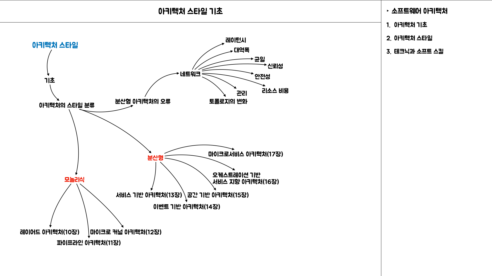

## Intro

`아키텍처 스타일`은 종종 `아키텍처 패턴`이라고도 불리우며, `다양한 아키텍처 특성`을 다루는 `컴포넌트의 명명된 관계`를 기술한다.

*아키텍트가 특정 아키텍처에 대해 이야기 할 경우*, 그의 목표는 `구조적인 측면`과 어떤 종류의 `아키텍처 특성`이 알맞는지(또는 `문제를 일으킬 수 있는지`) 살펴보고 통상적인 `배포 모델`과 `데이터 전략` 등 다양한 정보를 이해하는 것이다.

- `아키텍처 스타일`은 각 명칭마다 설계 패턴의 존재를 뒷받침하는 세부 내용이 함축되어 있다.
- `아키텍처 스타일`은 `토폴로지`와 기본 전제된 아키텍처 특성을, 이로운 것과 해로운 것 모두 기술한다.

## 2.9.1 기초 패턴

소프트웨어 아키텍처의 역사를 통틀어 끊임없이 나타나고 또 나타나는 패턴이있는데, 이런 패턴들은 `코드`, `배포`, 또는 `아키텍처의 다른 부분을 구성하는 시야`를 넓혀준다.

### 2.9.1.1 진흙잡탕

진흙잡탕은 요즘에는 보통 `실제 내부구조`라 할 만한 것은 하나도 없는, `데이터베이스를 직접 호출하는 이벤트 핸들러`를 가진 단순한 스크립팅 애플리케이션을 가리킨다. 이렇게 시작한 애플리케이션이 나중에 점점 규모가 커지면서 처치 곤란한 상태가 된다.

아키텍트는 무슨 수를 써서라도 이런 아키텍처는 피해야 한다. 구조가 없으면 앞으로 뭔가 변경하기가 점점 더 어려워지고, `배포`, `테스트`, `확장`, `성능` 역시 고통스럽기 때문이다. 많은 프로젝트가 `코드 품질` 및 `구조`에 관한 `거버넌스`가 결여된 탓에 본의 아니게 그렇게 된다.

`기술적으로 시각화`해보면 아키텍처 커플링의 모습을 볼 수 있다. 선이 굵을수록 `더 강하게 커플링` 됐다는 뜻 이다.

### 2.9.1.2 유니터리 아키텍처

소프트웨어 태동기에 단 1대의 컴퓨터에서 소프트웨어가 돌아갔다. 이후 하드웨어 / 소프트웨어는 다양한 진화 세대를 거치면서, 단일 엔티티로 시작했다가 보다 정교한 기능이 점점 더 많이 필요해지면서 나뉘어 졌다.

현재는 `유니터리(단일, 통일) 시스템`은 임베디드 시스템과 그 밖에 매우 제약이 많은 극 소수 환경을 제외하면 거의 쓰이지 않는다. 소프트웨어 시스템은 시간이 지날수록 점점 기능이 늘어나기 마련이므로 성능, 확장 등의 운영 아키텍처 특성을 유지하려면 관심사를 분리 할 필요가 있다.

[Unitary Architecture - Introduction](https://www.youtube.com/watch?v=KAo9Npoq8KY)

### 2.9.1.3 클라이언트 / 서버

실제로 대부분의 아키텍처 스타일은 시스템에 있는 여러 부분을 효과적으로 분리하는 방법을 다룬다. 프런트엔드와 백엔드로 기술적으로 기능을 분리한 2티어(two-tier 또는 클라이언트/서버 아키텍처)는 대표적인 기본 아키텍처 스타일이다.

> 데스크톱 + 데이터베이스 서버

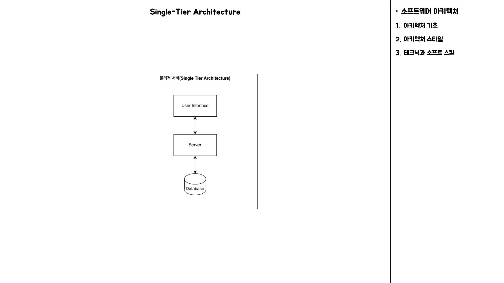

초창기 PC 아키텍처는 개발자가 `윈도우 같은 UI`를 기반으로 리치 데스크톱 애플리케이션을 개발하도록 적극 지원했다.
이 아키텍처는 표준 네트워크 프로토콜을 통해 접속 가능한 스탠드얼론 데이터베이스 서버와 잘맞았다. 프레젠테이션 로직은 데스크톱에 두고 계산량이 많은 액션은 사양이 탄탄한 데이터베이스 서버에서 실행했습니다.

> 브라우저 + 웹 서버

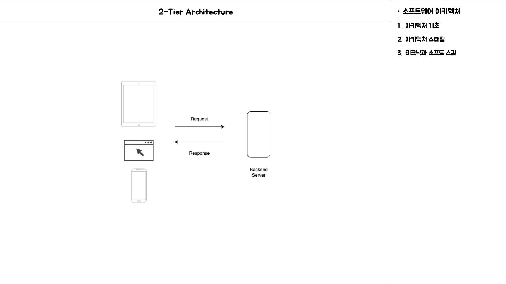

클라이언트는 `데스크톱`보다 훨씬 가벼운 `브라우저`로 대체되었고 내 외부 방화벽 모두 더 넓은 범위로 배포가 가능해졌다. 데이터베이스는 `웹 서버`와 분리되어 있지만 두 서버 모두 운영 센터 내부의 동급 머신에서 운용되고 `유저 인터페이스`는 브라우저에서 실행되므로 여전히 이 구조를 2티어 아키텍처로 바라보는 아키텍트들도 있다.

> 3티어(3-tier)

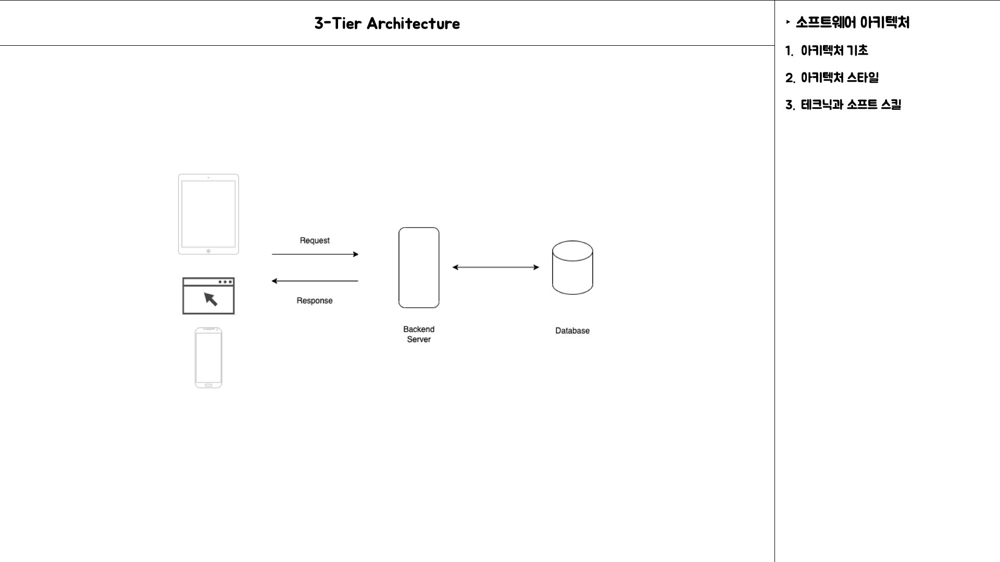

1990년대 후반에 인기를 끈 3티어 아키텍처는 더 많은 레이어로 분리한다. 고성능 데이터베이스 서버를 사용하는 `데이터베이스 티어`, 애플리케이션 서버가 관리하는 `애플리케이션 티어`, 그리고 처음에는 HTML로 시작하여 기능이 점점 많아져 온갖 자바스크립트 코드로 가득찬 `프런트엔드 티어`, 이렇게 세 티어가 완성 됐다.

3티어 아키텍처는 분산 아키텍처에 적합한 `공통 객체 요청 브로커 아키텍처`, `분산 컴포넌트 객체 모델` 같은 네트워크 수준의 프로토콜과 잘 맞았다.

요즘은 TCP/IP 같은 `네트워크 프로토콜이 어떻게 작동 하는지` 개발자가 신경쓰지 않아도 되는 것처럼, 아키텍트도 분산 아키텍처에서 이정도 수준의 `연결 작업`에 대해서는 그리 걱정할 필요가 없다.

당시 개발된 도구가 제공하는 기능들이 오늘날에도 여전히 `메시지 큐` 같은 도구 또는 `이벤트 기반 아키텍처` 등의 `아키텍처 패턴`에 존재하기 때문이다.

<aside>
💡 3티어, 언어 설계, 그리고 장기적인 전망
</aside>

`직렬화`를 지원하는 모든 자바 객체는 정해진 `인터페이스(Serializable)`을 구현해야 한다.
3티어 아키텍처가 불멸의 아키텍처 스타일이 될 거라 생각해서 엄청난 편의 기능을 언어에 내장한 것으로 `하위 호환성`을 보장하기 위해 지금은 아무도 쓰지 않는 직렬화를 지원해야 하는 까닭에 현대적인 기능을 추가하려고 해도 소용없게 됐다.

## 2.9.2 모놀리식 대 분산 아키텍처

아키텍처 스타일은 크게 `모놀리식(전체 코드를 단일 단위로 배포하는)`과 `분산형(원격 액세스 프로토콜을 통해 여러 단위로 배포하는)`, 두 종류 입니다.

이 세상에 완벽한 분류 체계는 없겠지만, `분산 아키텍처`는 `모놀리식 아키텍처` 스타일에서는 찾아볼수 없는 `공통적인 난제`와 `이슈`를 갖고 있으므로 다양한 `아키텍처 스타일을 분류하기에 좋은 기준`입니다.

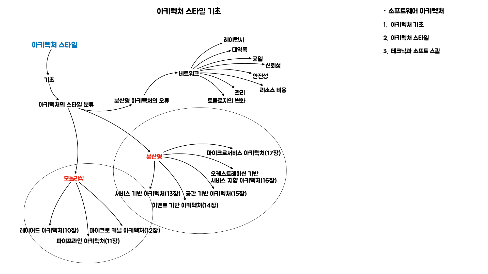

`분산 아키텍처` 스타일은 `모놀리식 아키텍처` 스타일에 비해 `성능`, `확장성`, `가용성` 측면에서 훨씬 강력하지만, 이런 파워에도 결코 무시할 수 없는 트레이드오프가 수반된다.

### 2.9.2.1 오류 #1: 네트워크는 믿을 수 없다.

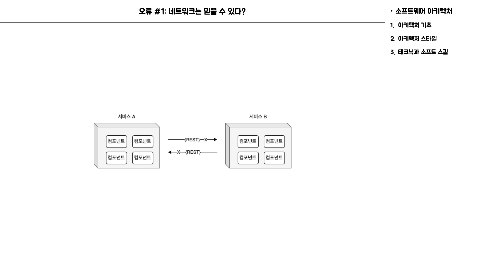

개발자, 아키텍트 모두 네트워크는 믿을 수 있다고 전제하지만 실제로는 전혀 그렇지 않다. `네트워크 신뢰도`는 점점 좋아지고 있긴 하나 아직도 미덥지 못하다.
`분산 아키텍처`는 그 특정상 서비스를 오가는, 또 서비스 간에 이동하는 `네트워크에 의존`하므로 이것은 아주 중요한 문제이다.

서비스B는 완전히 정상이지만 네트워크 문제 때문에 서비스 A는 서비스 B에 닿지 못한다. 설상가상으로, 서비스 A가 서비스 B에게 데이터를 처리해달라고 요청했지만 네트워크 문제로 인해 응답을 못받는 경우도 있다.

타임 아웃 같은 장치를 마련하거나 서비스 사이에 회로 차단기를 두는 것이다. 시스템이 네트워크에 더 의존할수록 시스템의 신뢰도는 잠재적으로 떨어질 가능성이 있다.

### 2.9.2.2 오류 #2: 레이턴시는 0이다.

메서드나 함수를 이용해 다른 컴포넌트를 로컬 호출하면 그 `소요시간(t_local)`은 대개 나노 초 내지 밀리초 단위로 측정되지만, 동일한 호출을 (REST, 메시징, RPC 등의) 원격 액세스 프로토콜을 통해서 수행하면 `서비스 액세스 시간(t_remote)`이 밀리 초 단위로 측정됩니다.

따라서 `t_remote`는 항상 `t_local`보다 클 수밖에 없고 `모든 분산 아키텍처에서 레이턴시는 0이 아닙니다.`

아키텍트는 어떤 분산 아키텍처를 구축 하든지 간에 평균 레이턴시는 반드시 알아야 합니다.

### 2.9.2.3 오류 #3: 대역폭은 무한하다.

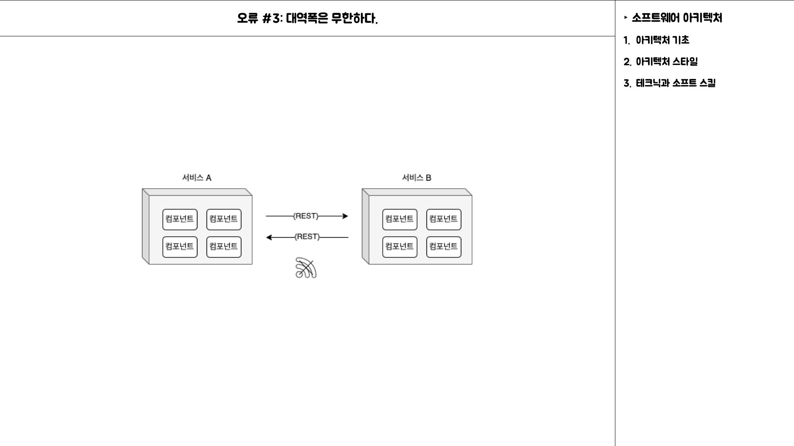

대역폭은 확 와 닿는 부분은 아니지만 책에 있는 내용을 보면 많이 분산된 서비스들의 경우 주고 받는 통신의 대역폭을 점유하게 되어 네트워크가 느려지고, 결국 레이턴시와 신뢰성에 영향을 주게 된다.

여기서 스템프 커플링이라는 용어가 등장하게 되는데 불필요한 정보까지 서로 주고 받다 보면 대역폭에 문제가 생길 수 있다는 내용이다.

그래서 해결할 수 있는 방법으로 몇 가지 제시한다.

- 프라이빗 REST API 엔드포인트를 둔다.
- 필드 셀렉터를 사용한다.
- GraphQL로 계약을 분리한다.
- 컨슈머 주도 계약과 값 주도 계약을 병용한다.
- 내부 메시징 엔드포인트를 사용한다.

결국에는 필요한 데이터만 주고 받아야 대역폭에 대한 부담을 줄일 수 있다.

### 2.9.2.4 오류 #4: 네트워크는 안전하다.

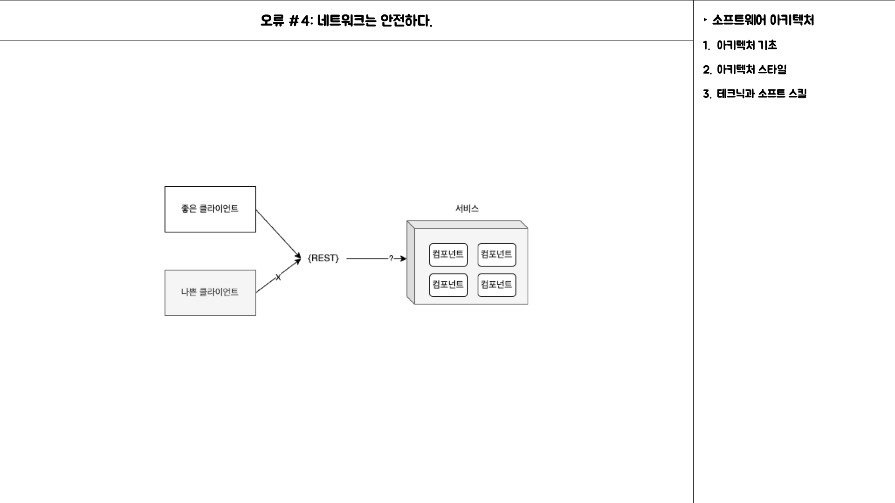

### 2.9.2.5 오류 #5: 토폴로지는 절대 안바뀐다.

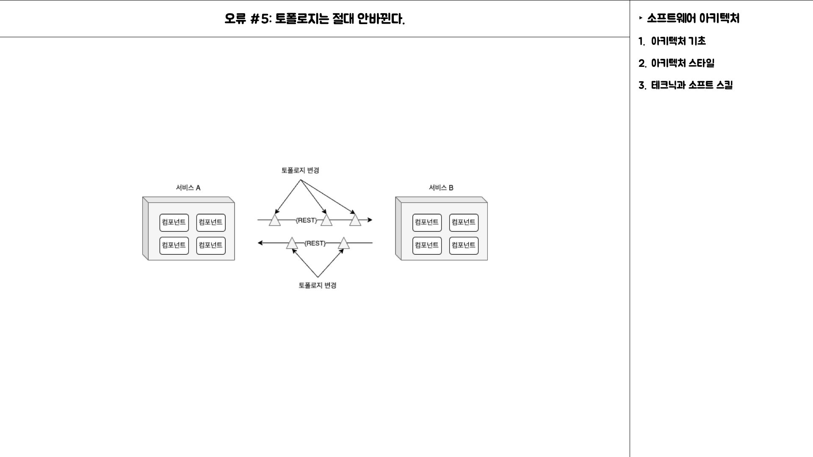

### 2.9.2.6 오류 #6: 관리자는 한 사람뿐이다.

### 2.9.2.7 오류 #7: 운송비는 0이다.

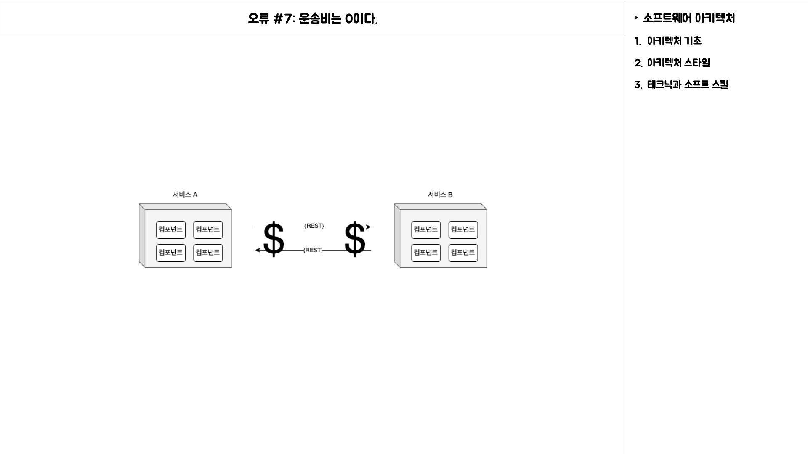

### 2.9.2.8 오류 #8: 네트워크는 균일하다.

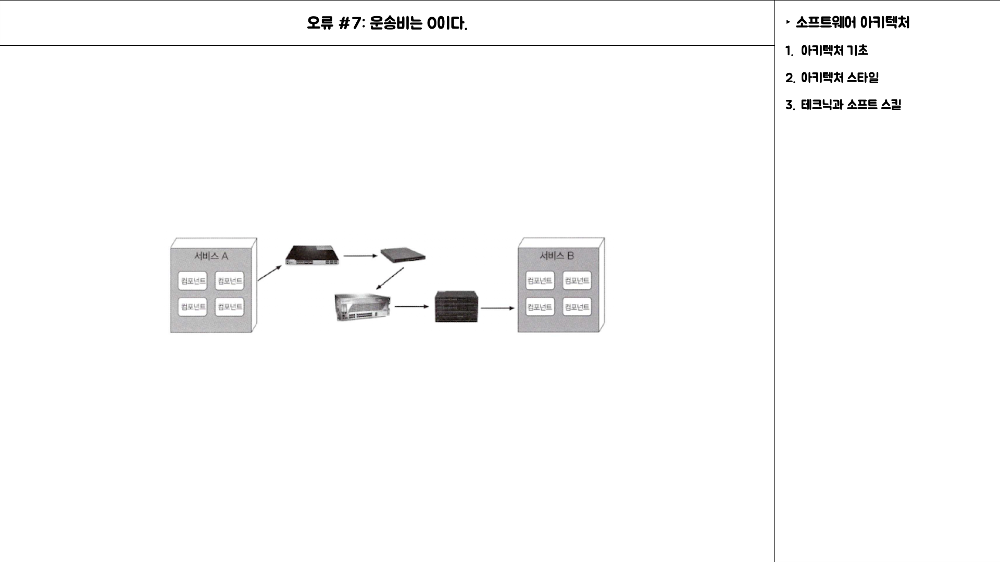

### 2.9.2.9 다른 분산 아키텍처 고려 사항

위에서 열거한 8가지 오류와 더불어, `모놀리식 아키텍`처에는 없지만 `분산 아키텍처`를 설계 할 때 맞닥뜨리게 될 이슈 및 해결해야 할 난제들이 존재한다.

> 분산 로깅

`분산 아키텍처`는 애플리케이션과 시스템 로그가 분산되어 있으므로 어떤 데이터가 누락된 근본 원인을 밝혀내기가 대단히 어렵고 시간도 많이 걸린다.

모놀리식 애플리케이션은 로그가 하나밖에 없어서 요청을 추적하여 이슈를 특정하기 쉽지만, 분산 아키텍처는 로그 종류만해도 수백가지에 달하고 위치도 제각각, 포맷도 제각각 이라서 문제를 집어내기가 참 어렵다.

스플렁크 같은 로깅 통합 도구를 사용하면 다양한 소스와 시스템에서 통합된 로그 및 콘솔로 데이터를 취합 할 수 있지만 복잡하기 그지없는 분산 로그를 확인하기에는 역부족이다.

> 분산 트랜잭션

모놀리식 아키텍처 세계에서 아키텍트, 개발자는 직관적이고 관리가 편한 트랜잭션을 당연시한다. 퍼시스턴스 프레임워크가 대신 실행하는 표준 커밋/롤백 기능은 ACID 트랜잭션을 걸어 업데이트 시 데이터 일관성과 무결성을 강제한다. 하지만 분산 아키텍처는 사정이 다르다.

분산 아키텍처는 최종 일관성 이라는 개념을 바탕으로 별도로 분리된 배포 단위에서 처리된 데이터를 미리 알 수 없는 어느 시점에 모두 일관된 상태로 동기화한다. 확장성, 성능, 가용성을 얻는 대가로, 데이터 일관성과 무결성을 희생하는 트레이드오프인 셈이다.

`분산 트랜잭션`을 관리하는 한 가지 방법으로 `트랜잭셔널 사가`가 있다.

사가는 보상을 위해 이벤트를 소싱하거나 트랜잭션 상태를 관리하기 위해 유한 상태 기계를 활용한다. 사가 외에 `BASE 트랜잭션`도 사용한다. `BASE`는 (BA)sic availability(기본가용성), (S)oft state(소프트상태), (E)ventual consistency(최종일 관성)의 약자입니다.

BASE 트랜잭션은 어떤 소프트웨어 조각이 아니라, 일종의 기법이다. 소프트 상태는 소스→ 타깃으로의 데이터 전달과 데이터 소스 간 비일관성을 말한다.

시스템 또는 서비스의 기본 가용성에 따라 시스템은 아키텍처 패턴과 메시징을 사용하여 결국 언젠가 일관되게 맞춰질 것이다.

> 계약 관리 및 버저닝

계약생성, 유지보수, 버저닝 역시 분산 아키텍처에서 다소 까다롭다. 계약은 클라이언트와 서비스 모두 합의한 행위와 데이터이다. 분산 아키텍처에서는 분리된 서비스와 시스템을 제각기 다른 팀과 부서가 소유하기 때문에 계약 유지보수가 특히 어렵습니다. 버전 구식화에 필요한 통신 모델은 더 더욱 복잡하다.