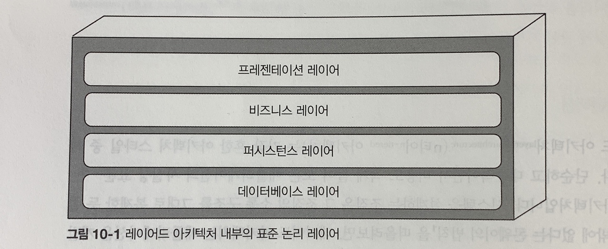
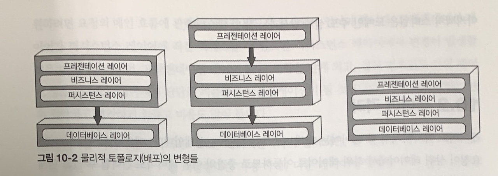
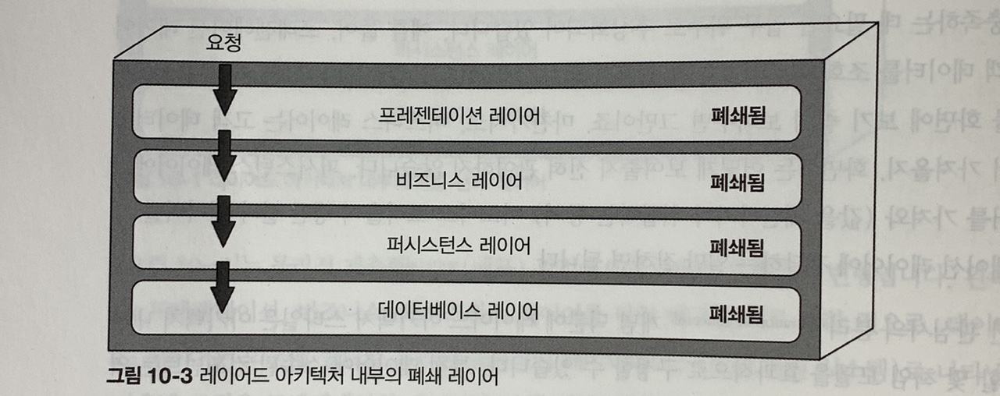
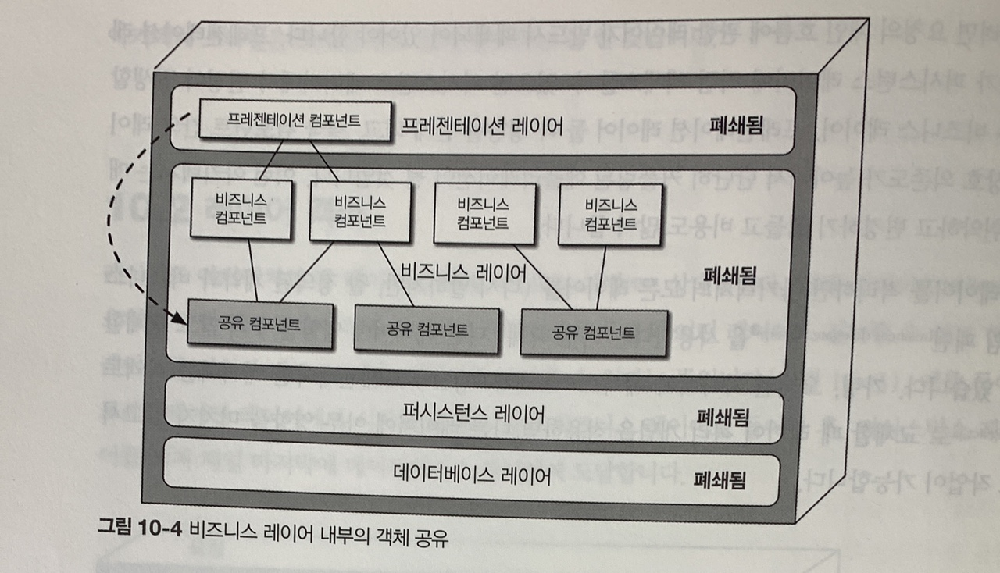
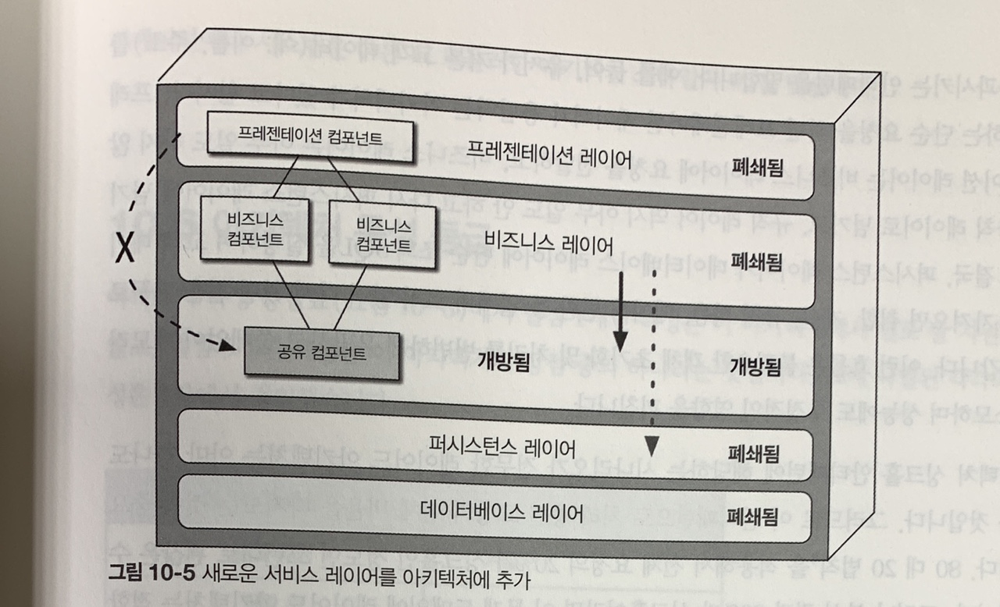

# 10장 레이어드 아키텍처 스타일
- 레이어드 아키텍처는 가장 흔한 아키텍처 스타일 중 하나
- 단순하고 대중적이면서 비용도 적게 들어 모든 애플리케이션의 사실상 표준 아키텍처
- 어떤 아키텍처 스일을 사용하는 게 좋을지 확신이 없을 때, 좋은 선택지가 될 가능성이 높음

## 10.1 토폴로지

- 내부 컴포넌트는 논리적으로 수평한 레이어들로 구성되며, 각 레이어는 애플리케이션에서 주어진 역할을 수행
- 일반적으로 프레젠테이션, 비즈니스, 퍼시스턴스, 데이터베이스의 4개 표준 레이어로 구성
- 컴포넌트를 도메인 단위로 묶는게 아니라, 아키텍처의 기술 역할(계층)에 따라 묶기 때문에 비즈니스 도메인이 각각 모든 레이어에 분산 됨 예) 고객 도메인은 프레젠테이션, 비즈니스 규칙, 데이터베이스 모든 레이어에 다 포함 됨
- 따라서, 도메인 주도 설계 방식과는 잘 맞지 않음

### 물리적 계층화(배포) 관점에서의 다양한 토폴로지 변형

1. 왼쪽 그림 : 프레젠테이션, 비즈니스, 퍼시스턴스 레이어를 단일 배포 단위로 합한 것으로, 데이터베이스 레이어는 외부에 별도로 분리된 물리적인 데이터베이스로 나타냄
2. 가운데 그림 : 프레젠테이션 레이어를 자체 배포 단위로 떼어내고 비즈니스 레이어와 퍼시스턴스 레이어를 두 번 째 배포 단위로 합한 것
3. 오른쪽 그림 : 데이터베이스 레이어를 포함한 4개 표준 레이어를 모두 단일 배포 단위로 뭉뜽그린 것. 데이터베이스가 내장돼 있거나, 인메모리 데이터베이스를 사용하는 소규모 애플리케이션에 적합한 구성

### 계층별 역할
- 프레젠테이션 레이어 : 모든 유저 인터페이스와 브라우저 통신 로직
- 비즈니스 레이어 : 요청을 받아 알맞은 비즈니스 규칙을 수행 

## 10.2 레이어 격리
- 폐쇄 레이어 : 요청이 상위 레이어에서 하위 레이어로 이동하므로 중간의 어떤 레이어도 건너뛸 수  없고 현재 레이어를 거쳐야 바로 그 다음 레이어로 나갈 수 있음.
- 개방 레이어 : 다른 레이어를 건너 뛰고 다음 레이어로 나갈 수 있음. (cf. 추월 차선 리더  패턴)

### 레이어 격리

- 어느 아키텍처 레이어에서 변경이 일어나도 다른 레이어에 있는 컴포넌트에 아무런 영향을 끼치지 않음
- 각 레이어는 서로 독립적으로 작동되므로 다른 레이어의 내부 작동 로직은 거의/전혀 알지 못함
- 레이어 격리를 지원하려면 요청의 메인 흐름에 관한 레이어가 반드시 폐쇄되어 있어야 함
- 레이어를 격리하면, 모든 레이어를 다른 레이어에 영향을 주지 않고 교체할 수 있음

## 10.3 레이어 추가
- 어떤 레이어는 개방하는 것이 더 합리적인 경우도 있음

- 프레젠테이션 레이어에서 비즈니스 레이어의 공통 비즈니스 기능을 구현한 객체를 직접 사용할 수 없도록 정한 경우, 위의 아키텍처에서는 프레젠테이션 레이어에서 공유 객체를 가져다 쓸 수 있고 지배/통제하기 어려운 아키텍처 구조

- 공유 비즈니스 객체가 포함된 새로운 서비스 레이어를 추가함으로써, 프레젠테이션 레이어가 직접 접근하지 못하도록 할 수 있음
- 하지만 새로 추가된 서비스 레이어는 개방 레이어로 설계해야 비즈니스 레이어가 지나갈 수 있음
- 레이어의 개방/폐쇄 여부를 정확히 문서화하여 소통해야 함

## 10.4 기타 고려 사항
- 아키텍처 스타일을 완전히 결정하지 못했다면, 레이어드 아키텍처는 좋은 출발점이 될 수 있음
- 아키텍처 싱크홀 안티패턴 : 요청이 한 레이어에서 다른 레이어로 이동할 때 각 레이어가 아무 비즈니스 로직도 처리하지 않고 그냥 통과 시키는 안티 패턴
- 아키텍처 싱크홀 안티패턴은, 불필요한 객체 초기화 및 처리를 빈번하게 유발하고 쓸데 없이 메모리를 소모하며 성능에도 부정적인 영향을 끼침으로 피해야 함
- 전체 요청의 20%가 싱크홀인 정도면 그런대로 괜찮은 수준이지만, 그 이상이 된다면 레이어드 아키텍처는 스타일이 아님
- 싱크홀 안티패턴을 해결하는 하나의 방법은, 모든 레이어를 개방하는 것이나, 그렇게 되면 아키텍처상 변경 관리의 어려움이 증가 함(격리가 되지 않기 때문)

## 10.5 왜 이 아키텍처 스타일을 사용하는가
- 처음 구축을 시작할 때, 예산과 일정이 빠듯한 경우 출발점으로 괜찮은 아키텍처
- 개발자, 아키텍트 모두 익숙하고 그리 복잡하지 않으며 어쩌면 비용도 가장 저렴한 아키텍처 스타일이므로 소규모 애플리케이션을 간편하게 개발할 수 있음
- 규모가 커질수록 유지 보수성, 민첩성, 시험성, 배포성 같은 아키텍처 특성이 점점 나빠짐

## 10.6 아키텍처 특성 등급
- 단순성 : 전체 비용과 단순성은 레이어드 아키텍처 스타일의 주요 강점
- 배포성 : 배포를 하려면 절차가 따가롭고 리스크가 높으며, 자주 배포할 수 없기 때문에 배포성은 떨어짐
- 시험성 : 단순한 3줄짜리 변경은 보통 수십 가지 다른 변경들 속에 파묻혀 배포 리스크가 한층 더 가중되어 시험성도 낮음. 하지만 컴포넌트를 모킹 또는 스터빙 할 수 있기 때문에 별점 2개
- 신뢰성 : 분산 아키텍처에서 일반적인 네트워크 트래픽, 대역폭, 레이턴시 문제는 덜 하므로 신뢰성은 보통이지만, 모놀로식 배포 속성상 배포 리스크 측면에서 점수가 낮음
- 탄력성, 확장성 : 모놀로식 배포와 아키텍처 측면에서 모듈성이 부족
- 성능 : 폐쇄적인 레이어 구조와 싱크홀 아키텍처 안티패턴 때문에 고성능 시스템에 어울리지 않음