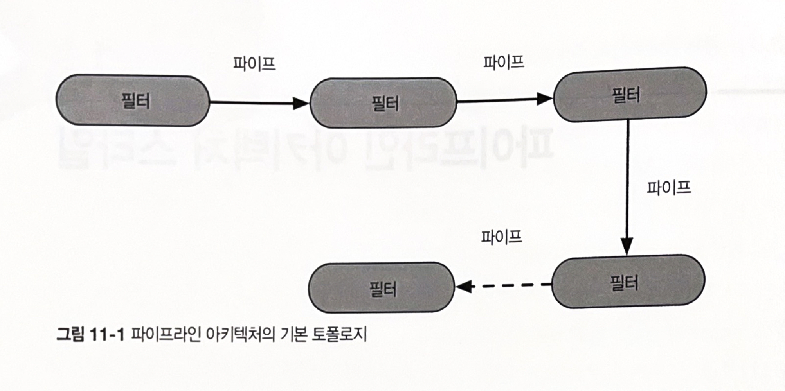
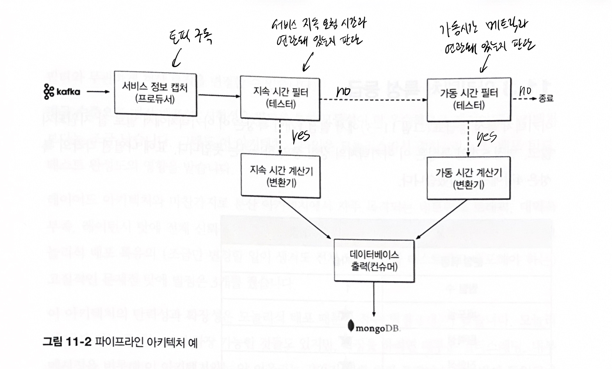

### Chapter 11 파이프라인 아키텍쳐 스타일

- 파이프

  - 한 소스에서 입력을 받아 다른 소스로 출력을 내는, 필터간 통신 채널
  - 성능 상 이유로 보통 단방향, 점대점 방식

- 필터

  - 자기 완비형(다른 서비스 호출x), 다른 필터와 독립적, 일반적으로 무상태성(상태를 보관x)
  - 한 가지 태스크만 수행한다. 복합 태스크는 여러 필터를 붙여서 처리함
  - 필터의 종류
    1. 프로듀서
       - 프로세스의 시작점
       - 아웃바운드만 있어서 소스라고도 함 (들어오는 트래픽은 없고 나가는 트래픽만 있기 때문)
    2. 변환기
       - 입력을 받아 변환 후 아웃바운드 파이프로 전달
       - 함수형 프로그래밍에서의 `map`
    3. 테스터
       - 입력을 받아 하나 이상의 기준에 대해 테스트를 하고 필요시 결과 생산
       - 함수형 프로그래밍에서의 `reduce`
    4. 컨슈머
       - 프로세스의 끝
       - 파이프라인 최종 결과를 데이터베이스에 저장하거나 유저 인터페이스 화면에 표시

- 예시

  - 전자 데이터 교환 도구, ETL(추출, 변환, 적재)도구, 아파치 카멜 등에서 쓰임

  - 다양한 서비스의 원격 계측 정보를 카프카에 스트리밍하는 예제

    

    - 이 예제는 파이프라인 아키텍쳐의 확장성을 잘 보여줌
    - 데이터베이스 접속 대기시간을 데이터베이스에 전달해야 할 경우 가동시간 필터 다음에 테스트 필터를 하나 추가하면 된다

- 파이프라인 아키텍쳐의 아키텍쳐 특성 등급

  - 전체 비용, 단순성 :+1: : 모놀리식에 가깝고 필터간에 독립적이기 때문에 분산 아키텍쳐에 비해 단순하고, 유지보수 비용도 적게 든다.
  - 배포성, 시험성 😐 : 간단한 변경에도 전체적으로 다시 배포해야함. 하지만 필터를 통한 모듈성이 더 우수하므로 레이어드 아키텍쳐보다는 조금 나음
  - 신뢰성 😐 : 분산 아키텍쳐에 비해 네트워크 트래픽, 대역폭, 레이턴시 문제는 덜함
  - 탄력성, 확장성 :-1: : 모놀리식 배포 때문에
  - 내고장성 :-1: : 모놀리식 배포 때문, 또 부족한 모듈성 때문. 어느 파트에 메모리 부족이 발생하면 어플리케이션 전체적으로 영향을 받음
