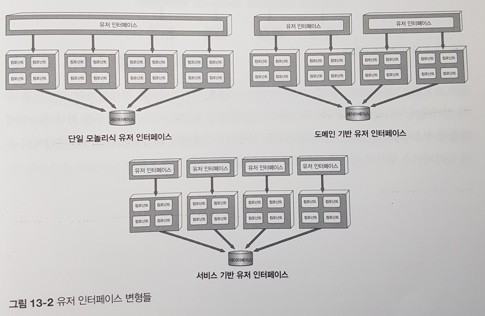

# 특징
- 마이크로 서비스 아키텍처 스타일의 일종
- 유연, 실용적
- 비교적 덜 복잡하고 비용이 적음
- 중앙 공유 데이터베이스를 사용

## 토폴로지
- 각각 때로 배포된 유저 인터페이스와 원격 서비스, 모놀리스 데이터베이스로 이루어진 대규모 분산 레이어 구조
- 프로토콜은 일반적으로 REST 가장 많이 사용하나, 메시징, RPC, SOAP 도 사용가능
- 유저 인터페이스는 대개 서비스 로케이터 패턴에 따라 유저 인터페이스, API 게이트웨이, 프록시에 내장된 유저 인터페이스를 직접 엑세스
  - 서비스 로케이터 패턴이란?
  - 런타임에 종속성을 주입
  - 
  - 출처: https://www.oracle.com/java/technologies/service-locator.html

## 토폴로지 변형
- 다양한 변형이 존재
- 유저 페이스가 1개 또는 여러개 가능(여러 도메인을 묶어서 유저인터페이스를 만들거나 하나의 도메인당 유저 인터페이스를 둘 수도 있음)
-  
  - (출처: 책 217쪽)
- **각 데이터베이스에 있는 도메인 데이터를 다른 도메인 서비스가 필요하지 않도록 설계** 하는 것이 중요!
--> 서비스간 상호 통신을 방지하고 데이터간 중복을 방지 가능
- 리버스 프록시나 게이트웨이로 구성된 API 레이어를 유저 인터페이스와 서비스 사이에 둘 수도 있음

## 서비스 설계 및 세분도
- 도메인 서비스를 레이어드 아키텍처 스타일로 설계하는 것이 일반적 (API 퍼사드 레이어, 비지니스 레이어, 퍼시스턴스 레이어)
- 서브 도메인을 이용해서 각 도메인 서비스를 분할하기도 함
- 서비스 기반 아키텍처
  - 내부 클래스 수준의 오케스트레이션
  - 커밋과 롤백이 어느정도 수반되는 ACID 데이터베이스 트랜잭션을 지원
  - 코드가 많이 배포될수록 문제 가능성(다소 큰 단위의 도메인 서비스 구성이므로)
- 마이크로서비스 아키텍처
  - 외부 서비스의 오케스트레이션
  - BASE 트랜잭션(Base-Availability, Soft state, Eventual consistency)
  - 각 서비스가 한가지 역할을 수행하므로 수정에 따른 다른 기능의 변경 가능성이 적음

## 데이터베이스 분할
- 서비스 기반 아키텍처에서 커스텀 공유 라이브러리에는
  - 데이터베이스 테이블 스키마를 나타낸 공유 클래스 파일(엔티티 객체) 
  - SQL 코드
  - => 테이블이 하나만 변경되도 전체를 배포해야하고 전체 서비스에 영향을 줌
- 데이터베이스의 변경 영향도와 리스크 낮추기
  - 데이터베이스를 **논리적으로 분할**하고, 연합 공유 라이브러리를 통해 명시
  - => 해당 공유 라이브러리를 사용하는 서비스에만 영향
- 서비스 기반 아키텍처에서는 데이터베이스 변경을 통제하기 위해 데이터 도메인을 올바르게 정의, 관리하고 데이터베이스는 가급적 논리적으로 잘게 나누는 것이 좋다!!

## 아키텍처 특성
- 서비스 기반 아키텍처는 **도메인 위주로 구성**된 아키텍처!
- 도메인 주도 설계와 잘 맞음
- 가장 구현하기 쉽고 비용면에서도 효율적인 분산 아키텍처

- 도메인 별로 테스트 가능 및 배포 가능
- 도메인 별로 개별적인 확장성이 가능함 => 확장성
- 내부 테이터(내부 네트워크망에서만 접속)와 기능을 외부 작업과 분리된 별도의 네트워크 영역에서 접근 가능 => 보안성
- 도메인 서비스가 굵직한 편이라 분산 트랜젝션이 적음 => (다른 분산 아키텍처에 비해) 신뢰성이 높음, 정교한 조율이 덜 필요함
- 장점: 민첩성, 시험성, 배포성, 확장성, 내고장성, 보안, 신뢰성
- 퀀텀은 1개 또는 그 이상(예시: 외부에서 고객상대 퀀텀, 내부 운영 퀀텀 => 2개)
- 서비스를 나누는 단위가 비교적 큰 편이므로 마이크로 서비스보다 확장성과 탄력성은 다소 떨어질 수 있음(별 2~3개)
