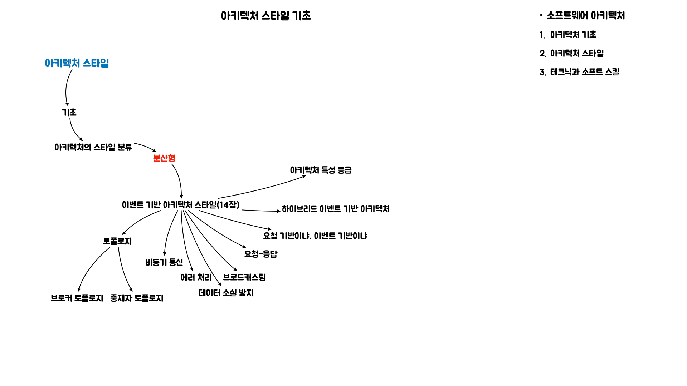

## Intro

`이벤트 기반 아키텍처`는 확장성이 뛰어난 고성능 애플리케이션 개발에 널리 쓰이는 `비동기 분산 아키텍처 스타일`이다. 적응성이 아주 좋아서 소규모 애플리케이션부터 크고 복잡한 애플리케이션까지 두루 사용할 수 있다.
`이벤트 기반 아키텍처`는 이벤트를 동기 수신/처리하는 별도의 `이벤트 처리 컴포넌트`들로 구성되며, 스탠드얼론 아키텍처 스타일 로 사용하거나 다른 아키텍처 스타일(예:이벤트 기반 마이크로 서비스 아키텍처)에 내장할 수도 있다.

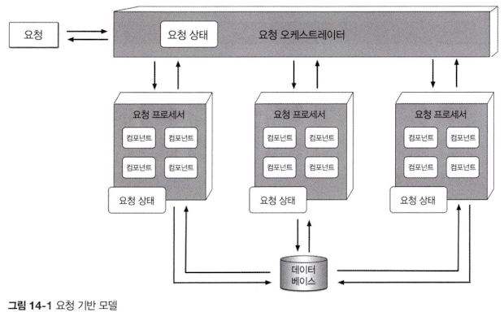

애플리케이션은 대부분 `요청 기반 모델`을 따른다.

1. 이 모델은 어떠한 액션을 수행하도록 시스템에 `요청`을 하면 `요청 오케스트레이터`가 접수한다.
	- `요청 오케스트레이터`는 보통 유저 인터페이스이지만 API 레이어나 엔터프라이즈 서비스 버스로도 구현할 수 있다.
2. 이 컴포넌트의 임무는 다양한 `요청 프로세서`에게 확정적 & 동기적으로 요청을 전달하는 역할을 담당한다.
	- `요청 프로세서`는 요청을 받아 데이터베이스에서 정보를 조회/수정하는 등의 작업을 수행하는 식으로 요청을 처리한다.

> ex) 어느 시스템에서 `유저`가 지난 반년치 `주문 이력`을 검색하는 경우

- `요청 기반 모델`에서의 주문 이력 조회
	- 특정한 컨텍스트에서 시스템에 데이터를 달라고 전달된, `데이터 기반의 확정적인 요청`이지, `시스템이 반응해야 할 이벤트`가 발생한 것은 아니다.

> ex) 온라인 경매 사이트에서 `입찰자`가 어떤 품목에 입찰을 하는 경우

- `이벤트 기반 모델`은 특정한 상황에 대응하여 그 이벤트에 알맞게 액션을 취한다.
	- `입찰하는 행위`는 시스템에 요청하는 것 처럼 보일 수도 있지만, `현재 가격이 발표된 직후에 발생하는 이벤트에 더 가깝다.`
	- 시스템은 이 이벤트에 반응함으로써 `동시 발생한` `다른 입찰가와 비교` 후 현재까지 `누가 가장 높은 가격`을 부른 입찰자인지 결정해야 한다.

---

## 2.14.1 토폴로지

`이벤트 기반 아키텍처`의 주요 토폴로지는 `중재자 토폴로지`와 `브로커 토폴로지`로 구분할 수 있다.

- `중재자 토폴로지`
	- 이벤트 처리 워크플로를 제어해야 하는 경우
- `브로커 토폴로지`
	- 신속한 응답과 동적인 이벤트 처리 제어가 필요한 경우

두 가지 아키텍처 특성과 구현 전략은 서로 다르기 때문에 `주어진 상황`에 가장 알맞은 것을 선택하기 위해 `각각의 특징에 대해서 잘 이해`해야 한다.

---

### 2.14.2 브로커 토폴로지

브로커 토폴로지는 중앙에 `이벤트 중재가가 없다는 점`에서 중재자 토폴로지와 다르다.

메시지(RabbitMQ, ActiveMQ, HornetQ 등) `경량 메시지 브로커`를 통해 `브로드캐스팅`되는 식으로 `이벤트 프로세서 컴포넌트`에 분산되어 흘러간다. 이러한 동작방식으로 비교적 이벤트 처리 흐름이 단순하고, 굳이 중앙에서 이벤트를 조정할 필요가 없는 경우 유용하다.

> `브로커 토폴로지`의 `구성요소`

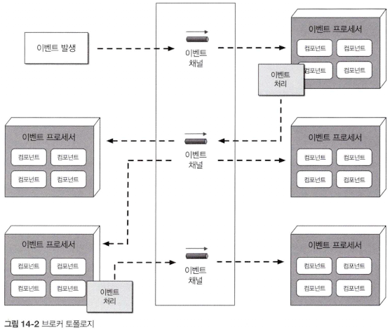

네 가지 기본 아키텍처 컴포넌트, 즉 `시작 이벤트`, `이벤트 브로커`, `이벤트 프로세서`, `처리 이벤트`로 구성된다.

1. `시작 이벤트`
	- 단순한 이벤트든, 복잡한 이벤트든 전체 이벤트 흐름을 개시하는 이벤트를 말한다.
	- 시작 이벤트는 이벤트 브로커의 이벤트 채널로 전송되어 처리된다.
2. `이벤트 브로커`
	- 시작 이벤트로부터 특정 이벤트를 전달받아 이벤트 채널을 통해 이벤트 프로세서에 전달하는 역할
3. `이벤트 프로세서`
	- 이벤트를 관리 / 제어하는 중재자가 브로커 토폴로지에 없으므로 `단일 이벤트 프로세서`는 이벤트 브로커에서 시작 이벤트를 받자마자 관련된 처리 작업을 마친 뒤 `처리 이벤트`를 생성하고 시스템의 나머지 부분에 자신이 한 일을 비동기로 알린다.
4. `처리 이벤트`
	- 처리 이벤트는 필요시 부가적인 처리를 위해 `이벤트 브로커`에 `비동기 전송`된다.
5. `이벤트 프로세서`
	- 그 외의 이벤트 프로세서는  리 이벤트를 리스닝하고 있다가 이벤트가 들어오면 그에 맞는 작업을 수행 후 다시 새로운 처리 이벤트를 발생함으로써 처리한 내용을 모두에게 알린다.

위 과정은 `최종 이벤트 프로세서`가 한 일에 아무도 관심이 없을 때까지 반복된다.

---

> `이벤트 브로커 컴포넌트`

보통 연합체(도메인 기반으로  클러스터링된 다수의 인스턴스)로 구성되며, 연합된 각 브로커에는 주어진 도메인의 이벤트 흐름에서 사용되는 모든 이벤트 채널이 들어있다.

> `브로커 토폴로지`

브로커 토폴로지는 속성상 파이어 앤드 포겟 방식으로 `비동기 브로드캐스팅`을 하므로 `토픽`(AMQP는 토픽 익스체인지)은 일반적으로 `발행-구독 메시징 모델`을 사용하는 `브로커 토폴로지`에서 사용된다.

브로커 토폴로지에서는 다른 이벤트 프로세서의 관심 여부와 무관하게 각 `이벤트 프로세서`가 `자신이 한 일을 모두에게 알리는 것`이 항상 바람직하다.

그래야 나중에 이벤트를 처리하는 과정에서 기능 추가가 필요하게 될 때 쉽게 확장할 수 있다.

> ex) 복잡한 이벤트 처리과정의 일부로 고객에게 작업 내역을 이메일로 발송하는 경우

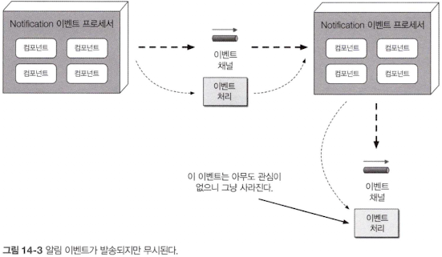

1. Notification `이벤트 프로세서`는 이메일을 만들어 보낸 뒤, 새로운 `처리 이벤트`를 `토픽`에 발행함으로써 나머지 시스템에 이 액션을 통보
2. 다른 이벤트 프로세서는 해당 `토픽`의 이벤트를 수신하지 않으므로 메시지는 사라짐

`아키텍처 확장성의 좋은 사례`로 어차피 `무시될 메시지를 보내는 것`이 리소스 낭비가 아니다. 만약, 나중에 고객에게 발송된  이메일을 분석하는 새로운 요구사항이 생기는 경우, 이메일 정보는 이미 이메일 토픽 안에 들어 있으니 따로 인프라를 추가하거나 다른 이벤트 프로세서를 변경하지 않아도 최소한의 작업으로 전체 시스템에 필요한 이메일 분석 `이벤트 프로세서를 추가`할 수 있다.

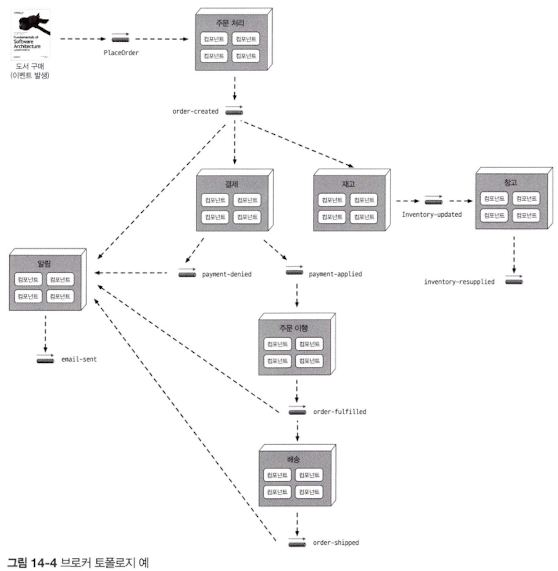

> ex) 주문 입력 시스템에서 이벤트가 처리되는 흐름

1. OrderPlacement `이벤트 프로세서`
	- `어떤 품목(도서)에 주문이 접수`를 시작으로 `시작 이벤트(PlaceOrder)`를 리스너
	- 데이터베이스 테이블에 주문을 삽입
	- 다음 고객에게 주문 ID를 반환
	- 자신이 주문을 생성했음을 order-created `처리 이벤트`를 통해 나머지 `프로세서에 통보`
	- order-created 처리 이벤트에 관심 있는 이벤트 프로세서는 Notification, Payment, Inventory
	- 모두 각자의 임무를 나란히 수행(병렬 처리)
2. `Notification 이벤트 프로세서`
	- `Notification 이벤트 프로세서`는 order-created 처리 이벤트를 접수
	- 고객에게 이메일을 보냄
	- 또 다른 처리 이벤트(email-sent)를 생성
3. 추후 이벤트 프로세서 개발(확장성)
	- 지금 당장 이벤트를 리스닝하는 이벤트 프로세서가 없지만, 나중에 다른 이벤트 프로세서가 이벤트를 받아 활용할 수 있는 일종의 걸쇠(hook)를 장치한 것
4. `Inventory 이벤트 프로세서`
	- Inventory 이벤트 프로세서도 order-created 처리 이벤트를 받아 해당 품목의 재고를 차감
	- inventor-updated 처리 이벤트를 통해 자신이 완료한 작업을 알림
5. `Warehouse 이벤트 프로세서`
	- Warehouse 이벤트 프로세서는 inventory-updated 이벤트를 받아 창고 간 재고 상태를 관리
	- 재고 부족 시 해당 품목을 재 주문
6. `Payment 이벤트 프로세서`
	- Payment 이벤트 프로세서 order-created 처리 이벤트를 받아 방금 주문한 고객의 신용 카드를 결제 처리
	- 작업을 끝낸 후 두 가지 이벤트를 생성
		- 결제가 완료되었음을 나머지 시스템에 알리는 이벤트(payment-applied)
		- 승인 거절됐음을 나머지 시스템에 알리는 이벤트(payment-denied)
7. `Notification 이벤트 프로세서`
	- payment-denied 처리 이벤트에 관심
	- 신용카드 승인 거절 시 고객이 신용카드 정보를 업데이트하거나 다른 방법으로 결제하도록 이메일로 유도
8. `OrderFulfillment 이벤트 프로세서`
	- payment-applied 처리 이벤트를 받아 오더 피킹과 포장 작업을 수행
	- 작업을 마친 후 order-fulfilled 처리 이벤트를 발행해서 주문이 이행됐음을 나머지 시스템에 알림
	- 해당 이벤트는 Notification 이벤트 프로세서, Shipping 이벤트 프로세서가 수신
9. `Notification 이벤트 프로세서`
	- 주문 접수 후 배송 준비가 완료됐음을 고객에게 알림
10. `Shipping 이벤트 프로세서`
	- 적절한 배송방법을 선택 후 주문을 배송, order-shipped 처리 이벤트를 발행
11. `Notification 이벤트 프로세서`
	- 고객에게 `주문 상태가 변경`되었음을 알림

브로커 토폴로지는 이벤트 프로세서는 이베트를 전달 후 더 이상 그 이벤트 처리에는 관여하지 않고 다른 시작 이벤트 또는 처리 이벤트에 반응할 준비를 한다. 또한 각 이벤트 프로세서는 이벤트 처리 도중 가변적인 부하나 백업 조건을 처리하기 위해 서로 독립적으로 확장할 수 있다.

만약 어떤 환경 문제로 인해 이벤트 프로세서가 느려지거나 실패하면 그 프로세서가 구독하는 토픽이 배압 지점(back pressure)이 된다.

---

브로커 토폴로지는 성능, 응답성, 확장성 측면에서 장점이 많이 있지만, 그만큼 단점도 적지 않다.
무엇보다 시작 이벤트와 연관된 전체 워크플로를 제어할 수가 없다. 따라서 다양한 조건에 따라 상황이 매우 유동적이고, 어느 시스템 파트도 실제 주문 트랜잭션이 언제 끝났는지 알 수 없다. 에러 처리 역시 어렵다.

비즈니스 트랜잭션을 관찰/통제하는 중재자가 없으므로 처리가 실패해도(예: Payment 이벤트 프로세서가 다운돼서 할당된 작업을 완료하지 못함) 다른 파트는 그 사실을 알 수 없다.

결국에는 `비즈니스 프로세스`는 교착 상태에 빠지고 자동이든 수동이든 뭔가 다른 조치를 해주지 않으면 프로세서는 정체된다. 이런 에러가 발생하는 것과는 상관없이 다른 프로세서는 알아서 작동한다.

이를테면, 재고를 차감하는 Inventory 이벤트 프로세서 등 다른 모든 이벤트 프로세서는 마치 `아무 일도 일어나지 않은 것처럼 정상적으로 이벤트에 반응하면서 각자 할 일을 한다.`

- 브로커 토폴로지의 장단점

| 장점               | 단점       |
|------------------|----------|
| 이베트 프로세서가 디커플링 됨 | 워크플로 제어  |
| 확장성이 높음          | 에러 처리    |
| 응답성이 우수함         | 복구성      |
| 성능이 우수함          | 재시작 능력   |
| 내고장성이 뛰어남        | 데이터 비일관성 |

### 2.14.3 중재자 토폴로지

`중재자 토폴로지`는 `브로커 토폴로지`의 단점들을 일부 보완한다. 여러 이벤트 프로세서 간의 조정이 필요한 `시작 이벤트`에 대하여 워크플로를 관리/제어하는 이벤트 중재자가 핵심이다.

`중재자 토폴로지`는 `시작 이벤트`, `이벤트 큐`, `이벤트 중재자`, `이벤트 채널`, `이벤트 프로세서` 등 5개 아키텍처 컴포넌트로 구성 된다.

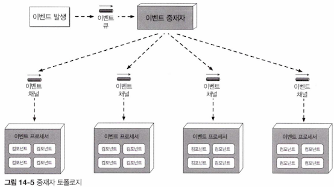

> `중재자 토폴로지`와 `브로커 토폴로지`의 차이점

- 시작 이벤트가 전체 이벤트 프로세스를 개시하는 이벤트인 점은 `브로커 토폴로지와 동일`하지만, 중재자 토폴로지에서는 시작 이벤트 큐를 거쳐 이벤트 중재자로 전달되는 차이점이 있다.
- 이벤트 중재자는 이벤트 처리에 관한 단계 정보만 갖고 있으므로 점대점 메시징으로 각각의 이벤트 채널(대부분 큐)로 전달되는 처리 이벤트를 생성한다. 각 이벤트 프로세서는 자신의 이벤트 채널에서 이벤트를 받아 처리한 뒤 중재자에게 작업을 완료했다고 응답한다.
- `이벤트 프로세서가 다른 프로세서에게 자신이 한 일을 알리지 않는 것`도 브로커 토폴로지와 다른점이다.

> 중재자 토폴로지의 장점

- 중재자 토폴로지 구현체에는 대부분 특정 도메인이나 이벤트 그룹과 연관된 중재자가 여럿 존재하므로 토폴로지의 단일 장애점(SPF, Single Point of Failure)을 줄이고 전체 처리량과 성능을 높일 수 있다.
- 예를 들면 전체 고객에 관한 이벤트는 고객 중재자가 처리하게 하고, 주문 관련 이벤트는 주문 중재자가 처리하게 하는 식이다.

> 이벤트 중재자의 다양한 구현 방식

이벤트 중재자는 처리하는 이벤트의 `특성`과 `복잡도`에 따라서 다양한 방법으로 구현할 수 있다.

간단한 에러 처리와 오케스트레이션이 필요한 이벤트는 아파치 카멜, 뮬, ESB, 스프링 인티그레이션 등의 중재자로도 충분하다. 보통 이러한 중재자는 `이벤트 워크플로`를 `프로그래밍 코드로 제어`한다.

이벤트 워크 플로에 조건부 처리가 많고 동적 경로가 많아 에러 처리가 복잡한 경우 이벤트 처리 단계를 기술할 수 있는 솔루션을 사용하는 것이 좋고, 에러 처리 리다이렉션, 멀티 캐스팅 기능을 하는 요소들을 포함하는 솔루션 사용하는 것이 좋다.

알맞은 이벤트 중재자 구현체를 선택하기 위해서는 먼저 중재자를 통해 어떤 종류의 이벤트를 처리할 것인지 고민해야 한다.

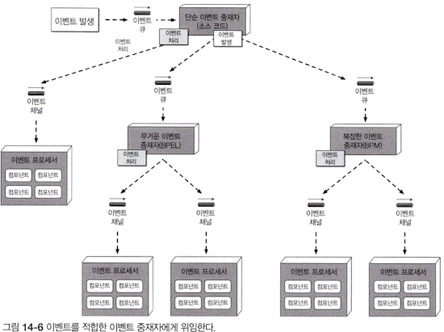

이벤트 복잡도를 한 가지 기준으로 평가하는 경우는 거의 없으므로 알기 쉽게 단순함, 어려움, 복잡함 정도로 분류한 뒤 모든 이벤트가 항상 단순한 중재자를 거치도록 하는 것이 좋다. 그러면 이 중재자는 이벤트 등급에 따라 이벤트를 직접 처리하거나 더 복잡한 다른 이벤트 중재자에게 위임한다. 이런 식으로 모든 종류의 이벤트를 그에 알맞은 중재자가 효과적으로 처리할 수 있도록 구성한다.

> 단순한 이벤트 워크플로

단순 중재자로 처리할 수 있는 경우 Simple Event Mediator가 처리 이벤트를 생성하여 전달

> 복잡한 이벤트 워크플로

시작 이벤트가 어려움 또는 복잡함 등급으로 분류되는 경우 시작 이벤트를 무거운 & 복잡한 이벤트 중재자로 바로 넘긴다.

Simple Event Mediator는 원 이벤트를 가로채 해당 이벤트의 완료 시점을 알아내거나, 전체 워크 플로를 다른 중재자에게 위임하는 등의 일을 한다.

---

> 서점 주문 입력 이벤트를 중재자 토폴로지에서 처리하는 방법

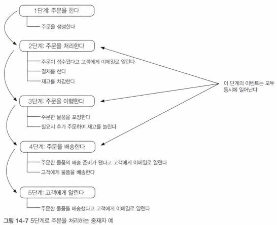

브로커 토폴로지와 동일하게 시작 이벤트(PlaceOrder)를 customer-event-queue로 흘려 처리를 개시한다.

Customer 중재자는 시작 이벤트를 받아 처리 이벤트를 생성하는데 2, 3, 4 단계의 처리 이벤트는 모두 동시에 발생하면서 단계별로 처리된다.

3단계(주문 이행)는 4단계(주문 배송)에서 배송 준비가 끝나 고객에게 알림을 보내기 전에 반드시 완료되어 확인응답을 받아야 한다.

> 1단계 이벤트 발행

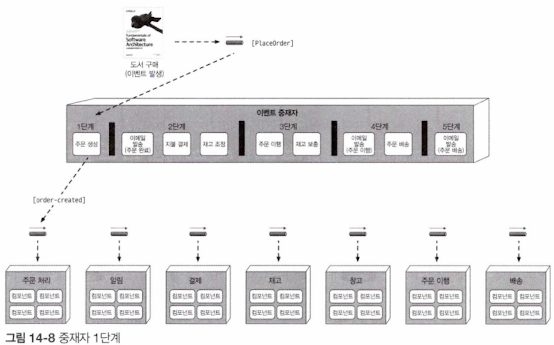

- 시작 이벤트를 접수한 `Customer 중재자`는 먼저 create-order 처리 이벤트를 생성하고, 이 메시지를 order-placement-queue로 보낸다.
- OrderPlacement 이벤트 프로세서는 이 이벤트를 받아 문제가 없는지 확인한 뒤 주문 ID와 함께 중재자에게 확인응답을 한다.
- 중재자는 (주문 처리 비즈니스 규칙에 따라) 해당 주문 ID를 바로 고객에게 보내 주문 접수 사실을 알릴 수도 있고, 모든 단계가 완료될 때까지 계속 진행할 수도 있다.

> 2단계 이메일 발송, 지불 결제, 재고 조정 로직 처리

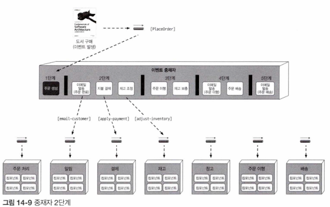

- email-customer, apply-payment, adjust-inventory를 동시에 만들어 각각 지정된 큐로 전달
- Notification, Payment, Inventory 세 이벤트 프로세서는 모두 메시지를 받아 해야 할 일을 한 다음 처리가 완료되었음을 중재자에게 알린다.
- 중재자는 다음 3단계로 이동하기 전에 3개의 병렬 프로세스로부터 모두 확인응답을 받을 때까지 대기하는데, 어느 곳에서라도 에러가 발생하는 경우 중재자는 문제해결을 위한 조치를 취할 수 있다.

> 3단계

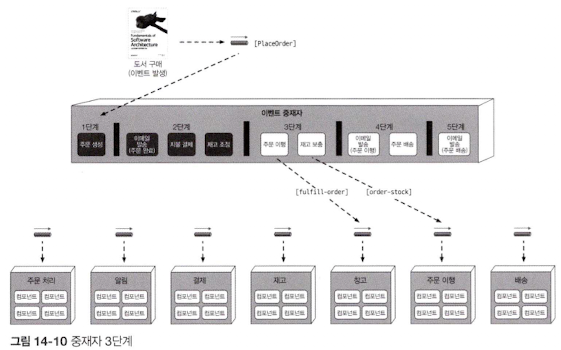

- 세 이벤트로부터 정상 확인응답을 받은 중재자는 3단계로 넘어가 주문을 이행
- 이 때 fulfill-order, order-stock 두 이벤트는 동시에 발생할 수 있고, OrderFulfilment, Warehouse 이벤트 프로세서는 이 두 이벤트를 받아 각자 해야 할 일을 하고 중재자에게 확인응답

> 4단계

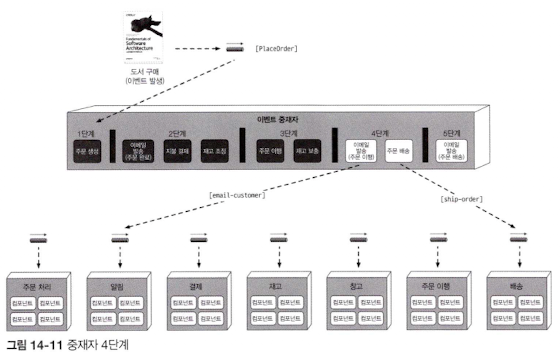

- 이벤트 처리가 완료되면 중재자는 4단계로 넘어가 주문을 배송한다.
- ship-order 이벤트 뿐만 아니라, 다음에 해야 할 일에 관한 정보가 담긴 email-customer 처리 이벤트도 함께 생성한다.

> 5단계

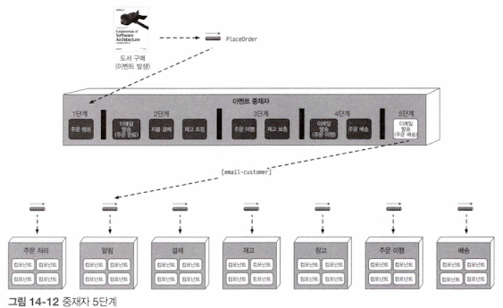

- 중재자는 5단계로 넘어가 email-customer 이벤트를 하나 더 생성한 뒤 주문이 배송되었음을 고객에게 알린다.
- 워크플로는 완료되고, 중재자는 시작 이벤트 흐름을 완료로 마킹한 뒤 시작 이벤트와 연관된 상태를 모두 삭제 한다.

중재자 컴포넌트는 브로커 토폴로지와는 달리 워크플로에 대해 잘 알고 있고 통제가 가능하다는 점에서 이점이 있다. 중재자는 워크플로를 제어하므로 `이벤트 상태를 유지`하면서 필요 시 `에러처리`, `복구`, `재시작`을 할 수있다.

예를들어, 고객 신용카드가 만료되어 결제 처리가 안되었다면 이 에러 사실을 통보 받은 중재자는 결제 처리가 완료될 때까지 주문을 이행할 수 없다는 사실을 알고 있기 때문에 워크플로를 중단시킨 후 자체 데이터 저장소에 요청 상태를 기록한다. 나중에 언젠가 결제 처리가 완료되면 중단된 지점부터 워크플로를 다시 시작하면 된다.

> 두 토폴로지의 처리 이벤트의 의미와 사용방법 차이

`브로커 토폴로지`에서는 시스템에서 발생한 이벤트로서 처리 이벤트가 발행되고, 이벤트 프로세서는 각자 맡은 일을 하면서 나머지 이벤트 프로세서는 그 액션에 반응하는 식으로 돌아간다.

`중재자 토폴로지`에서 place-order, send-email, fulfill-order 같은 처리 이벤트는 사건(이미 일어난 일)이 아니라 커맨드(일어나야 할 일)이다.

따라서 `중재자 토폴로지`에서는 `처리 이벤트`가 반드시 처리되어야 할 이벤트(커맨드)인 반면, `브로커 토폴로지`에서는 그냥 무시해도 된다.

중재자 토폴로지는 브로커 토폴로지에서 불가능한 문제를 해결할 수 있지만 그만큼 부정적인 요소도 있다.

첫째, 복잡한 이벤트 흐름 내에 발생하는 동적인 처리를 선언적으로 모델링하기가 매우 어렵다.

- 보통은 중재자의 내부 워크 플로는 일반적인 처리만 하고 복잡한 이벤트 처리는 변화무쌍한 부분은 중재자 + 브로커 형태의 하이브리드 모델로 처리한다.

둘째, 이벤트 프로세서는 브로커 토폴로지와 동일한 방식으로 쉽게 확장할 수 있지만, 그렇게 되면 중재자도 함께 확장해야 하므로 전체 이벤트 처리 흐름에 병목 지점이 생기기 쉽다.

셋째, 중재자 토폴로지는 이벤트 처리를 중재자가 제어하므로 이벤트 프로세서가 상대적으로 더 많이 커플링되어 성능은 브로커 토폴로지보다 좋지 않다.

- 중재자 토폴로지의 장단점

| 장점      | 단점             |
|---------|----------------|
| 워크플로 제어 | 이벤트 프로세서가 커플링됨 |
| 에러 처리   | 확장성 낮음         |
| 복구성     | 성능 낮음          |
| 재시작 능력  | 내고장성 좋지 않음     |
| 데이터 일관성 | 워크플로 모델링 복잡함   |

브로커 토폴로지냐, 중재자 토폴로지냐, 결국 워크플로 제어와 에러 처리 기능이 우선인가, 아니면 고성능 확장성이 더 중요한가의 트레이드오프를 잘 따져 선택할 수 밖에 없다.

중재자 토폴로지의 성능과 확장성도 그리 나쁜편은 아니지만 브로커 토폴로지 만큼은 못하다.

## 2.14.4 비동기 통신

`이벤트 기반 아키텍처 스타일`은 (이벤트 컨슈머의 응답을 받아야 하는) 요청/응답 처리뿐만 아니라(응답이 필요 없는)파이어 앤드 포겟 처리 모두 비동기 통신만 사용한다는 점에서 다른 아키텍처 스타일과 차별화 된다.
비동기 통신은 시스템 응답성을 전반적으로 높이는 강력한 기법으로 활용 할 수 있다.

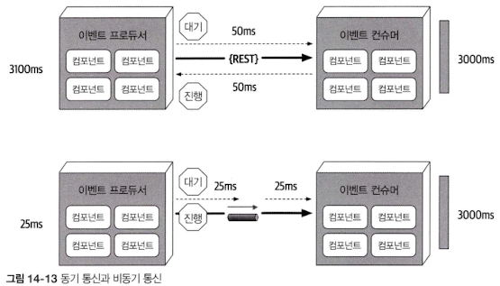

예를 들어, 유저가 작성한 제품 후기를 댓글로 게시하는 웹사이트의 프로세스를 확인한다고 할 때, 댓글 서비스는 여러 파싱 엔진을 거치는데, 보통 댓글 하나를 게시하려면 3,000밀리초가 걸린다고 한다.

REST로 동기 호출을 하면, 서비스가 댓글을 수신하는데 50밀리초, 댓글을 게시하는 데 3,000밀리초, 댓글이 등록됐음을 유저에게 응답하기까지 네트워크 지연 시간이 50밀리초 소요되어 유저가 댓글을 게시하는 데 총 3,100밀리초의 응답 시간이 걸린다.

메시지를 비동기 전송하면, 최종 유저 입장에서 웹사이트에 댓글을 게시하는 데 소요된 25밀리초밖에 안걸린다. 물론, 실제로 댓글을 게시하려면 여전히 3,025밀리초 (메시지 수신에 25밀리초, 댓글 게시에 3,000밀리초)가 걸리지만 최종 유저 관점에서는 이미 댓글의 처리가 완료된 셈이다.

이 부분은 응답성과 성능의 차이점을 잘 보여주는 예시이다. 유저가 굳이 어떤 정보를 돌려받을 필요가 없으면 기다리게 할 이유 또한 없다.

- 응답성은 어떤 액션이 접수되어 곧 처리될 것이라는 사실을 유저에게 알리는 것
- 성능은 종단간 프로세스가 더 빨리 수행되게끔 만드는 것

댓글 서비스는 텍스트를 처리하는 방식을 최적화하는 어떤 일도 수행하지 않기 때문에 3,000 밀리초는 어느 쪽이든 똑같이 걸린다.

만약에 성능에 손을 댄다거나 캐시나 그와 유사한 기술을 적용해서 모든 텍스트와 문법 파싱 엔진이 병렬 실행되도록 댓글 서비스를 최적화했을 것이다.

위 내용은 결국 전반적인 응답성을 개선한 것이다.

응답 시간은 각각 3,100밀리초, 25밀리초로 크게 차이가 난다. 여기서 고민해볼 문제가 있다.

1. 동기 호출은 댓글이 게시되었음을 최종 유저에게 보장한다.
2. 비동기 호출은 언젠가 댓글이 게시될 예정이라는 미래의 약속과 함께 확인 응답을 받은 것 뿐이다.

최종 유저 입장에서는 댓글의 게시가 이미 끝난 것처럼 보이지만, 댓글에 비속어 등이 포함되어 있는 경우 댓글 게시는 거부되고 최종 유저에게 돌아갈 방법 또한 없다.

`비동기 통신에서는 에러 처리가 가장 큰 문제`이다. 응답성은 엄청나게 개선되지만 에러를 제대로 처리하기 쉽지 않기 때문에 이멘트 기반 시스템의 복잡도가 가중된다.

이러한 문제도 `워크플로 이벤트 패턴`을 통해 `리엑티브 아키텍처 패턴`으로 해결할 수 있다.

## 2.14.5 에러 처리

`리엑티브 아키텍처의 워크플로 이벤트 패턴`은 비동기 워크플로에서 에러 처리 문제를 해결하는 한 가지 방법으로  `탄력성`과 `응답성`이라는 두 마리 토끼를 겨냥한 `리엑티브 아키텍처 패턴`의 일종이다.

즉, 시스템을 `응답성에 영향을 미치지 않고` 탄력적으로 에러를 처리할 수 있도록 하는 패턴이다.

`워크플로 이벤트 패턴`은 `워크플로 대리자`를 통해 위임, 봉쇄, 수리 작업을 한다. `이벤트 프로듀서`는 메시지 채널을 통해 데이터를 `이벤트 컨슈머`에게 비동기 전송하고, `이벤트 컨슈머`가 데이터를 처리하는 도중 에러가 발생하면 즉시 해당 에러를 `워크플로 프로세서`에게 위임한 뒤 `이벤트 큐`에 있는 다음 메시지로 넘어간다.

이렇게 에러가 발생해도 바로 다음 메시지를 바로 처리하므로 `전체 응답성은 영향을 받지 않는다`. 만약 이벤트 컨슈머가 손수 에러를 해결하느라 시간을 소비 한다면 그동안 큐에 있는 다음 메시지는 읽지 않기 때문에 처리 대기중인 나머지 메시지의 응답성도 영향을 받는다.

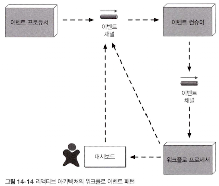

`에러를 수신한 워크플로 프로세서`는 메시지에 뭐가 잘못됐는지 살펴본다. 정적인, 확정적이 에러도 있을 수 있지만, 머신러닝 알고리즘으로 메시지를 분석해서 데이터의 이상한 점을 조사해봐야 할 수도 있다.(?)
`워크플로 프로세서`는 프로그래밍 방식으로 원데이터를 변경해서 긴급 조치(?)한 후 원래 큐로 돌려보낸다.
`이벤트 컨슈머`는 이 메시지를 새로운 메시지로 간주하여 이번에는 성공을 기대하며 `재처리를 시도`한다. 물론 끝내 워크플로 프로세서가 메시지의 문제점을 파악할 수 없는 경우도 있지만, 이런 경우 메시지를 다른 큐로 보내 ‘대시보드’라 불리우는 애플리케이션이 받는다. 대시보드는 보통 업무 담당자의 데스트탑에 위치하는데, 담당자는 직접 메시지를 확인해 조치를 취하고 원래 큐로 다시 전송한다.

> 워크플로 이벤트 패턴의 예시

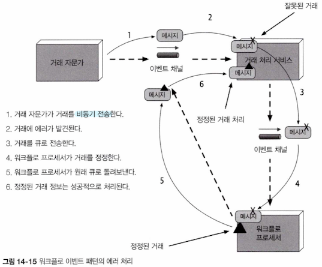

## 2.14.6 데이터 소실 방지

`비동기 통신을 할 때 데이터 소실`은 언제나 중요한 관심사이다. 불행하게도 이벤트 기반 아키텍처는 데이터가 소실될 만한 곳이 많이 있다. 데이터 소실이란, 메시지가 도중에 삭제되어도 최종 목적지에 도달하지 못한 상태를 말한다. 여기서는 비동기 메시징에서 데이터 소실을 방지하는 몇 가지 기본적인 기술에 대해서 이야기 한다.

> ex) 이벤트 프로세서 A가 큐에 메시지를 비동기 전송하고 이벤트 프로세서 B는 이 메시지를 받아 데이터베이스에 삽입하는 상황

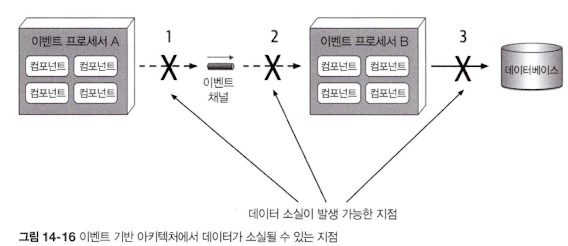

- 이벤트 소실이 일어날 수 있는 상황 3가지
	1. 이벤트 프로세서 A에서 `메시지 큐가 전달되지 않는 경우`, 아니면 전달되었어도 다음 이벤트 프로세서가 메시지를 가져오기 전에 `브로커가 다운되는 경우`
	2. 이벤트 프로세서 B가 `큐에서 다음 메시지를 꺼내` `이벤트를 처리하기 전에 장애 발생 시`
	3. 데이터 에러로 인해 이벤트 프로세서 B가 데이터베이스에 메시지를 저장할 수 없는 경우

> 메시지가 큐에 전달되지 않는 이슈

데이터 소실 문제는 기본적인 메시징으로 어느정도 해결할 수 있다. 1번 이슈(메시지가 큐에 전달되지 않음)는 `동기 전송`과 `퍼시스턴트 메시지 큐`를 이용하면 쉽게 해결된다.

퍼시스턴스 메시지 큐는 이른바 전달 보장도 지원한다. 즉, 메시지 브로커가 메시지를 수신하면 신속한 조회를 위해 메모리에 저장하는 동시에 물리적 데이터 저장소에도 메시지를 저장하는 것이다.

이렇게 처리하면 메시지 브로커가 다운되도 메시지가 디스크에 물리적으로 저장되어 있기 때문에 브로커가 다시 살아날 때까지 메시지 처리를 계속할 수 있다.

동기 전송은 브로커가 메시지를 저장했다고 확인응답을 줄 때까지 메시지 프로듀서를 차단하여 기다리게 한다. 이 두 가지 기본 기술을 활용하면 메시지는 프로듀서 또는 퍼시스턴스 메시지 큐에 있기 때문에 이 둘 사이에 메시지가 소실될 일은 없다.

> 이벤트 프로세서 B가 큐에서 다음 메시지를 꺼내 이벤트를 처리하기 전에 고장

역시 클라이언트 확인응답 모드라는 기본적인 메시징 기술을 이용하면 해결 가능하다. 원래 메시지는 큐에서 빠져나가는 즉시 삭제되는데, 클라이언트 확인응답 모드는 메시지를 큐에 보관한 채 다른 컨슈머가 메시지를 읽을 수 없게 클라이언트 ID를 메시지에 부착한다. 따라서 이벤트 프로세서 B가 잘못돼도 메시지는 큐에 계속 남아 있으니 데이터 소실을 방지할 수 있다.

> 데이터 에러 때문에 이벤트 프로세서 B가 메시지를 데이터베이스에 저장할 수 없음

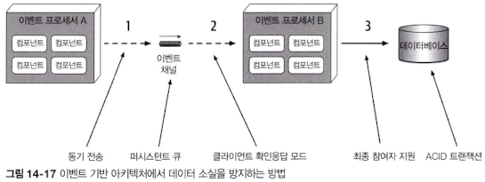

데이터베이스 본연의 ACID(원자성, 일관성, 격리성, 내구성) 트랜잭션의 커밋으로 해결이 가능하다. 데이터베이스에 커밋이 일어나면 데이터가 확실하게 저장된다. 최종 참여자 지원을 활용하면 메시지 처리가 끝나 데이터베이스에 저장됐음을 확인한 이후에 큐에서 메시지가 삭제된다. 따라서 이벤트 프로세서 A에서 데이터베이스로 가는 도중에 메시지가 소실될 일은 없다.

## 2.14.7 브로드캐스팅

이벤트 기반 아키텍처는 메시지를 누가 받든 (컨슈머가 있다면), 그 메시지로 무슨 일을 하든 상관없이 이벤트를 브로드캐스트 할 수 있다.

> `프로듀서`가 발행한 메시지를 여러 구독자가 수신하는 형태

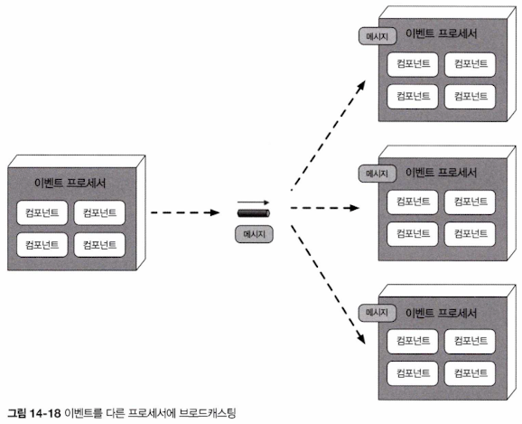

`메시지 프로듀서`는 자신이 보낸 메시지를 어느 `이벤트 프로세서`가 수신할 지, 또 메시지를 받아 무슨 일을 할 지 모른다. 그러므로 어쩌면 브로드 캐스팅은 여러 이벤트 프로세서를 가장 높은 수준으로 `디커플링`하는 수단이며, `최종 일관성`, `복잡한 이벤트 처리`(CEP)등 다양한 쓰임새를 지닌 필수 기능이다.

주식 시장에서 거래되는 기업 주가가 얼마나 오르락내리는지 생각해볼 때, 그때 그때 시세는 다른 많은 것들에 영향을 미치겠지만, 종가를 발행하는 서비스는 이 정보를 누가 어떻게 사용하든 알 필요없이 그냥 브로드캐스트하면 그만이다.

## 2.14.8 요청 - 응답

위에서는 이벤트 컨슈머의 즉시 응답이 필요하지 않은 비동기 요청에 대해서 이야기 했다.

만약 도서를 주문할 때 주문 ID가 필요한 경우에는 어떻게 해야 할까? 항공편 예약 시 확인 번호가 필요한 경우에는 어떻게 할까? 결국 `서비스나 이벤트 프로세서 간에 동기 통신이 필요한 경우`가 생긴다.

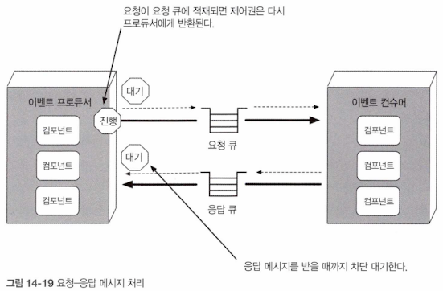

이벤트 기반 아키텍처는 동기 통신을 요청-응답 메시징(request-response messaging) 방식으로 수행한다.

`요청-응답 메시징` 내부의 각 이벤트 채널은 `요청 큐`, `응답 큐`로 구성된다. 처음 정보를 요청하면 요청 큐에 비동기 전송된 후 `메시지 프로듀서`에게 제어권이 반환되며, 메시지 프로듀서는 응답 큐에 응답이 도착하길 기다리며 차단 대기(blocking wait) 상태가 된다. 메시지 컨슈머가 메시지를 받아 처리한 후 응답 큐에 응답을 보내면 이벤트 프로듀서는 응답 데이터가 포함된 메시지를 수신한다.

요청-응답 메시징을 구현하는 주요한 기술은 두 가지이다.

> `첫 번째로 가장 일반적인 기술로, 메시지 헤더에 상관(correlation) ID를 사용하는 방법`

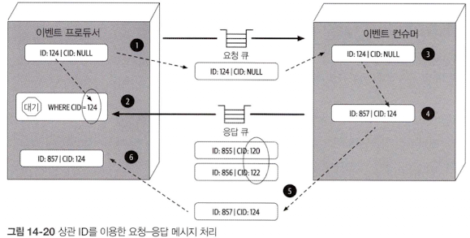

상관 ID는 응답 메시지의 필드로, 대부분 원요청 메시지의 메시지 ID로 세팅한다. 처리 흐름도에서 메시지 ID는 ID, 상관 ID는 CID로 표시한다.

1. `이벤트 프로듀서`는 `요청 큐`에 메시지를 보내고 고유한 메시지 ID를 기록한다. 이때 상관 ID(CID)는 null
2. 이벤트 프로듀서는 메시지 필터(또는 메시지 셀렉터)로 응답 큐를 차단 대기 한다.
   이때 메시지 헤더에는 원 메시지ID 124와 동일한 상관 ID가 있다. 현재 응답 큐에는 상관 ID가 120인 메시지 ID 855, 상관 ID가 122인 메시지 ID 856가 있다.
   이 두 메시지 모두 이벤트 컨슈머가 찾고 있는 상관 ID(CID 124)와 일치하지 않으므로 어느 것도 선택되지 않는다.
3. 이벤트 컨슈머는 메시지(ID 124)를 받아 요청을 처리한다.
4. 이벤트 컨슈머는 응답 메시지를 생성하고 메시지 헤더의 상관 ID(CID)를 원메시지ID(124)로 세팅한다.
5. 이벤트 컨슈머는 새 메시지(ID 857)를 응답 큐로 보낸다.
6. 2단계의 메시지 셀렉터와 상관 ID(124)가 일치하므로 이벤트 프로듀서는 메시지를 수신한다.

> `둘째로 응답 큐에 임시큐를 두고 요청-응답 메시징을 구현하는 방법`

임시 큐는 지정된 요청에만 사용되는데, 요청이 들어오면 생성되고 요청이 종료되면 삭제된다.

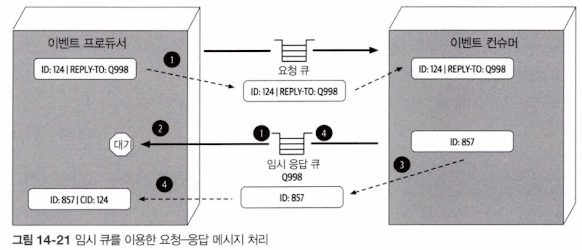

임시 큐는 각 요청별로 이벤트 프로듀서만 알고 있는 전용 큐이므로 상관 ID는 필요하지 않는다.

임시 큐의 작동 매커니즘

1. 이벤트 프로듀서는 임시 큐를 생성하고(또는 메시지 브로커에 따라 자동 생성) reply-to 헤더(또는 사전 정의된 다른 커스텀 헤더)에 임시 큐 이름을 세팅하여 요청 큐에 메시지를 보낸다.
2. 이벤트 프로듀서는 임시 응답 큐를 차단 대기하면서 응답이 도착하길 기다린다. 이 큐에 전달된 메시지는 원 메시지를 보낸 이벤트 프로듀서에만 속하므로 따로 메시지 셀렉터는 필요 없다.
3. 이벤트 컨슈머는 메시지를 받아 요청을 처리한 후 reply-to 헤더에 세팅된 이름을 가진 응답 큐로 응답 메시지를 보낸다.
4. 이벤트 프로세서는 메시지를 수신한 다음 임시 큐를 삭제한다.

기술적으로는 임시 큐가 훨씬 단순하지만 메시지 브로커는 매번 요청을 할 때마다 임시 큐를 생성/폐기하는 일을 반복해야 한다. 따라서 대용량 메시지 처리 시 메시지 브로커의 속도가 크게 떨어지고, `전체 성능`과 `응답성` 역시 영향을 받을 수 있다. 그래서 우리는 대체로 상관 ID를 사용하는 방법을 권장한다.

## 2.14.9 요청 기반이냐, 이벤트 기반이냐

`요청 기반 모델`과 `이벤트 기반 모델` 모두 소프트웨어 시스템을 설계하는 유효한 접근 방식이다. 그러나 시스템이 전체적으로 성공하려면 가장 알맞은 모델을 선택하는 것이 중요하다.
워크플로의 `확정성`과 `제어`가 중요하면 체계적인 `데이터 기반의 요청에 특화된 요청 기반 모델`을, `복잡하고 동적인 유저 처리` 등 주로 `고도의 응답성`과 `확장성`을 요하는, `유연한 액션 단위의 이벤트를 처리`한다면 `이벤트 기반 모델`이 좋은 선택이다.

어떤 모델이 가장 최적인지 결정하려면 이벤트 기반 모델의 장단점을 정확하게 이해할 필요가 있다.

> 이벤트 기반 모델의 장단점

| 요청 기반보다 좋은 점        | 단점                   |
|---------------------|----------------------|
| 동적인 유저 컨텐츠의 응답성이 좋음 | 최종 일관성만 지원           |
| 확장성, 탄력성이 우수함       | 처리 흐름을 제어하기 곤란함      |
| 민첩성과 변화 관리가 우수함     | 이벤트 흐름의 결과를 예측하기 어려움 |
| 적응성과 확장성이 뛰어남       | 테스팅, 디버깅이 어려움        |
| 응답성과 성능이 좋음         |                      |
| 실시간 의사결정이 가능        |                      |
| 상황 인지에 따른 반응성이 좋음   |                      |

## 2.14.10 하이브리드 이벤트 기반 아키텍처

이벤트 기반 아키텍처와 다른 아키텍처 스타일을 함께 사용하는 하이브리드 아키텍처 기반의 애플리케이션도 있다. `이벤트 기반 아키텍처를 다른 아키텍처 스타일의 일부로 활용하는 아키텍처 스타일`로는 `마이크로서비스 아키텍처`, `공간 기반 아키텍처`가 대표적이다. 그 밖에 이벤트 기반 마이크로커널 아키텍처, 이벤트 기반 파이프라인 아키텍처도 하이브리드 아키텍처 예이다.

어떤 아키텍처 스타일이든지 이벤트 기반 아키텍처를 추가하면 병목 지점을 제거하고 이벤트 요청을 백업하는 배압지점을 확보하는데 유용하며, 다른 아키텍처 스타일에서는 찾아볼 수 없는 유저 응답성이 보장된다.

마이크로서비스 아키텍처, 공간 기반 아키텍처 는 데이터 펌프에 메시징을 활용하며, 다른 프로세서에 데이터를 비동기 전송하여 데이터베이스 데이터를 업데이트합니다. 또 서비스 간에 메시지를 주고받으며 통신할 때 마이크로서비스 아키텍처의 서비스와 공간 기반 아키텍처의 처리 장치 모두 이벤트 기반 아키텍처를 활용함으로써 프로그래밍 방식의 확장성을 달성할 수 있다.

## 2.14.11 아키텍처 특성 등급

<aside>
💡 아키텍처 특성 등급표에서 별점 1개인 특성은 해당 아키텍처에서 잘 지원하지 않고, 별점 5개인 특성은 이 아키텍처의 강점 중의 하나라는 뜻이다.
</aside>

| 아키텍처 특성 | 별점         |
|---------|------------|
| 분할 유형   | 기술         |
| 퀀텀 수    | 하나 또는 여러 개 |
| 배포성     | ⭐️⭐️⭐️     |
| 탄력성     | ⭐️⭐️⭐️     |
| 진화성     | ⭐️⭐️⭐️⭐️⭐️ |
| 내고장성    | ⭐️⭐️⭐️⭐️⭐️ |
| 모듈성     | ⭐️⭐️⭐️⭐️   |
| 전체 비용   | ⭐️⭐️⭐️     |
| 성능      | ⭐️⭐️⭐️⭐️⭐️ |
| 신뢰성     | ⭐️⭐️⭐️     |
| 확장성     | ⭐️⭐️⭐️⭐️⭐️ |
| 단순성     | ⭐️         |
| 시험성     | ⭐️⭐️       |

아키텍처는 특정 도메인이 여러 이벤트 프로세서에 분산되어 있고, 중재자, 큐, 토픽을 통해 서로 묶여 있는, 기술 분할된 아키텍처이다. 한 도메인에 변경이 발생하면 많은 이벤트 프로세서, 중재자, 다른 메시징 아티팩트에도 영향을 미치므로 이벤트 기반 아키텍처는 도메인 분할 아키텍처는 아니다.

이벤트 기반 아키텍처는 각 이벤트 프로세서의 데이터베이스 상호작용 및 요청-응답 처리를 기반으로 하기 때문에 `퀀텀 수는 1개 이상` 가능하다.

모든 통신은 비동기로 이루어지지만 여러 이벤트 프로세서가 단일 데이터베이스 인스턴스를 공유하는 경우 전부 동일한 아키텍처 퀀텀 내에 포함됩니다.

요청-응답 처리도 마찬가지라서 이벤트 프로세서끼리는 여전히 비동기 통신을 주고받지만 이벤트 컨슈머에게 직접 요청을 받아야 하는 구조라면 결국 해당 이벤트 프로세서는 동기적으로 함께 묶여 모두 동일한 퀀텀에 소속된다.

가령, 한 이벤트 프로세서가 주문을 처리하기 위해 다른 이벤트 프로세서에게 요청을 전달한다고 하면, 첫번째 이벤트 프로세서는 다른 이벤트 프로세서로 부터 주문ID를 넘겨받을 때 까지 기다려야한다.

주문을 받아 주문ID를 생성하는 두 번째 이벤트 프로세서가 다운되면 첫 번째 이벤트 프로세서는 더 이상 진행 할 수 없으므로 비동기 메시지를 송수신 하더라도 이 둘은 동일한 아키텍처 퀀텀의 일부이며 동일한 아키텍처 특정을 공유한다.

이벤트 기반 아키텍처는 `성능`, `확장성`, `내고장성`에 별점 5개로, 이 세 특정은 아키텍처 스타일의 주요 강점이기도하다. 이벤트 프로세서(경쟁 컨슈머)는 프로그래밍 방식의 로드 밸런싱이 가능하며 확장성이 매우 뛰어나다. 요청 부하가 증가하면 프로그래밍 방식으로 이벤트 프로세서를 추가해서 증가된 요청을 처리할 수 있다. 또 이벤트 워크플로의 최종 일관성 및 최종처리를 제공하는 고도로 분리된 비동기 이벤트 프로세서를 활용하면 내고장성을 실현할 수 있다. 유저 인터페이스나 이벤트 프로세서를 제공하는 행위는 즉시 응답을 필요로 하지 않으며, 다른 다운스트림 프로세서를 사용할 수 없을 경우 나중에 이벤트를 처리할 목적으로 프라미스와 퓨처를 이용하면 된다.

이 아키텍처는 특유의 비결정적, 동적인 이벤트 흐름 때문에 단순성과 시험성은 상대적으로 낮은 편이다. 요청 기반 모델의 확정적인 흐름은 경로와 결과가 잘 알려져 있으므로 비교적 테스트 하기 쉽지만 이벤트 기반 모델은 그렇지 않다. 이벤트 프로세서가 동적 이벤트에 어떻게 반응할 지, 어떤 메시지를 생성할 지 알 수 없는 때가 더 많다. 따라서 `이벤트 트리 다이어그램`이 매우 복잡해질 수 있고 시나리오 가짓수만 수백∼수천개에 달하므로 관리 및 테스트가 아주 어렵다.

이벤트 기반 아키텍처는 고도로 진화적이므로 `진화성`은 별점 5개입니다. 신구 이벤트 프로세서를 통해 새로운 기능을 추가하는 것은 특히 브로커 토폴로지에서는 비교적 간단한 일이다. 발행된 메시지를 통해 훅(Hook)을 제공하면 데이터를 바로 사용할 수 있으니 신기능을 추가하려고 인프라 또는 기존 이벤트 프로세서를 변경할 필요가 전혀 없다.