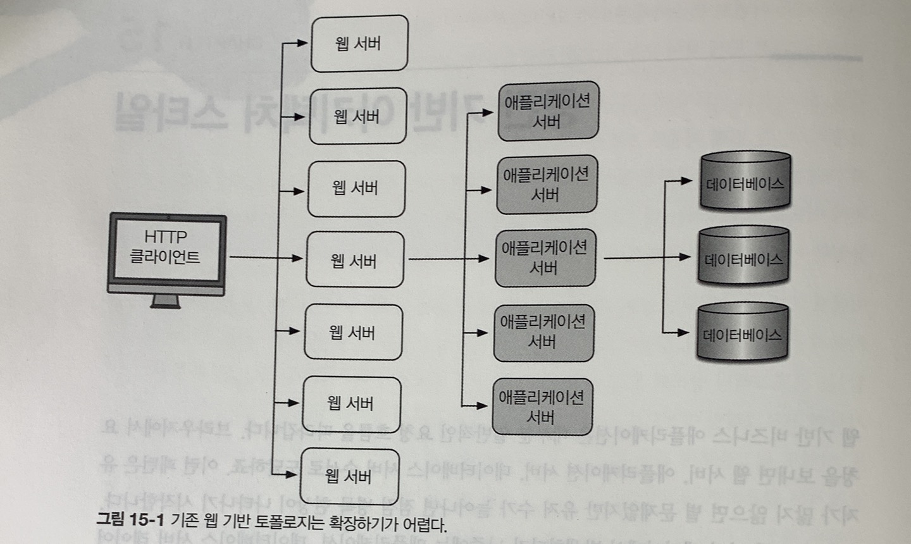
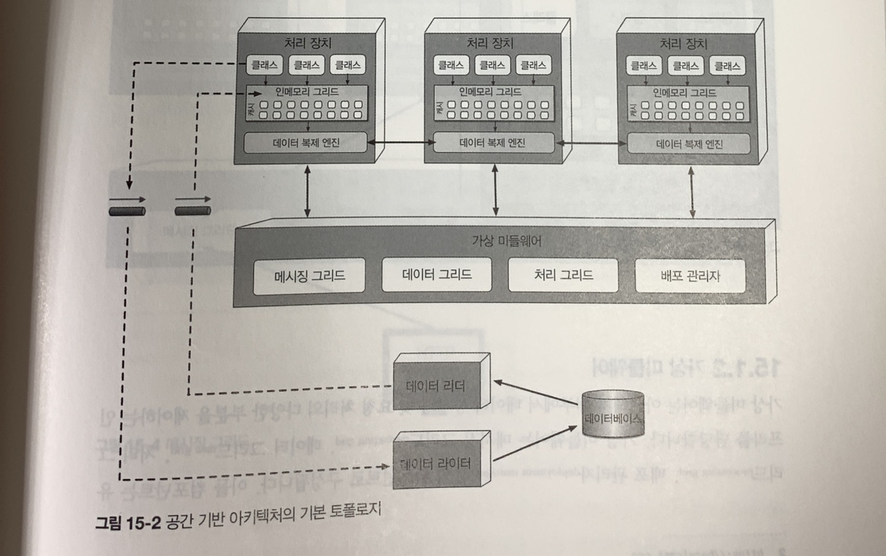
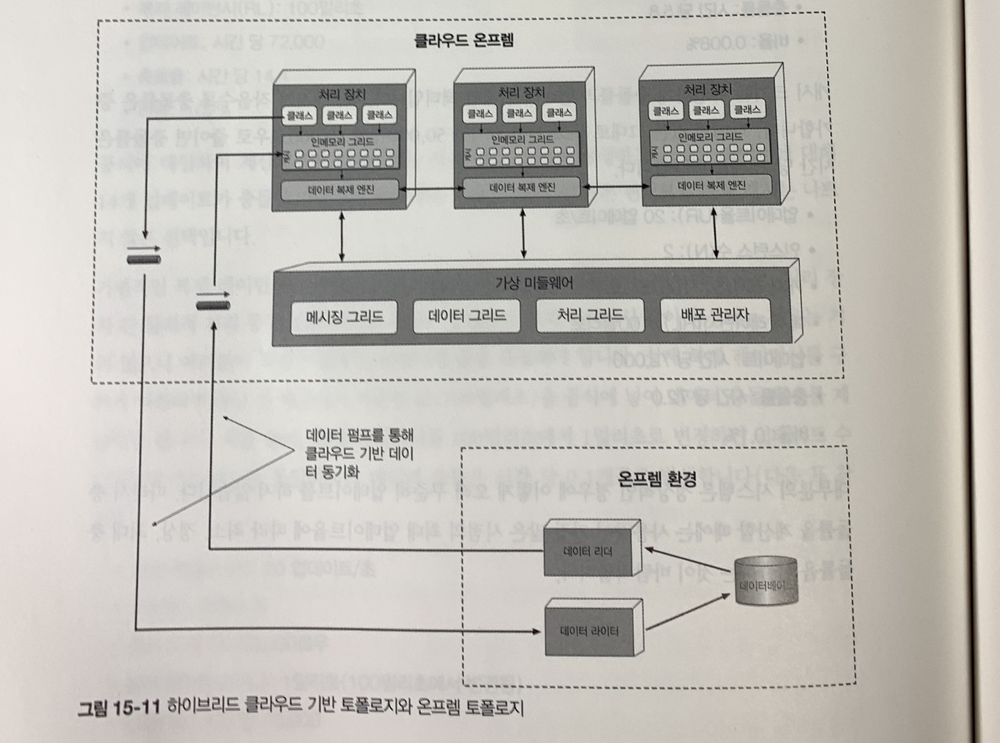

# 15장 공간 기반 아키텍처 스타일
- 웹 기반 비즈니스 애플리케이션은 대부분 웹 서버, 애플리케이션 서버, 데이터베이스 서버 순서로 흐름이 이어짐
- 해당 패턴은 유저 수가 늘어나면 점점 병목 현상이 나타남
- 병목을 제거하기 위해 웹 서버를 늘리면, 해당 병목이 애플리케이션으로 이동하고, 그렇게 확장하더라도 다시 데이터베이스 서버가 병목점이 될 가능성이 높음
- 동시 유저 부하가 많은 대용량 애플리케이션은 데이터베이스의 동시 처리 가능한 트랜잭션 수가 최종 제약조건이 되는 경우가 많고, 애플리케이션을 확장하는 작업이 쉽지 않음

- 공간 기반 아키텍처 스타일은 높은 확장성, 탄력성, 동시성 및 이와 관련된 문제를 해결하기 위해 설계된 아키텍처 스타일

## 15.1 토폴로지
- 시스템에서 동기 제약조건인 중앙 데이터베이스를 없애는 대신, 복제된 인메모리 데이터 그리드 (imdg)를 활용하면 확장성, 탄력성, 성능을 높일 수 있음
- 모든 활성 처리 장치들이 데이터를 복제
- 처리 장치는 데이터를 업데이트할 때 퍼시스턴스 큐에 메세지를 보내닌 식으로 데이터베이스에 데이터를 비동기 전송
- 애플리케이션의 표준 트랜잭션 처리에 관여하지 않으므로 데이터베이스 병목 현상이 사라지고 애플리케이션은 거의 무한에 가까운 확장성이 보장됨
- 공간 기반 아키텍처는 처리장치, 가상 미들웨어, 데이터 펌프, 데이터 라이터, 데이터 리더 컴포넌트로 구성

### 15.1.1 처리 장치
- 처리 장치는 애플리케이션 로직을 가지고 있음
- 애플리케이션 로직 외에도 헤이즐캐스트, 아파치 이그나이트, 오라클 코히어런스 등의 제품에 잇는 인메모리 데이터 그리드 및 복제 엔진도 처리 장치에 포함

### 15.1.2 가상 미들웨어
- 가상 미들웨어는 아키텍처 내부에서 데이터 동기화 및 요청 처리의 다양한 부분을 제어하는 인프라를 담당
- 가상 미들웨어는 메시징 그리드, 데이터 그리드, 처리 그리드, 배포 관리자 등의 컴포넌트로 구성

메시징 그리드
- 입력 요청과 세션 상태를 관리
- 가상 미들웨어에 요청이 유입되면 메시징 그리드는 어느 활성 처리 장치가 요청을 받아 처리할지 결정하여 해당 처리 장치로 요청을 전달
- 해당 컴포넌트는 보통 부하 분산이 가능한 일반 웹 서버로 구현 (HA프록시, NGINX)

데이터그리드
- 공간 기반 아키텍처 스타일에서 가장 중요하고 필수적인 컴포넌트
- 데이터 그리드가 거의 대부분 복제 캐시로서 처리 장치에만 구현되어 있지만, 외부 컨트롤러가 필요한 복제 캐시 구현체나 분산 캐시를 사용할 경우, 데이터 그리드는 가상 미들웨어 내부의 데이터 그리드 컴포넌트와 처리 장치 모두에 위치
- 데이터는 이름이 동일한 데이터 그리드가 포함된 처리 장치 간에 동기화 됨

처리 그리드
- 필수 컴포넌트는 아니지만, 다수의 처리 장치가 단일 비즈니스 요청을 처리할 경우 요청 처리를 오케스트레이트하는 일을 함
- 종류가 다른 처리 장치(주문 처리, 결제 처리 장치) 사이에 조정이 필요한 요청이 들어오면 처리 그리드가 두 처리 장치 사이에서 요청을 중재/조정

배포 관리자
- 부하 조건에 따라 처리 장치 인스턴스를 동적으로 시작/종료하는 컴포넌트
- 애플리케이션에서 다양한 확장성(탄력성) 요구사항을 구현하는데 꼭 필요한 컴포넌트

### 15.1.3 데이터 펌프
- 데이터 펌프는 데이터를 다른 프로세서에 보내 데이터베이스를 업데이트하는 장치
- 처리 장치가 데이터를 데이터베이스에 직접 읽고 쓰지 않으므로 데이터 펌프는 반드시 필요
- 데이터 펌프는 항상 비동기로 동작하면서 메모리 캐시와 데이터베이스의 최종 일관성을 실현
- 데이터 펌프는 대개 메시징 기법으로 구현
- 메시징은 비동기 통신을 지원하고 전달을 보장하며 선입 선출 큐를 통해 메시지 순서도 유지

### 15.1.4 데이터 라이터
- 데이터 라이터는 데이터 펌프에서 메시지를 받아 그에 맞게 데이터베이스를 업데이트 하는 컴포넌트

### 15.1.5 데이터 리더
- 데이터 리더는 데이터베이스에서 데이터를 읽어 리버스 데이터 펌프를 통해 처리 장치로 실어 나르는 컴포넌트
- 데이터 리더는 세가지 경우에만 작동
1. 동일한 이름의 캐시를 가진 모든 처리 장치 인스턴스가 실패하는 경우
2. 동일한 이름의 캐시 안에서 모든 처리 장치를 재배포하는 경우
3. 복제 캐시에 들어있지 않은 아카이브 데이터를 조회하는 경우

## 15.2 데이터 충돌
- 이름이 동일한 캐시가 포함된 서비스 인스턴스에 시시각각 업데이트가 일어나는 active/active 상태에서 복제 캐시를 사용하면 복제 레이턴시 때문에 데이터 충돌이 발생할 수 있음
- 데이터 충돌은 한 캐시 인스턴스(캐시 A)에서 데이터가 업데이트 되어 다른 캐시 인스턴스(캐시 B)에 복제하는 도중에 동일한 데이터가 해당 캐시(캐시 B)에서 업데이트 되는 현상을 말함
> 충돌 예시
> - 파란색 제품의 현재 재고는 500개
> - 서비스 A는 파란색 제품의 재고 캐시를 490개(10개 판매)로 업데이트
> - 캐시를 복제하는 동안 서비스 B는 파란색 제품의 재고 캐시를 495개(5개 판매)로 업데이트
> - 서비스 A의 업데이트를 복제했기 때문에 서비스 B의 재고 캐시는 490개로 업데이트 됨
> - 서비스 A 캐시는 서비스 B 업데이트를 복제했기 때문에 495개로 업데이트 됨
> - 서비스 A, B 두 캐시 모두 값이 정확하지 않고 동기화가 어긋남 (재고는 495개가 되어야 함)

- 데이터 충돌 발생 빈도는 동일한 캐시를 포함한 처리 장치 인스턴스 수, 캐시 업데이트율, 캐시 크기, 캐시 제품의 복제 레이턴시 등 여러 팩터가 영향을 미침

## 15.3 클라우드 대 온프레미스 구현
- 공간 기반 아키텍처는 배포 환경 측면에서 독자적적인 선택지가 있음
- 클라우드, 온프레미스 환경 사이에 어중간하게 배포할 수 있음

## 15.4 복제 캐시 대 분산 캐시
- 대부분의 공간 기반 아키텍처는 복제 캐시를 사용하지만 분산 캐시도 사용할 수 있음
- 복제 캐시를 사용할 경우, 각 처리 장치는 이름이 동일한 캐시를 사용하는 모든 처리 장치 간에 동기화되는 자체 인메모리 데이터 그리드를 가지고 있음
- 복제 캐시는 속도가 매우 빠르고 높은 수준의 내고장성을 지원하며 중앙 서버에서 캐시를 갖고 있는 형태가 아니므로 단일 장애점이 없음

- 분산 캐시는 중앙 캐시를 갖고 잇는 전용 외부 서버 또는 서비스가 필요
- 처리 장치는 데이터를 내부 메모리에 저장하는 대신, 전용 프로토콜을 통해 중앙 캐시 서버에 잇는 데이터를 액세스
- 모든 데이터가 한 곳에 있고 복제할 필요가 없으니 분산 캐시는 높은 수준의 데이터 일관성을 보장하지만, 복제 캐시보다 성능이 낮고 시스템 전체 레이턴시가 증가

## 15.5 니어 캐시
- 처리 장치마다 상이한 데이터를 프런트 캐시에 갖게 되고 처리 장치 간 성능과 응답성의 일관성이 결여되므로, 니어 캐시 모델을 권장하지 않음

## 15.6 구현 예시
### 15.6.1 콘서트 티켓 판매 시스템
- p288 참고
### 15.6.2 온라인 경매 시스템
- p288 참고
## 15.7 아키텍처 특성 등급
- p289 참고