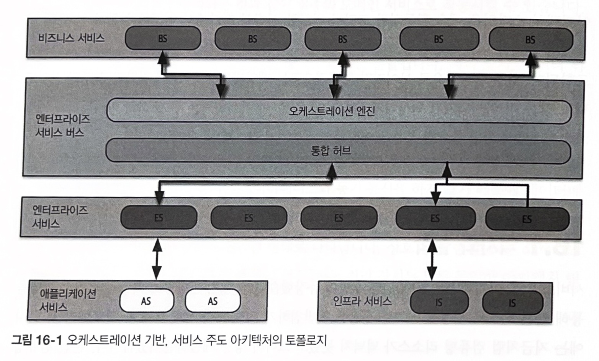

### Chapter 16 오케스트레이션 기반 서비스 지향 아키텍쳐 스타일

- 저자 왈 : 이 아키텍쳐는 얼토당토 않은 아키텍쳐
- 
- 이 아키텍쳐의 중심 철학은 엔터프라이즈 레벨의 재사용
- 

- 비즈니스 서비스
  - 최상단에 위치, 진입점 역할
  - 코드는 전혀 없고 입력, 출력, 스키마 정보만 갖고 있음
- 엔터프라이즈 서비스
  - 특정 비즈니스 도메인에 관한 원자적 행위를 구현하는 역할을 담당함
  - 이 아키텍쳐의 재사용 목표 때문에 책임을 분리함
- 애플리케이션 서비스
  - 한 번만 사용 가능한 단일 구현체 서비스
- 인프라 서비스
  - 모니터링, 로깅, 인증/인가 등의 운영 관심사를 지원
- 오케스트레이션 엔진
  - 모든 로직이 여기에 있기 때문에 모든 요청이 오케스트레이션 엔진을 통하고, 내부 호출할때도 엔진을 경유한다
  - 비즈니스 서비스 구현체를 서로 엮어주며 트랜잭션 조정과 메시지 변환 등의 기능을 수행함
  - 트랜잭셔널 로직은 데이터베이스가 아닌 오케스트레이션 엔진에서 선언적으로 처리된다
  - 비즈니스와 엔터프라이즈 서비스의 관계, 이 둘을 매핑하는 방법, 트랜잭션 경계는 어디까지인지 등을 정의
- 예 : 보험 회사에서 Customer 재사용
  - 보험 회사의 모든 부서에서 Customer라는 개념이 포함되어 있어서 재사용 가능한 Customer 서비스를 만들어서 원래 서비스가 Customer 서비스를 참조하도록 만듦
  - 단점1. Customer 서비스를 변경하면 모든 서비스에 영향을 미치므로 위험하다.
  - 단점2. 하나의 Customer 서비스에 고객에 관한 모든 상세 정보를 담아야 한다.
