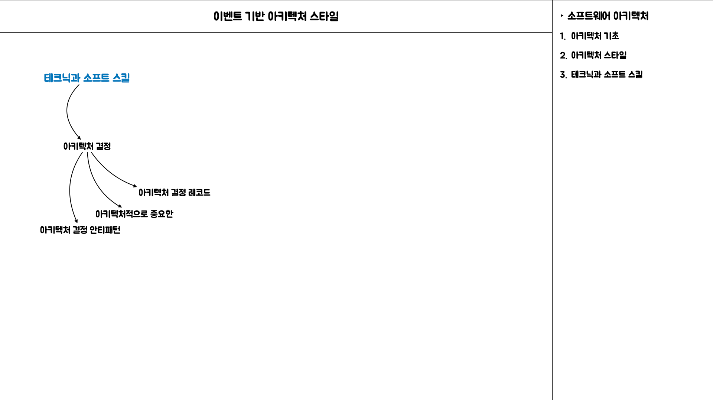
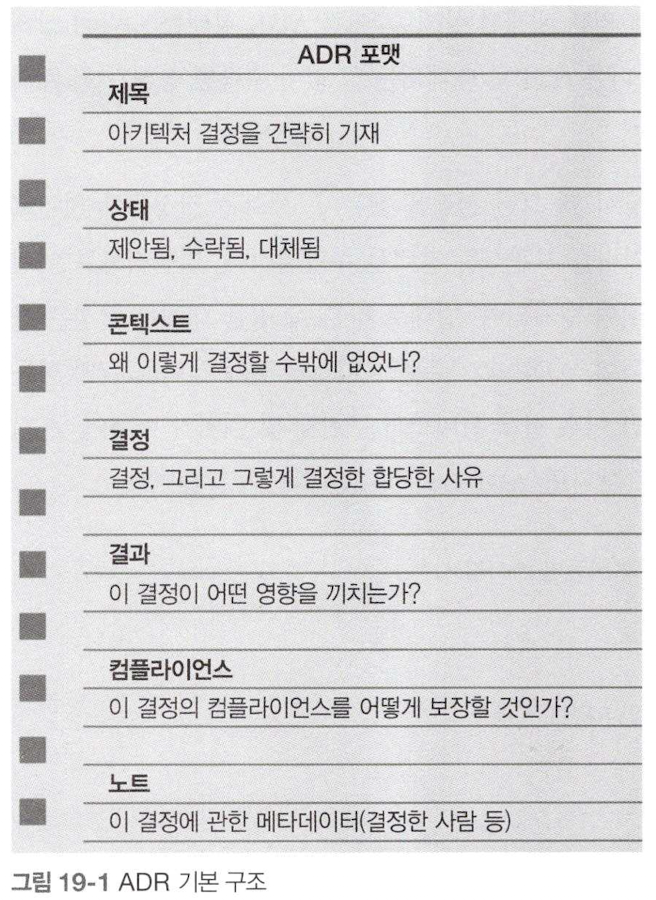
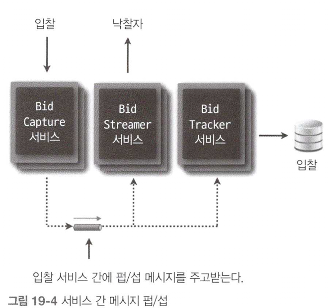
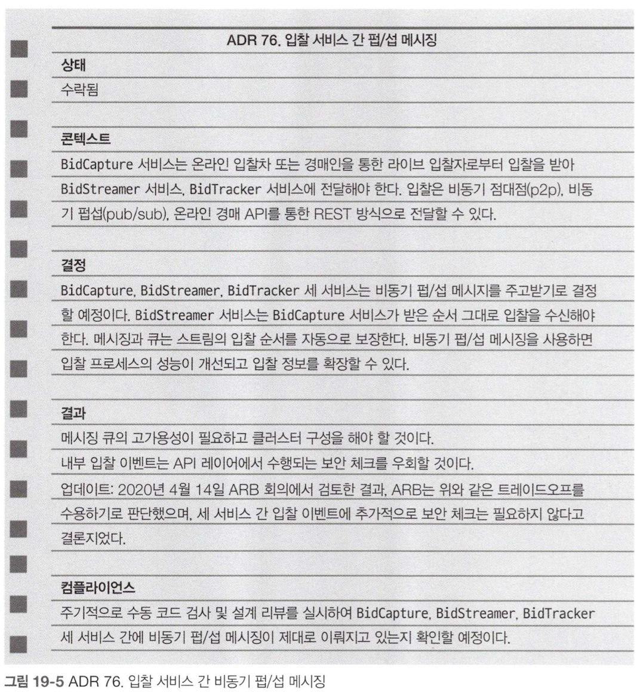

# 3.19 아키텍처 결정

## Intro

아키텍처에게 기대하는 핵심 가치 중 하나는 `아키텍처 결정`을 내리는 것이다.
`아키텍처 결정`은 애플리케이션이나 `시스템의 구조`에 관한 것이 대부분이지만, `기술 결정` 역시 포함될 수 있다.

`아키텍처 결정`을 하기 위해서는 `충분한 정보를 수집`하고 `결정을 정당화`, `문서화`한 다음 `이해 관계자들과 효과적으로 소통`해야 한다.

## 3.19.1 아키텍처 결정 안티패턴

아키텍처를 결정하는 것도 기술이다. 그렇기 때문에 아키텍처 안티패턴에 빠지는 일도 드물지 않다.
안티패턴이란  처음에는 좋은 생각처럼 보이지만 이내 곧 곤경에 빠뜨리는 애물단지로 정의한다. 부정적인 결과를 내는 반복 가능한 프로세스라 정의하기도 한다.

여기서는 아키텍처 결정에서 자주 발생하는 아키텍처 안티패턴을 세 가지로 분류한다.

1. 네 패를 먼저 보여주지마
2. 무한반복 회의
3. 이메일 기반 아키텍처

위 안티패턴은 보통 순차적으로 누적되어 발전하는 경향이 있다. `네 패를 먼저 보여주지마`  안티패턴을 극복하면 `무한반복 회의` 안티패턴으로 이어지고, 다시 이 안티패턴을 극복하면 `이메일 기반 아키텍처` 안티패턴으로 이어질 때가 많다.

이런 세 가지 안티패턴을 모두 극복하는 경우에 보다 정확하고 효과적인 `아키텍처 결정`을 할 수 있을 것이다.

### 3.19.1.1 ‘네 패를 먼저 보여주지마’ 안티패턴

아키텍트가 잘못된 선택 하는 것을 두려워한 나머지 아키텍처 결정을 회피하거나 미루는 현상을 말한다.

해당 안티패턴은 두 가지 방법으로 극복할 수 있다.

1. 어떤 중요한 아키텍처 결정을 내리기 전, 마지막으로 책임질 수 있는 순간까지 기다리는 것이다.
	- 아키텍트가 자신의 결정을 정당화하고 검증하기 위해 충분한 정보를 수집할 때까지 기다리지만, 개발팀을 마냥 붙잡아 두거나 분석 마비 안티패턴에 빠질 정도로 오래 기다리지는 않음을 의미한다.
2. 개발팀과 지속적으로 협력하면서 아키텍트가 결정한 내용을 원래 의도한대로 추진한다.
	- 세부적인 기술에 관한 모든 이슈를 아키텍트 혼자 전부다 알수는 없기 때문에 개발팀의 협력은 절대적으로 필요하다.
	- 이는 나중에 문제가 생겨도 아키텍트가 아키텍처 결정을 변경하면서 재빠르게 대응할 수 있다.

### 3.19.1.2 ‘무한반복 회의’ 안티패턴

`네 패를 먼저 보여주지마` 안티패턴을 극복하면 이어서 `무한반복 회의` 안티패턴으로 이어진다. 사람들이 어떤 결정을 왜 했는지 모르고 주구장창 회의만 계속 하는 것이다.

`무한반복 회의 안티패턴이 발생하는 이유`는 `아키텍트가 자신이 내린 결정을 정당화하는 데 실패`했기 때문이다.
`아키텍처 결정`을 정당화하기 위해서는 그 결정을 내리게 된 기술적, 비즈니스적 근거를 제시하는 것이 중요하다.

그렇게 해야 그 아키텍처 결정을 정말 다른 무엇보다 우선해야 하는지 한 번 더 돌아볼 수 있다. 그럴 만한 비즈니스 가치가 없다면 좋은 아키텍처 결정이 아니기 때문에 재고해 보는 것이 좋다.

가장 일반적인 비즈니스 정당화로는 비용, 출시 시기, 유저 만족도, 전략적 포지셔닝 등이 있다.
이 네 가지 관점에서 비즈니스적으로 정당화할 때에는 무엇이 비즈니스 이해관계자에게 중요한지 숙고해봐야 한다. 이를테면 비즈니스 이해관계자가 비용보다 시장 출시 시기에 더 관심이 있는데도 단순히 비용 절감만 내세우면서 결정을 정당화하려는 것은 바람직하지 않다.

### 3.19.1.3 ‘이메일 기반 아키텍처’ 안티패턴

아키텍트가 아키텍처 결정을 하고 그 결정을 온전히 정당화한 다음은 `이메일 기반 아키텍처` 안티패턴이 등장한다.

사람들이 아키텍처 결정을 놓치거나 잊어버리고 심지어는 그렇게 결정되었다는 사실조차 알지 못해 아키텍처 결정을 구현하지 못하는 상태이다.

즉, 아키텍처 결정을 효과적으로 전달하는 문제와 관련된 안티패턴이다.

이 안티패턴을 방지하고 아키텍처 결정을 효과적으로 전달하기 위해서는 어떻게 해야 할까?

1. 이메일 본문에 아키텍처 결정을 포함시키지 않는다.
	- 이메일 본문에 아키텍처 결정을 기재하면 그 결정에 관한 여러 경로의 기록 체계가 파생되고, 중요한 세부 사항들이 이메일에서 누락되기 쉬운 까닭에 고질적인 `무한반복 회의` 패턴이 재발하게 된다.
	- 이메일 본문에는 아키텍처 결정의 본질과 맥락 정도만 언급하고 세부적으로는 단일 기록 시스템에 보관하여 그 링크만 제공한다.
2. 아키텍처 결정에 정말 관심있는 사람들에게만 통지한다.

## 3.19.2 아키텍처적으로 중요한

아키텍처 결정에 기술적인 내용이 포함되면 아키텍처 결정이 아니라, 기술 결정이라고 단정짓는 아키텍트들이 많지만 반드시 그런 것은 아니다. 아키텍트가 어떤 기술을 사용하기로 결정했고, 그 기술을 어떤 아키텍처 특성을 직접 지원하기 위해 선택한 것이라면 이는 아키텍처 결정이 맞다.

아키텍처적으로 중요한 결정이라 할 수 있는 요소로 `구조`, `비기능 특성`, `의존성`, `인터페이스`, `구현 기술`에 영향을 미치는 결정이라 할 수 있다.

> 구조
>

사용 중인 아키텍처의 패턴이나 스타일에 영향을 미치는 결정들이다. 일례로, 여러 마이크로서비스 간에 데이터를 공유하기로 한 결정은 마이크로 서비스의 경계 콘텍스트는 물론 애플리케이션 구조에도 영향을 미친다.

> 비기능 특성
>

개발 또는 유지보수 중인 애플리케이션이나 시스템에 중요한 아키텍처 특성들이다.
만약 어떤 기술을 선택하느냐에 따라 성능이 달라지고 성능이 애플리케이션의 중요한 팩터일 경우, 이러한 기술 선택이 곧 아키텍처 결정이 된다.

> 의존성
>

전체 확장성, 모듈성, 민첩성, 시험성, 안전성 등에 영향을 미치는 시스템 내부의 컴포넌트와 서비스 간의 커플링 지점을 가리킨다.

> 인터페이스
>

게이트웨이, 통합 허브, 서비스 버스, API 프록시를 통해 서비스와 컴포넌트에 액세스하고 조정하는 수단을 말한다.

계약 버저닝, 버전 구식화 전략 등 계약에 정의된 내용이 곧 인터페이스이다. 인터페이스는 시스템을 사용하는 다른 부분에도 영향을 미치므로 아키텍처적으로 매우 중요하다.

> 구현 기술
>

원래 그 자체는 기술적인 것이지만, 아키텍처의 많은 부분에 영향을 미치는 플랫폼, 프레임워크, 도구, 프로세스에 관한 결정이다.

## 3.19.3 아키텍처 결정 레코드

아키텍처 결정을 가장 효과적으로 문서화 하는 방법은 바로 아키텍처 결정 레코드(ADR)이다.

ADR은 아키텍처 결정이 기술된 짧은 텍스트 파일로, 일반 텍스트로 작성할 수 있지만 대게 아스키독이나 마크다운 같은 텍스트 문서 포맷 또는 위키 페이지 템플릿으로 작성한다.

ADR을 관리하는 도구도 존재 한다. ADR tools라는 ADR 전용 오픈소스 도구를 통해 아키텍처 의사 결정 기록을 관리 또한 가능하다.

### 3.19.3.1 기본 구조

ADR의 기본 구조는 제목, 상태, 컨텍스트, 결정, 결과 이렇게 주요 5개 섹션으로 구성된다. 추가적으로 컴플라이언스 와 노트라는 추가 섹션을 덧붙인다.

> 제목
>

제목은 일련 번호와 함께 아키텍처 결정을 짤막한 문구로 표현한다.

> 상태
>

상태는 제안됨, 수락됨, 대체됨으로 표시하여 수락 또는 변경된 이력을 보관하는 강력한 수단이다.

> 컨텍스트
>

컨텍스트 섹션은 불가항력적인 요소를 특정한다.

어떤 이유에서 결정을 내렸는지에 대한 특수한 상황에 대한 분석 내용과 문제점에 대해서 서술한다.

대안에 대해서 상세하게 분석한 문서가 필요한 경우 컨텍스트 대힌 대안 섹션을 추가한다.

> 결정
>

결정 섹션에는 아키텍처 결정돠 그렇게 결정하게 된 사유에 대해서 전부 작성한다.

결정 섹션의 큰 장점은 아키텍트가 방법보다 이유에 더 무게를 실을 수 있다는 것이다.

결정을 내린 이유와 그런 결정을 할 수 밖에 없었던 이유가 공유되면 사람들은 문제의 맥락을 더 잘 이해하고 행여 다른 문제가 생기지 않도록 리펙터링을 통해 실수를 예방할 수 있다.

> 결과
>

결과 섹션은 아키텍처 결정의 전체적인 영향도를 기술한다.

아키텍처 결정이 어떤 영향을 미치는지 구체적으로 기술함으로써 아키텍트는 결정의 장점보다 그 영향이 더 중요한지 되돌아 보게 된다.

이 섹션은 아키텍처 결정에 관한 트레이드오프는 물론, 분석 결과도 문서화 할 수 있다.

> 컴플라이언스
>

컴플라이언스 관점에서 아키텍트가 아키텍처 결정을 어떻게 측정/관리하는게 좋을 지 생각할 수 있도록 한다.

아키텍트는 본인의 결정에 대한 컴플라이언스 체크를 수동으로 할 지, 아니면 피트니스 함수로 자동화 할 지 결정해야 한다. 피트니스함수로 자동화 할 수 있으면 피트니스 함수를 작성하는 방법, 그리고 컴플라이언스 측면에서 이 아키텍처 결정을 판단하기 위해 코드베이스에 다른 변경은 필요 없는지 등의 내용을 기재한다.

> 노트
>

ADR에 대한 다양한 메타데이터를 포함한다.

- 원저자
- 승인일
- 승인자
- 대체일
- 최종 수정일
- 수정자
- 최종 수정 내역

### 3.19.3.2 ADR 저장

ADR에 대한 내용은 저장 위치와 상관없이 각 아키텍처 결정은 자체 파일이나 위키 페이지를 갖고 있어야 한다.

다만 저장 시 디렉터리를 통해 `프레임워크 관련 내용`, `애플리케이션이나 시스템에 관한 아키텍처`, `애플리케이션, 시스템 서비스간 통신에 대한 내용`을 구분하는 것이 좋다.

### 3.19.3.3 ADR로 문서화

ADR은 소프트웨어 아키텍처를 효과적으로 문서화하는 수단으로 활용할 수 있다.

### 3.19.3.4 ADR로 표준화

표준이라는 것은 유용해서라기보다는 사람들이 일하는 방식을 통제하는 용도로 더 많이 사용된다. ADR이라는 표준을 만드는 이유는 다른 무엇보다 우선시해야 하는 논리를 효과적으로 검증하는 수단이 된다.

### 3.19.3.5 예시

아키텍트는 어떤 시스템에서 확정한 아키텍처 결정들이 아무리 뻔하더라도 하나하나 그 사유를 밝히고 문서화해야 한다.

입찰 시스템에 대한 아키텍처 결정에 대한 ADR문서화 사례

