## Intro

모든 아키텍처는 리스크를 갖고 있다. `아키텍처 리스크 분석`은 아키텍트의 핵심 활동 중 하나로 리스크를 꾸준히 분석하여 아키텍처의 내부 결함을 바로 잡고 리스크를 줄이는 일이다.

이 장에서는 리스크 스토밍 활동을 통해 리스크를 도출, 평가, 식별하는 핵심 기술과 프렉티스를 정리한다.

## 3.20.1 리스크 매트릭스

아키텍처의 리스크를 평가하려는 경우, 먼저 낮음, 중간, 높음의 정도로 리스크를 분류할 수 있어야 한다. 이러한 분류 과정은 개인의 주관이 반영될 수 밖에 없어서 아키텍처 어느 부분이 정말로 리스크가 높은지, 중간 정도인지 밝혀내기가 어렵다.

리스크 매트릭스를 활용하면 주관성을 낮추고, 특정한 아키텍처 영역에서 리스크를 찾아내는 데 도움이 된다.

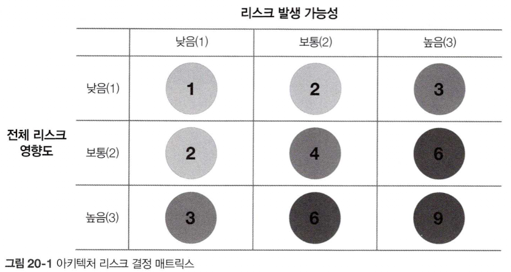

전체 리스크 영향도와 발생 가능성, 두 가지 차원으로 리스크를 평가한 뒤 낮음(1), 중간(2), 높음(3) 등급을 매긴다. 괄호 안의 숫자와 매트릭스 각 그리드의 숫자를 곱하여 리스크를 객관적인 수치로 정량화 할 수 있다.
예를들어, 애플리케이션이 접속하여 사용하는 중앙 데이터베이스의 가용성이 문제가 되었다고 가정할 때

1. `전체 리스크 영향도 차원`을 생각한다.
	- 만약 데이터베이스가 다운되어 사용할 수 없게 되면 전체 시스템이 어떠한 영향을 받는지 생각한다.
	- 아키텍트는 리스크가 높다고 보고, 3이나 6, 9로 매길 것이다.
2. `리스크의 발생 가능성 차원`에 대해서 생각한다.
	- 데이터베이스는 고가용성 클러스터로 구성되므로 전체 서버가 일시 다운되어 불용 상태가 될 가능성이 희박하다.

결국 높은 영향도, 낮은 가능성이 교차하는 지점에서 전체 리스크는 3등급을 받게 될 것이다.

## 3.20.2 리스크 평가

`리스크 매트릭스`를 활용하면 `리스크 평가`를 작성할 수 있다. 리스크 평가는 맥락에 따라 유의미한 평가 기준에 대해 전체 아키텍처 리스크를 요약한 리포트이다.

리스크 평가는 천차만별이지만 일반적으로는 애플리케이션의 서비스나 도메인 영역에 기반한 평가 기준(리스크 매트릭스로 식별한)이 포함된다.

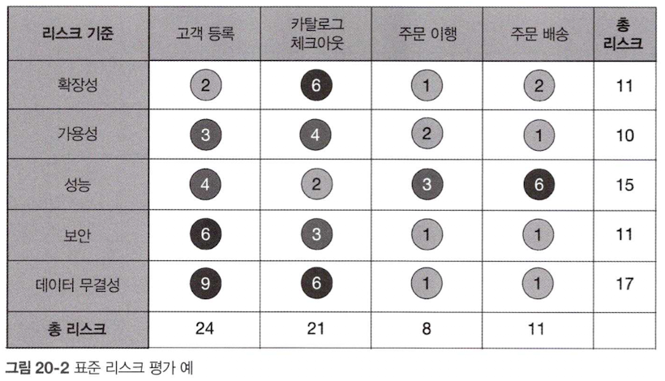

리스크 매트릭스로 정량화한 리스크는 평가 기준별로, 서비스 또는 도메인 영역 별로 누적치를 계산 할 수 있다. 상대적 수치를 비교하면 어떤 리스크 범주나 도메인 영역에서 리스크가 개선됐는지, 아니면 반대로 악화되었는지 파악이 가능하다.

표의 내용처럼 모든 분석 결과를 담을 수도 있지만, 주어진 맥락에 맞게 전달하려는 메시지를 잘 표현하기 위해서는 필터링이 필요하다.

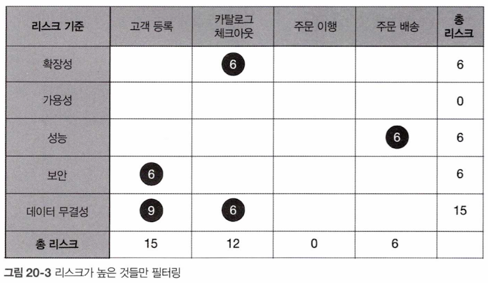

리스크가 높은 시스템 영역에 대해서 발표하려는 경우, 필터링을 통해 리스크가 높은 영역만 표시하면 전체적인 신호 대 잡음비(SNR)가 개선되고, 시스템이 지금 좋은 상태인지, 나쁜 상태인지 명확하게 전달 할 수 있다.

하지만 평가 리포트도 특정 시점에 대한 스냅샷일 뿐, 상황이 좋아지는 추세인지 아닌지는 알 수 없다. 이 부분도 리스크 등급 옆에 플러스(+), 마이너스(-) 같은 보편적인 방향기호를 사용하여 상태에 대한 방향성을 나타낼 수 있다.

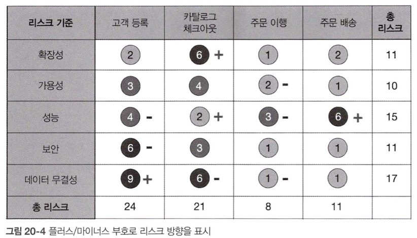

고객 등록의 성능은 중간이지만 방향은 마이너스 부호라서 점점 상황이 나빠지고 리스크가 높아지는 추세임을 표현할 수 있다. 반면 카탈로그 체크아웃의 확장성은 높고 플러스 부호이므로 점차 개선되고 있다는 것을 표현할 수 있다.

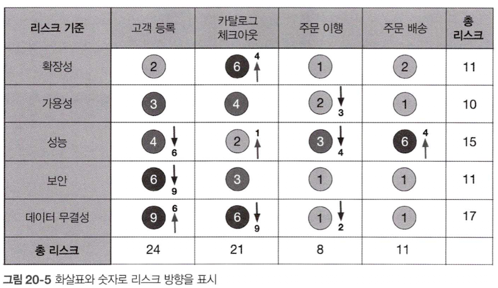

플러스/마이너스 부호조차 헷갈릴 수 있으니 진행 중인 방향의 리스크 등급 번호와 화살표를 같이 명시하는 것도 좋은 방법이다.

## 3.20.3 리스크 스토밍

시스템의 모든 리스크를 아키텍트 혼자 결정할 수는 없다. 아키텍트 한 사람이 리스크 영역을 하나도 빠짐없이 살펴볼 수도 없거니와, 시스템 전 부문을 완벽하게 알고있는 아키텍트도 없기 때문에 리스크 스토밍을하는 것이 좋다.

리스크 스토밍은 특정 범위 내에 있는 아키텍처 리스크를 찾아내는 협력적인 활동이다. 일반적인 리스크 영역으로는 검증되지 않은 기술, 성능, 확장성, 가용성(전이적 종속정 포함), 데이터 소실, 단일 장애 지점, 보안 등이 있다.

리스크 스토밍은 보통 여러 아키텍트가 참여하지만 선임 개발자와 기술 책임자도 동석하면서 더 효과적이며, 개발자도 참석하면 구현 관점에서 아키텍처 리스크를 짚어볼 수 있으므로 아키텍처를 더 선명하게 이해할 수 있다.

리스크 스토밍의 수행 과정은 `개별 파트`와 `협력 파트`가 공존한다.

1. 개별 파트
	- 모든 참가자가 앞 절에서 설명한 리스크 매트릭스를 이용하여 각자 알아서 아키텍처 영역에 리스크를 할당한다.
	- 각 참가자가 특정 아키텍처의 영역의 영향을 받거나 주의가 산만해지지 않기 때문에 리스크 스토밍을 할 때에는 이런 비협력적인 활동 역시 필요하다.
2. 협력 파트
	- 전체 참가자가 모여 리스크 영역에 대해 공감하고 어떻게 하면 리스크를 줄일 수 있을지 논의한다.

개별 / 협력 파트 모두 아키텍처 다이어그램을 사용한다.

일반적으로 전쳬 리스크 평가는 종합적인 아키텍처 다이어그램을 사용하고, 애플리케이션의 특정 영역에 관한 리스크 스토밍은 해당 아키텍처 다이어그램을 사용한다.
리스크 스토밍을 주관하는 아키텍트는 다이어그램을 최신 상태로 업데이트하고 모든 참가자들이 볼 수 있게 관리할 책임이 있다.

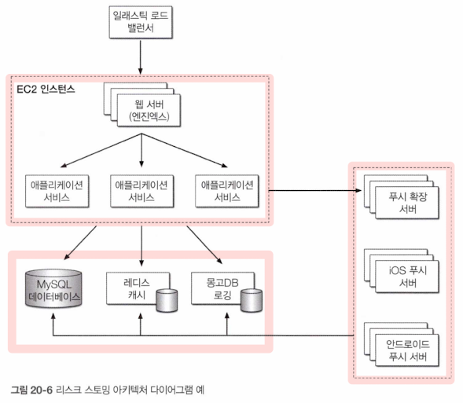

AWS ELB는 웹 서버(NginX)와 애플리케이션 서비스가 위치한 각 EC2 인스턴스를 처리한다. 애플리케이션 서비스는 MySQL, 레이스 캐시, 몽고 DB를 호출해서 로깅한다. 푸시 확장 서버도 함께 호출하는데 이 확장 서버는 다시 MySQL, 레디스 캐시, 몽고 DB의 로깅 기능과 연계된다.

이때 리스크 스토밍은 크게 세 가지 활동으로 이루어진다.

1. 식별
2. 합의
3. 완화

개별적이고 비협력적이며, 합의와 완화는 모든 참가자가 한데 모여 작업하는 협력적 활동이다.

### 3.20.3.1 식별 활동

각 참여자가 아키텍처 내부의 `리스크 영역`을 개인적으로 식별하는 활동

1. `리스크 스토밍`을 주관하는 아키텍트가 협력 파트를 진행하기 전에 참가자 전원에게 초대장을 보낸다. 이 초대장에는 아키텍처 다이어그램, 리스크 스토밍 부문(리스크 분석 대상 영역), 리스크 스토밍의 협력 파트를 진행할 날짜 및 장소가 적혀 있다.
2. 참가자는 리스크 매트릭스를 이용해 개별적으로 아키텍처를 분석하고 리스크를 낮음, 중간, 높음으로 분류한다.
3. 참가자는 작은 색상별 포스트잇 메모지에 리스크 번호를 각각 기재한다.

리스크 스토밍은 보통 한 가지 특정 부분만 분석하지만 인력, 일정 등의 사정에 따라 한 번에 여러 부문을 분석하는 경우도 있다.

### 3.20.3.2 합의 활동

리스크 스토밍에서 합의는 참가자 모두가 아키텍처 내부의 리스크에 대해 뜻을 함께 한다는 목표로 하는 협력적인 활동이다.

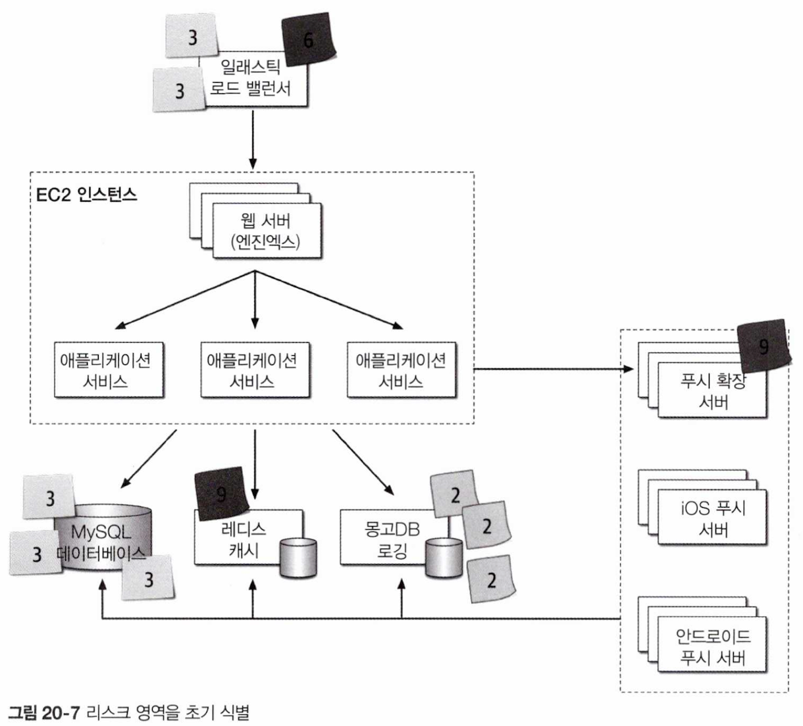

리스크 스토밍 세션 참가자들은 각자 리스크를 발견한 영역의 아키텍처 다이어그램에 포스트 잇을 붙이기 시작하고, 포스트 잇을 다 붙인 후 리스크 스토밍 협력 파트가 시작된다.

리스크 스토밍의 목표는 사람들이 한 팀이 되어 리스크 영역을 분석하고 과연 그것이 리스크가 맞는지 합의를 이끌어내는 것이다.

> 리스크 영역의 식별
>
1. ELK의 리스크에 대해 두 참가자는 `리스크 중간`, 나머지 한 참가자는 `리스크 높음`으로 식별
2. 한 참가자가 푸시 확장 서버를 `리스크 높음`으로 식별
3. 세 참가자 가 MySQL 데이터베이스를 `리스크 중간`으로 식별
4. 한 참가자가 레디스 캐시를 `리스크 높음`으로 식별
5. 세 참가자가 몽고DB로 로깅을 `리스크 낮음`으로 식별
6. 다른 아키텍처 영역은 `모두 리스크가 없는 것`으로 보고 따로 포스트 잇을 붙이지 않음

- 3, 5번은 세 참가자 모두 리스크 레벨과 당위성에 동의 했으니 더 이상 논의할 필요가 없다.
- 1번은 의견 차이가 있었고 2, 4번은 한명의 참가자만 리스크라고 생각하기 때문에 합의 활동을 통해 논의되어야한다.

- 리스크가 높다는 판단은 실제 경험에서 나타난 것일 수도 있고, 해당 담당자가 특정 기술에 대한 정보가 없다는 것에 대해서도 리스크가 높다는 판단을 내릴 수 있다.

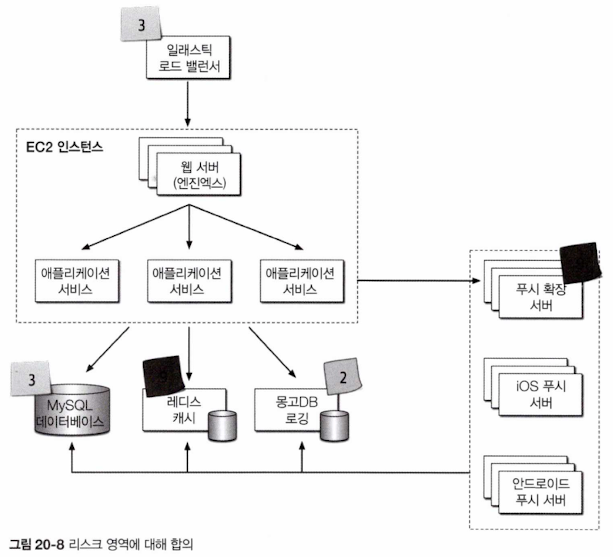

결론적으로 모든 참가자가 식별된 리스크 영역에 의견을 함께 할 때까지 반복된다. 포스트 잇을 모두 통합해서 최종 결과가 도출되면 다음 활동으로 넘어간다.

### 3.20.3.2 완화 활동

모든 참가자가 아키텍처 리스크 영역에 대해 합의한 후 마지막으로 가장 중요한 리스크 완화 활동을 한다. 아키텍처에서 리스크를 줄이려면 일반적으로 아키텍처의 특정 영역을 변경 또는 개선하는 작업이 필요하다.

식별된 리스크에 따라 원래 아키텍처를 완전히 바꿔야 할 수도 있지만, 처리량 병목 이슈를 줄이기 위해 배압 큐를 추가하는 등 간단한 아키텍처 리팩터링 만으로 해소되는 경우도 있다.

전쳬 아키텍처는 물론, 아키텍트와 비즈니스 이해 관계자들 간의 협상에도 리스크 스토밍은 상당한 영향을 미칠 수있다.

결론적으로 리스크 평가와 리스크 스토밍 기법을 적절히 혼용하면 리스크 식별 및 추척, 아키텍처 개선, 주요 이해 관계자 간의 협상을 진행하는 과정에서 큰 도움이 될 것이다.

## 3.20.4 애자일 스토리 리스크 분석

리스크 스토밍은 아키텍처는 물론, 다른 소프트웨어 개발 분야에도 응용할 수 있다. 리스크 매트릭스를 사용하면 유저 스토리의 리스크는 첫 번째 차원과 두 번째 차원으로 식별 할 수 있다. 동일한 아키텍처 리스크 매트릭스를 스토리에 활용함으로써 리스크가 높은 스토리를 찾아내고 그런 스토리를 주의 깊게 추적해서 우선 순위를 두는 것이다.

## 3.20.5 리스트 스토밍 예시

리스크 스토밍으로 어떻게 전쳬 시스템의 아키텍처를 개선 할 수 있는지 예를 들어본다.

> 환자들의 다양한 건강 상태에 대해 간호사가 조언을 해주는 `콜 센터 시스템`

- 질문을 받으면 간호사나 환자에게 의료 문제를 안내하는 서드파티 진단 엔진을 사용한다.
- 환자는 콜센터에 전화를 걸어 간호사와 통화하거나 간호사 없이 직접 진단 엔진에 액세스 하는 셀프 서비스 웹사이트를 이용한다.
- 전국적으로 250명의 간호사와 수십만 명에 달하는 셀프 서비스 환자를 동시에 지원할 수 있어야 한다.
- 간호사는 환자의 의무기록을 열람할 수 있지만, 환자는 자신의 의무기록을 볼 수 없다.
- 의무 기록에 미국 의료 정보 보호법를 준수 해야한다. 즉, 간호사 이외의 그 누구도 의무 기록을 열람할 수 없다.
- 전염병과 독감이 유행하는 시즌에 데이터 요청이 급증해도 시스템이 이를 감당해야 한다.
- 간호사 프로필에 따라 통화가 연결되어야 힌다.
- 서드파티 진단 엔진은 초당 약 500개의 요청을 처리 할 수 있어야 한다.

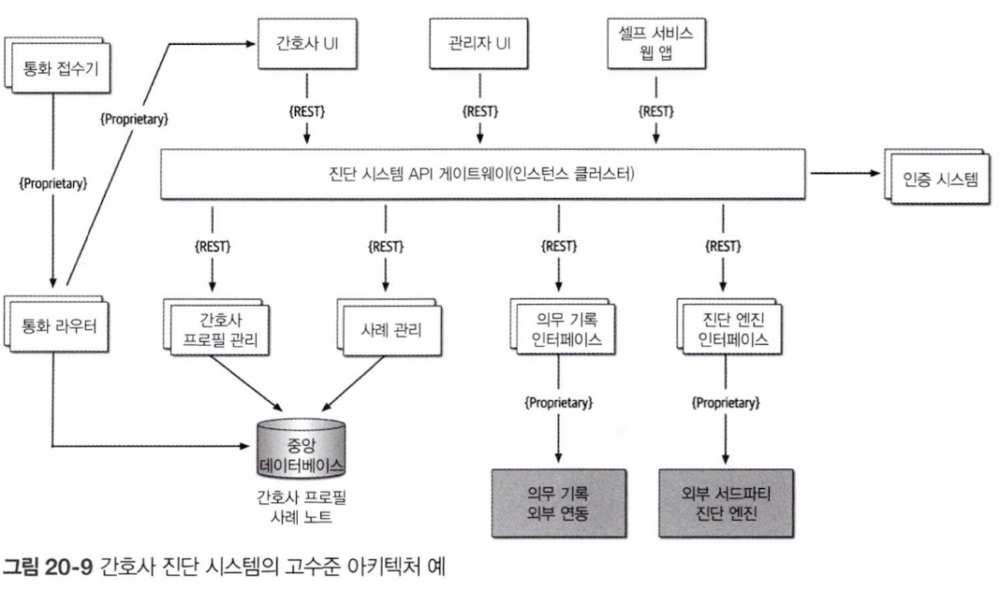

아키텍처에는 `셀프 서비스용 인터페이스`, `전화를 받는 간호사용 인터페이스`, `관리 직원이 간호사 프로필과 시스템 설정 값을 추가하는 관리용 인터페이스`, 이렇게 3개의 웹 기반 유저 인터페이스가 있다.

콜 센터 부분은 걸려온 전화를 받는 통화 접수기와 프로필을 보고 통화 가능한 간호사에게 연결시켜주는 `통화 라우터`로 구성된다.
이 `아키텍처의 핵심`은 요청이 들어오면 보안 체크 후 적절한 백엔드 서비스로 보내주는 진단 시스템 `API 게이트웨이`이다.

이 시스템은 사례 관리 서비스, 간호사 프로필 관리 서비스, 의무 기록 인터페이스, 외부 서드 파티 진단 엔진, 이렇게 4개 주요 서비스로 구성된다.

모든 통신은 외부 시스템과 콜센터 서비스로 접속하기 위한 전용 프로토콜을 제외하고 REST로 한다.

아키텍트는 자가 평가 차원에서 한 번 더 요구사힝을 살펴보고 아키텍처 다이어그램을 재검토한 다음, 이 아키텍처가 가용성, 탄력성, 보안 측면에서 어느 정도의 리스크가 있을지 고민한다.

다음 절 부터 리스크 스토밍을 통해 아키텍처의 리스크를 줄일지 고민하도록 한다.

### 3.20.5.1 가용성

1차 리스크 스토밍 세션에서 아키텍트는 먼저 `가용성`에 집중하도록 한다. 시스템이 성공하려면 가용성이 매우 중요하다. 리스크 스토밍에 참가한 사람들은 `식별`, `협력` 활동의 결과로 리스크 매트릭스를 만들어 리스크 영역을 제시할 수 있다.

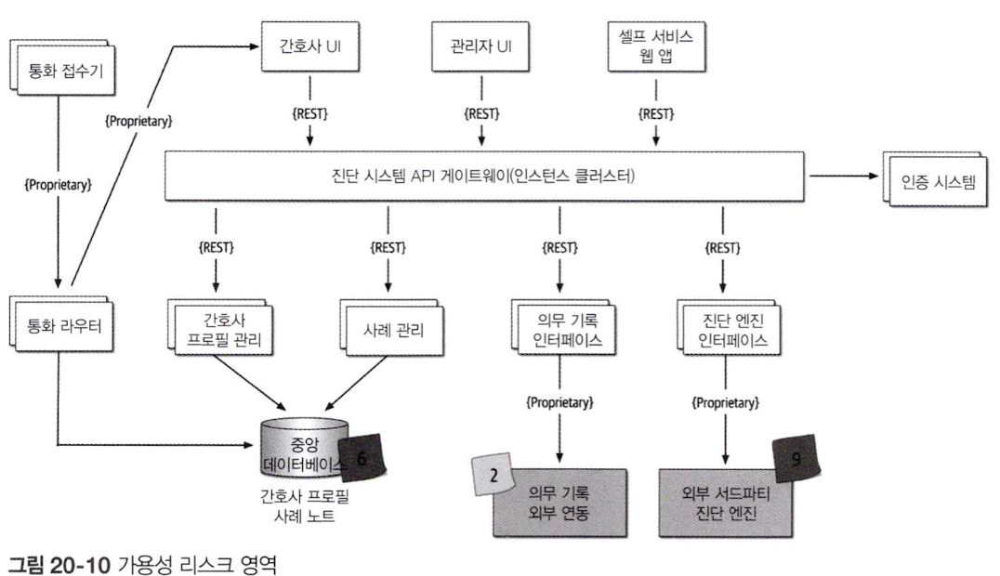

- 중앙 데이터베이스를 사용하는 아키텍처는 영향도가 높고 가능성이 중간이므로 리스크 높음으로 식별되었다.
- 진단 엔진 가용성은 영향도가 높고, 가능성을 알 수 없으므로 리스크 높음으로 식별되었다.
- 의무 기록 가용성은 시스템 실행에 필수 컴포넌트가 아니므로 리스크 낮음으로 식별되었다.
- 각 서비스는 여러 인스턴스로 구성되어 있고, API 게이트웨이에도 클러스터링되어 있으니 다른 시스템 파트는 가용성 측면에서 리스크로 보이지 않는다.

> 리스크 스토밍 협력을 통한 내용

- 모든 참가자는 데이터베이스가 다운되면 통화 라우터는 작동하지 않을 수 있다는 점을 확인
	- 데이터베이스 리스크를 완화하려면 하나의 물리적인 데이터베이스를 간호사 프로필 정보가 저장된 데이터베이스 클러스터, 단일 인스턴스 형태의 사례 기록용 데이터베이스, 두 개의 데이터베이스로 분리하는게 낫다는 결론을 내렸다.
	- 데이터베이스를 분리함으로써 데이터베이스 가용성에 대한 우려가 불식되고, 사례 기록은 관리자만 볼 수 있도록 보안성도 개선되는 효과를 볼 수 있다.
	- 간호사 프로필 정보를 통화 라우터에 캐시하는 방법도 생각해 볼 수 있지만, 통화 라우터의 구현 코드가 서드파티 제품일 가능성이 높아 데이터베이스 액세스 방식을 택한다.
- 외부 시스템(진단 엔진, 의무 기록 시스템)은 마음대로 제어할 수 없기 때문에 가용성 관리가 훨씬 어렵다.
- 이러한 가용성 리스크를 완화하는 한 가지 방법
	- 시스템 별로 SLA(서비스 수준 계약)나 SLO(서비스 수준 목표)가 명시된 문서를 확인해 보는 것이다.
	- SLA는 일반적으로 법적 구속력이 있는 공식 계약서인 반면, SLO는 그렇지 않다.
	- 한 연구 결과 자료를 보면, 진단 엔진의 SLA가 99.99% 가용성(연간 다운타임 52.60분)을, 의무 기록 시스템이 99.9% 가용성(연간 다운타임 8.77시간)을 보장한다. 이 정도면 상대적으로 리스크가 없아고 보아도 무방하다.

### 3.20.5.2 탄력성

2차 리스크 스토밍에서는 주로 유저 부하 급증에 따른 가변 확장성을 뜻하는 탄력성에 대해서 논의한다.

간호사는 250명에 불과하지만 셀프 서비스 파트도 진단 엔진과 간호사 정보를 액세스 할 수 있으므로 진단 인터페이스에 상당한 요청이 몰릴 수 있다. 세션 참가자들은 특히 독감 시즌에 시스템 부하가 클 것으로 우려된다.

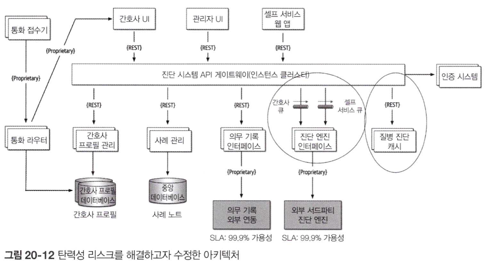

이에 모든 참가자는 만장일치로 진단 엔진 인터페이스를 리스크 높음으로 식별한다. 단순하게 계산하더라도 초당 500개 요청을 처리하는 능력으로는 예상 처리량을 감당할 수 없다고 본다.

가뜩이나 REST를 연계 프로토콜로 사용하는 아키텍처의 경우 더욱 그러하다.

`API 게이트웨이`와 `진단 엔진 인터페이스` 간의 배압 지점에 `비동기 큐(메시징)`를 두고 진단 엔진 호출의 완충 지대로 활용하는 방법도 있지만, 간호사가 진단 엔진의 응답을 너무 오래 대기하거나 타임아웃이 발생할 가능성이 있으므로 좋은 방법은 아니다.

앰뷸런스 패턴을 응용하여 `셀프 서비스`보다 간호사에게 더 높은 우선 순위를 부여하는 방법도 있다. 이렇게 처리하면 메시지 채널이 2개 필요한데, 이 방법도 리스크 완화에 약간은 도움이 되겠지만 `대기 시간 문제`는 여전히 숙제로 남는다.

결국 `배압 지점`을 제공하는 큐 기술 외에도 `발병에 관한 특정 진단 질문을 캐시함`으로써 진단 엔진 인터페이스에 도달하는 호출을 줄일 수 있다고 판단한다.

> 개선 사항

- 2개의 큐 채널(간호사용, 셀프 서비스 환자용)
- 특정 질병이나 독감에 관한 요청을 처리하는 질병 진단 캐시 서버 서비스가 새로 도입되었다.

제약이 되었던 팩터(진단 엔진 호출)가 제거되어 수만 개 요청도 동시에 처리할 수 있다. 만약 리스크 스토밍을 하지 않았다면 질병이 퍼지고 독감 시즌이 도래하고 나서야 리스크가 식별되었을 것이다.

### 3.20.5.3 보안

1, 2차 리스크 스토밍 성과에 고무된 아키텍트는 이 시스템이 지원해야 하는 또 다른 중요한 아키텍처 특성인 보안을 논하는 최종 세션을 갖도록 한다.

우선 HIPAA 규제 요구사항 때문에 의무 기록 열람은 간호사만 열람이 가능하도록 안전하게 관리해야 한다. 아키텍트는 이러한 요구사항이 API 게이트웨이의 보안 체크(인증, 인가) 문제는 아니라고 생각하지만, 이해 관계자들이 다른 부분에서 보안 리스크를 찾아낼 지 궁금할 수 있다.

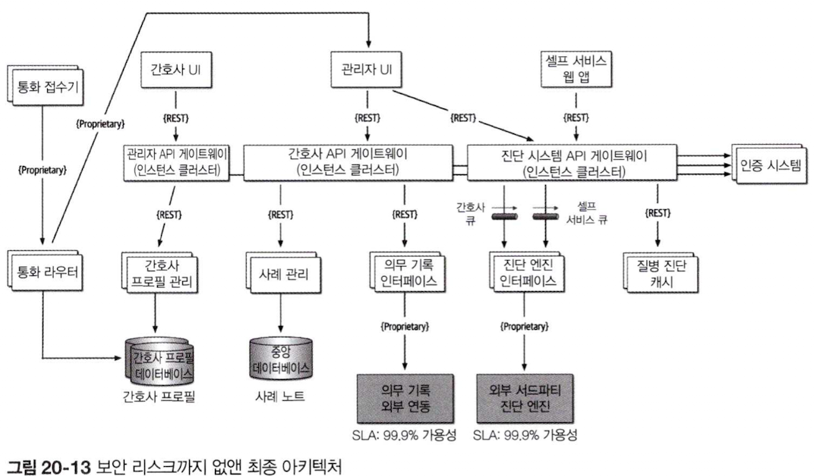

리스크 스토밍을 한 결과, 전원 진단 시스템 API 게이트웨이를 리스크 높음으로 식별하였다. 관리 직원이나 셀프 서비스 환자가 의무 기록을 열람 시 영향도와 그럴 가능성이 중간임을 감안한 결과이다.

리스크 발생 가능성은 각 API 호출에 대해 보안 체크를 하기 떄문에 높지 않지만, 모든 호출(셀프 서비스, 관리자, 간호사)이 동일한 API 게이트웨이를 통과하므로 가능성은 중간으로 본 것이다.

참여자들은 유저 유형별로(관리자, 셀프 서비스/진단, 간호사) API 게이트웨이를 사용하면 관리자용 웹 유저 인터페이스 또는 셀프 서비스용 웹 유저 인터페이스의 호출이 의무 기록 시스템까지는 도달하지 못하게 막을 수 있다고 결론 내렸다.

> 결론

리스크 스토밍은 1회성 프로세스가 아니라, 프로덕션에서 발생하기 전에 리스크 영역을 포착하고 미리 그 해결 방법을 찾는, 시스템이 살아 숨쉬는 내내 계속 반복하는 과정이다. 리스크 스토밍 활동을 얼마나 자주 할지는 변경 빈도, 아키텍처 리펙터링 활동, 아키텍처의 점진적 개발 등 여러 팩터에 따라 달라진다.

일반적으로 주요 기능이 추가된 직후나 매 이터레이션이 끝나는 시점에 특정 차원에 대해 리스트 스토밍을 한다.