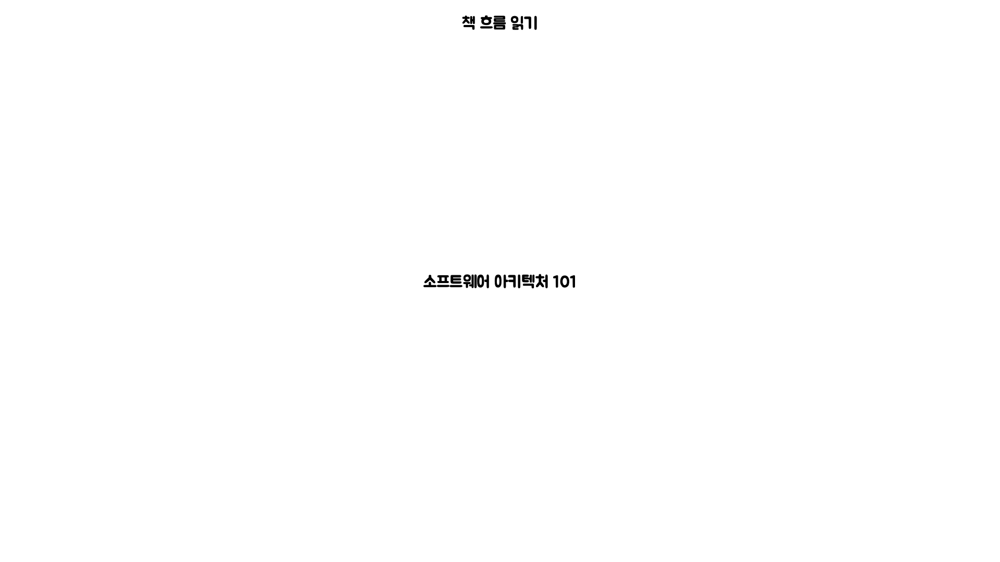

# book-software-architecture-101

📚소프트웨어 아키텍처 101 - 엔지니어링 접근 방식으로 배우는 소프트웨어 아키텍처 기초

## Intro

- [책 링크](http://www.kyobobook.co.kr/product/detailViewKor.laf?mallGb=KOR&ejkGb=KOR&barcode=9791162244869&orderClick=JAj)

1. 서론 (p.28 ~ 47)
2. 기초
    1. 아키텍처 사고 (p.52 ~ 64)
    2. 모듈성 (p.68 ~ 87)
    3. 아키텍처 특성 정의(p.92 ~ 99)
    4. 아키텍처 특성 식별(p.101 ~ 110)
    5. 아키텍처 특성의 측정 및 거버넌스(p.115 ~ 121)
    6. 아키텍처 특성 범위(p.132 ~ 136)
    7. **컴포넌트 기반 사고(p.141 ~ 161)**
3. 아키텍처 스타일
    1. 기초(p.165 ~ p.178)
    2. 레이어드 아키텍처 스타일(p.181 ~ 189)
    3. 파이프라인 아키텍처 스타일(p.193 ~ 198)
    4. 마이크로커널 아키텍처 스타일(p.201 ~ 212)
    5. 서비스 기반 아키텍처 스타일(p.215 ~ 228)
    6. **이벤트 기반 아키텍처 스타일(p.232 ~ 262)**
    7. **공간 기반 아키텍처 스타일(p.266 ~ 289)**
    8. 오케스트레이션 기반 서비스 지향 아키텍처 스타일(p.291 ~ 298)
    9. **마이크로 서비스 아키텍처 스타일(p.301 ~ 324)**
    10. 최적의 아키텍처 스타일 선정(p.325 ~ 333)
4. 테크닉과 소프트 스킬
    1. 아키텍처 결정(p.341 ~ 356)
    2. 아키텍처 리스크 분석(p.359 ~ 376)
    3. 아키텍처 도식화 및 프레젠테이션(p.380 ~ 391)
    4. 개발팀을 효율적으로(p.393 ~ 416)
    5. 협상과 리더쉽 스킬(p.417 ~ 436)
    6. 커리어패스 개발(p.438 ~ 457)

## 📆 스터디 일정

- 스터디 기간: 2022/02/14 ~ 2022/05/02 (총 12주)
- 스터디 세션: 매주 월요일 20:00 ~

### OT 내용

- 자기소개
    - 하는 일, 어떤 목표로 스터디에 참여했는지
    - 회사 개발의 아키텍처에 대한 의견을 낼 수 있는 위치인지?
- 책 목차의 전체적인 흐름 이야기

## 🖐 모집 인원

- 총 5명

## 📜 진행 방식

- 총 24장까지 각 챕터의 주제에 대해서 `책 안의 개념적으로 습득하여야 할 내용`과 `경험적인 내용에 대해 공유하는 것`으로 진행한다.
- 매주 스터디 전, 발표자는 발표자료를 PR로 올린다.
- 발표자 외 인원은 **PR**에 발표한 내용에 대해 `이해가 되지 않는 내용` 또는 `중요하거나 공유하고 싶은 내용`을 댓글로 작성한다.
- 스터디 장은 발표한 `챕터의 목표`와 `간략하게 정리할 수 있는 내용`으로 **issue**에 남긴다.
- 주제 별 발표 내용에 의문이 있다면 질문, 의견이 다른 경우 **스터디 시간에 질의** 또는 **issue**에 댓글을 남겨 공유될 수 있도록 한다.

|  주차  |  일정  | 발표1                                    | 발표2                             |
|:----:|:----:|:---------------------------------------|:--------------------------------|
| 1주차  | 2/14 | OT                                     | 자기소개                            |
| 2주차  | 2/21 | Chapter 2. 아키텍처 사고(NY)                 | Chapter 3. 모듈성(NE)              |
| 3주차  | 2/28 | Chapter 4. 아키텍처 특성 정의(SR)              | Chapter 5. 아키텍처 특성 식별(HK)       |
| 4주차  | 3/7  | Chapter 6. 아키텍처 특성 측정 및 거버넌스(JH)       | Chapter 7. 아키텍처 특성 범위(NY)       |
| 5주차  | 3/14 | Chapter 8. 컴포넌트 기반 사고(NE)              | Chapter 9. 아키텍처 스타일 기초(SR)      |
| 6주차  | 3/21 | Chapter 10. 레이어드 아키텍처(HK)              | Chapter 11. 파이프라인 아키텍처(JH)      |
| 7주차  | 3/28 | Chapter 12. 마이크로커널 아키텍처(NY)            | Chapter 13. 서비스 기반 아키텍처(NE)     |
| 8주차  | 4/4  | Chapter 14. 이벤트 기반 아키텍처(SR)            | Chapter 15. 공간 기반 아키텍처(HK)      |
| 9주차  | 4/11 | Chapter 16. 오케스트레이션 기반 서비스 지향 아키텍처(JH) | Chapter 17. 마이크로서비스 아키텍처(NY)    |
| 10주차 | 4/18 | Chapter 18. 최적의 아키텍처 스타일 선정(NE)        | Chapter 19. 아키텍처 결정(SR)         |
| 11주차 | 4/25 | Chapter 20. 아키텍처 리스크 분석(HK)            | Chapter 21. 아키텍처 도식화 프레젠테이션(JH) |
| 12주차 | 5/2  | Chapter 22. 개발팀을 효율적으로                 | Chapter 23. 협상과 리더쉽 스킬          |
| 13주차 | 5/9  | Chapter 24. 커리어패스 개발                   | 회고                              |

## 📚 Github 저장소

- PR에 대한 머지는 직접 운영진이 할 예정입니다.
- 발표자료의 파일명은 아래와 같이 해주세요.

> [1주차]_1장_서론_SR

- PR을 올려주실때는 포크 저장소를 이용해주세요.
- PR은 발표자료 파일명과 동일하게 올려주세요.

> [X주차]_X장_제목_이름

- Issue 는 아래와 같이 제목을 작성해주세요.

> [X주차]_X장_제목

## 💰 보증금 및 벌금

- 보증금 2만원을 첫 시작 때 운영진에게 입금합니다.
- 발표자료를 기한 내에 PR하지 않은 경우 벌금으로 차감됩니다.
- 벌금은 4000원입니다.
- 마지막 모임에서 남은 금액에 대해 환급을 받는다.
- 모든 벌금은 마지막 모임 시, 오프라인 모임 시 사용됩니다.(스터디룸 비)
- 중도 하차하신 분은 보증금을 돌려드리지 않습니다.

## 기타

- 커뮤니케이션을 위해 Slack을 사용합니다.
